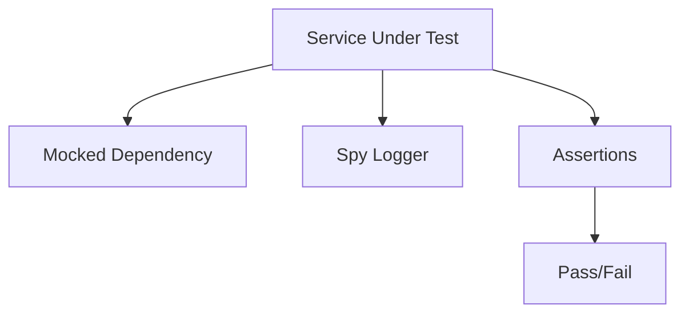

# Day 033 [Beginner]: Mocking and Test Doubles

## Index

- Goal
- Prerequisites
- Explanation
- Topic by Topic
- Key Concepts
- Visual Concept Map
- End-to-End Practical
- Hands-on Coding
- Mini Exercise
- Assessment Quiz
- Task
- Self Check
- Interview Questions and Answers
- Day Outcome

## Goal

Use mocks, stubs, fakes, and spies correctly to isolate logic and create reliable automated tests.

## Prerequisites

- Day 032 API testing basics
- Basic dependency injection understanding

## Explanation

Test doubles replace real dependencies like databases, payment gateways, and email services so tests stay fast and deterministic.

## Topic by Topic

### Topic 1: Types of Test Doubles

Theory:
Common doubles: dummy, fake, stub, spy, and mock.

Practical:
Choose the lightest double needed per test.

**Explanation:** Test doubles matter because they let you isolate code behavior when real dependencies are slow, unstable, or irrelevant to the current test.

**Key Points:**

- Different doubles solve different testing problems.
- Isolation can improve speed and focus.
- Use the right double for the right reason.

### Topic 2: Module and Function Mocking

Theory:
Mock external modules to isolate business logic.

Practical:
Mock repository function in service tests.

**Explanation:** Module and function mocking help replace real dependencies with controlled behavior for focused verification.

**Key Points:**

- Mock dependencies intentionally.
- Control behavior to test the target unit clearly.
- Avoid mocking without a specific reason.

### Topic 3: Spies for Interaction Testing

Theory:
Spies verify whether functions were called with expected args.

Practical:
Assert logger/email function calls.

**Explanation:** Spies are useful when you want to observe how a function was called without fully replacing its purpose.

**Key Points:**

- Spies help verify interactions.
- They are useful for call-count and argument checks.
- Use them when behavior observation matters.

### Topic 4: Avoid Over-mocking

Theory:
Too much mocking can make tests detached from reality.

Practical:
Prefer integration tests for critical paths.

**Explanation:** Over-mocking is risky because tests can drift away from real behavior and become easy to pass but hard to trust.

**Key Points:**

- Mock only what you truly need.
- Too much mocking can hide integration issues.
- Balance isolation with realism.

### Topic 5: Reset and Cleanup

Theory:
Mock state leaks can cause flaky tests.

Practical:
Reset mocks after each test.

**Explanation:** Reset and cleanup keep test suites deterministic by removing leftover state from previous tests.

**Key Points:**

- Clear mocks and spies between tests.
- Cleanup reduces flaky outcomes.
- Shared state should not leak across test cases.

### Topic 6: Fake vs Mock and Tool-neutral Syntax

Theory:
Use fakes when you need simple in-memory behavior, and mocks/spies when you need strict interaction checks. Jest and Vitest APIs are very similar.

Practical:
Choose the smallest double that proves behavior, and keep tests readable in either Jest or Vitest.

## Double Selection Table

| Need                           | Best Double |
| ------------------------------ | ----------- |
| Return fixed value             | Stub        |
| Verify call count              | Spy         |
| Replace full module            | Mock        |
| Lightweight in-memory behavior | Fake        |

**Explanation:** Understanding fake vs mock differences and tool-neutral ideas helps you reason about testing patterns beyond one specific framework API.

**Key Points:**

- Learn the concept, not just the library syntax.
- Naming differences matter less than behavior.
- Tool-neutral understanding improves adaptability.

## Key Concepts

- Test double taxonomy
- Dependency isolation patterns
- Interaction vs state assertions
- Mock hygiene and cleanup
- Fake vs mock decision clarity
- Jest and Vitest API equivalence basics
- Realism vs speed tradeoffs

## Visual Concept Map



## End-to-End Practical

1. Identify external dependencies in service.
2. Replace dependency with mock in tests.
3. Assert success and failure behavior.
4. Add spy assertions for side effects.
5. Reset mock state between tests.

## Hands-on Coding

### Example 1: Case - Mock Repository Function

Scenario:
Service should not call real DB during unit tests.

```js
const userRepo = { findByEmail: jest.fn() };

async function loginService(email) {
  const user = await userRepo.findByEmail(email);
  if (!user) throw new Error("User not found");
  return user;
}

test("throws when user missing", async () => {
  userRepo.findByEmail.mockResolvedValue(null);
  await expect(loginService("x@y.com")).rejects.toThrow("User not found");
});
```

### Example 2: Case - Spy on Logger

Scenario:
Critical service should log error with context.

```js
const logger = { error: jest.fn() };

function processPayment(amount) {
  if (amount <= 0) {
    logger.error("Invalid amount", { amount });
    throw new Error("Invalid amount");
  }
}

test("logs invalid amount", () => {
  expect(() => processPayment(0)).toThrow();
  expect(logger.error).toHaveBeenCalledWith("Invalid amount", { amount: 0 });
});
```

### Example 3: Case - Mock Rejection Path

Scenario:
Email provider outage should be handled gracefully.

```js
const mailer = { send: jest.fn() };

async function notifyUser() {
  try {
    await mailer.send();
    return "sent";
  } catch {
    return "queued";
  }
}

test("queues mail when provider fails", async () => {
  mailer.send.mockRejectedValue(new Error("timeout"));
  await expect(notifyUser()).resolves.toBe("queued");
});
```

### Example 4: Case - In-memory Fake Repository

Scenario:
Service logic needs realistic behavior without real database.

```js
function createFakeUserRepo() {
  const items = [];
  return {
    async save(user) {
      items.push(user);
      return user;
    },
    async findByEmail(email) {
      return items.find((u) => u.email === email) || null;
    },
  };
}
```

### Example 5: Case - Jest and Vitest Mock Equivalents

Scenario:
Team uses different runners across projects.

```js
// Jest:
// const fn = jest.fn();

// Vitest:
// const fn = vi.fn();

// Both support: mockResolvedValue, mockRejectedValue, toHaveBeenCalledWith
```

## Mini Exercise

Scenario:
Write tests for order service by mocking repository and notification dependencies.

Expected output:

- Dependency isolation via mocks
- Side-effect verification via spies
- Failure fallback behavior tested

## Assessment Quiz

### Quiz Questions

1. Why use mocks in unit tests?
2. What is the difference between mock and spy?
3. True or False: Skipping edge-case handling is acceptable in production.
4. Why is over-mocking harmful?
5. When should you prefer a fake over a strict mock?

### Quiz Answers

1. To isolate logic and avoid slow/flaky external dependencies.
2. Mock replaces behavior; spy observes calls on existing behavior.
3. False.
4. Tests may pass while real integrations fail.
5. When you need simple realistic behavior, not strict call assertions.

## Task

- Use at least 2 test doubles in one module test suite
- Add one failure-path test with mocked rejection
- Complete mini exercise and quiz.

## Self Check

- You can isolate backend logic using correct test doubles.
- You can avoid flaky tests through mock hygiene.
- You can answer at least 4 out of 5 quiz questions.

## Interview Questions and Answers

### Beginner

Question: When should you avoid mocks?

Answer: When validating real integration contracts is more important than isolation speed.

### Middle

Question: What is the main value of spies?

Answer: They verify interactions such as function calls and parameters.

### Advanced

Question: What is the central tradeoff in mocking strategy?

Answer: Faster isolated tests versus reduced realism if overused.

## Day 033 Outcome

- You can design robust unit tests with suitable doubles
- You can balance isolation speed and integration confidence
- You are ready for integration testing with Testcontainers in Day 034
