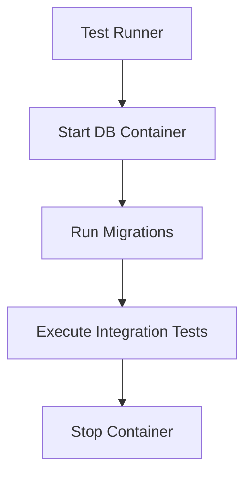

# Day 034 [Beginner]: Integration Testing with Testcontainers

## Index

- Goal
- Prerequisites
- Explanation
- Topic by Topic
- Key Concepts
- Visual Concept Map
- End-to-End Practical
- Hands-on Coding
- Mini Exercise
- Assessment Quiz
- Task
- Self Check
- Interview Questions and Answers
- Day Outcome

## Goal

Run reliable integration tests against real dependencies using Testcontainers.

## Prerequisites

- Day 033 mocking fundamentals
- Docker installed and running locally

## Explanation

Integration tests validate real interactions with databases or external systems. Testcontainers launches disposable containers during tests for realism and repeatability.

## Topic by Topic

### Topic 1: Why Integration Tests

Theory:
Unit tests cannot catch schema mismatch and query behavior issues.

Practical:
Use integration tests for repository and data workflows.

**Explanation:** Integration tests matter because they verify how real components work together, not just isolated logic.

**Key Points:**

- Integration tests catch system-boundary issues.
- They provide stronger realism than unit tests.
- Use them for high-value interactions.

### Topic 2: Testcontainers Lifecycle

Theory:
Container startup/teardown should be controlled by test hooks.

Practical:
Use beforeAll/afterAll for DB container lifecycle.

**Explanation:** Testcontainers lifecycle matters because reliable setup and teardown determine whether container-based tests stay usable and stable.

**Key Points:**

- Manage container startup and shutdown carefully.
- Lifecycle control affects test speed and reliability.
- Stable container handling reduces CI pain.

### Topic 3: Schema and Seed Setup

Theory:
Integration tests need deterministic schema and test data.

Practical:
Run migration and seed scripts in setup.

**Explanation:** Schema and seed setup help tests start from known data so outcomes stay repeatable.

**Key Points:**

- Keep test schemas predictable.
- Seed only what the test needs.
- Controlled data improves trust in results.

### Topic 4: Isolation and Cleanup

Theory:
Each test should avoid data leakage from previous tests.

Practical:
Truncate tables after each test.

**Explanation:** Isolation and cleanup are critical in integration testing because real services and databases can otherwise leak state across runs.

**Key Points:**

- Reset data or environments between tests.
- Isolation keeps failures easier to diagnose.
- Cleanup is part of test correctness.

### Topic 5: Speed vs Realism

Theory:
Integration tests are slower but catch real dependency bugs.

Practical:
Keep focused set of high-value integration tests.

**Explanation:** Speed versus realism is a central integration-testing tradeoff, since more realistic tests usually cost more time and complexity.

**Key Points:**

- Choose realism where it adds clear value.
- Keep the suite fast enough to stay useful.
- Balance cost against confidence.

### Topic 6: Container Readiness and CI Stability

Theory:
Tests should start only after dependencies are ready. CI runners can be slower, so startup/wait strategy matters.

Practical:
Wait for container readiness, set clear timeouts, and keep deterministic setup hooks.

## Integration Testing Tradeoff Table

| Aspect            | Unit Tests | Integration Tests |
| ----------------- | ---------- | ----------------- |
| Speed             | Fast       | Slower            |
| Realism           | Lower      | High              |
| Failure diagnosis | Easier     | Harder            |

**Explanation:** Container readiness and CI stability matter because the hardest part of integration testing is often keeping the environment dependable under automation.

**Key Points:**

- Wait for services to be truly ready.
- CI stability depends on reliable environment behavior.
- Infra flakiness can hide real test value.

## Key Concepts

- Real dependency validation
- Disposable container strategy
- Deterministic setup/teardown
- Data isolation discipline
- Readiness-aware startup flow
- CI timeout and stability tuning
- Balanced test pyramid

## Visual Concept Map



## End-to-End Practical

1. Start PostgreSQL container with Testcontainers.
2. Configure connection string dynamically.
3. Run schema migration.
4. Execute repository integration tests.
5. Clean tables and stop container.

## Hands-on Coding

### Example 1: Case - Start PostgreSQL Container

Scenario:
Repository tests need real PostgreSQL environment.

```js
const { PostgreSqlContainer } = require("@testcontainers/postgresql");

let container;

beforeAll(async () => {
  container = await new PostgreSqlContainer("postgres:16").start();
  process.env.DATABASE_URL = container.getConnectionUri();
});

afterAll(async () => {
  await container.stop();
});
```

### Example 2: Case - Repository Integration Test

Scenario:
Create user and verify round-trip persistence.

```js
test("creates and fetches user", async () => {
  const created = await userRepo.create({
    name: "Asha",
    email: "asha@test.dev",
  });
  const found = await userRepo.findByEmail("asha@test.dev");

  expect(found.id).toBe(created.id);
  expect(found.email).toBe("asha@test.dev");
});
```

### Example 3: Case - Cleanup Between Tests

Scenario:
Ensure test independence and prevent cross-test data leaks.

```js
afterEach(async () => {
  await db.query("TRUNCATE TABLE users RESTART IDENTITY CASCADE");
});
```

### Example 4: Case - Health Check Before Running Tests

Scenario:
Run tests only after database is reachable.

```js
beforeAll(async () => {
  // Simple readiness check query
  await db.query("SELECT 1");
});
```

### Example 5: Case - CI-friendly Timeout

Scenario:
Container startup is slower in CI and needs explicit timeout budget.

```js
// Example idea: increase suite timeout for container startup phase.
// Jest: jest.setTimeout(60000)
// Vitest: test.setTimeout(60000)
```

## Mini Exercise

Scenario:
Write integration tests for users repository against disposable PostgreSQL container.

Expected output:

- Real DB container lifecycle managed
- Repository CRUD behavior validated
- Test cleanup ensures isolation

## Assessment Quiz

### Quiz Questions

1. Why are integration tests important even with strong unit tests?
2. What does Testcontainers add compared to local shared DB?
3. True or False: Skipping edge-case handling is acceptable in production.
4. Why is data cleanup mandatory between tests?
5. Why should integration tests wait for dependency readiness?

### Quiz Answers

1. They validate real interactions with external dependencies.
2. Disposable, reproducible test environments.
3. False.
4. Leftover data causes flaky and order-dependent tests.
5. To avoid random startup failures and non-deterministic test results.

## Task

- Build one containerized integration test module
- Add setup, teardown, and cleanup hooks
- Complete mini exercise and quiz.

## Self Check

- You can validate real DB integration behavior safely.
- You can run reproducible integration tests in CI.
- You can answer at least 4 out of 5 quiz questions.

## Interview Questions and Answers

### Beginner

Question: Why not use one shared dev database for integration tests?

Answer: Shared state causes flaky tests and inconsistent environments.

### Middle

Question: Is Testcontainers only for databases?

Answer: No, it supports many services like Redis, Kafka, and Elasticsearch.

### Advanced

Question: What is the core tradeoff of integration tests?

Answer: Better realism and confidence with slower execution and more setup complexity.

## Day 034 Outcome

- You can run reliable container-based integration tests
- You can design deterministic test setup and cleanup workflows
- You are ready for E2E testing fundamentals in Day 035
