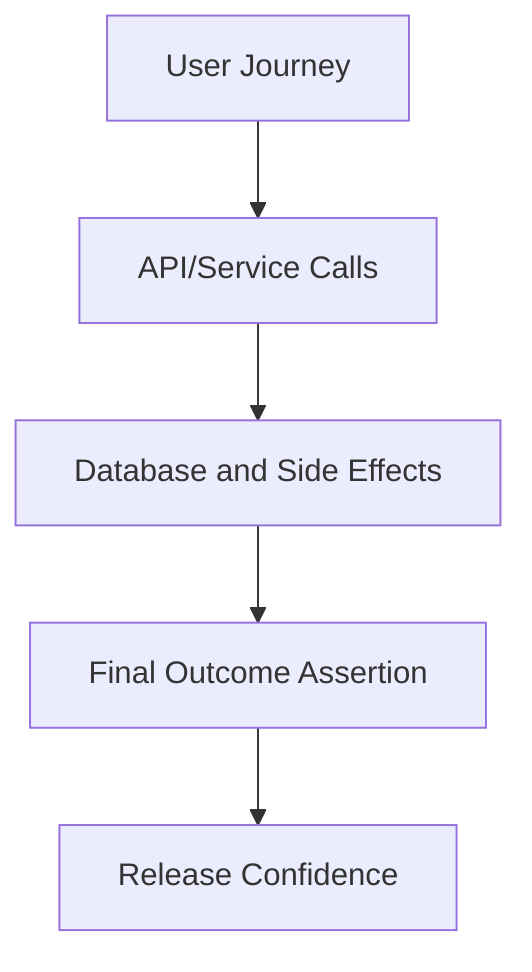

# Day 035 [Beginner]: End to End Testing Fundamentals

## Index

- Goal
- Prerequisites
- Explanation
- Topic by Topic
- Key Concepts
- Visual Concept Map
- End-to-End Practical
- Hands-on Coding
- Mini Exercise
- Assessment Quiz
- Task
- Self Check
- Interview Questions and Answers
- Day Outcome

## Goal

Understand and implement practical end-to-end tests that validate complete user journeys across backend systems.

## Prerequisites

- Day 034 integration testing basics
- Basic CI pipeline awareness

## Explanation

E2E tests verify full workflows from entry point to final outcome. They provide high confidence but should stay focused on critical business journeys.

## Topic by Topic

### Topic 1: Test Pyramid Position

Theory:
E2E tests sit at top of pyramid: fewer tests, broader coverage.

Practical:
Select top-risk user journeys for E2E.

**Explanation:** End-to-end tests sit at the top of the test pyramid because they validate full user or system flows across many layers.

**Key Points:**

- E2E tests cover complete behavior paths.
- They provide strong confidence but cost more.
- Use them for critical flows, not every detail.

### Topic 2: Scenario Design

Theory:
E2E scenarios should map to business-critical flows.

Practical:
Cover signup-login-purchase or create-update-delete journeys.

**Explanation:** Scenario design matters because E2E tests should reflect real user journeys, not random implementation details.

**Key Points:**

- Focus on meaningful workflows.
- Keep scenarios business-relevant.
- Avoid brittle tests tied to internal structure.

### Topic 3: Environment Strategy

Theory:
E2E needs stable environment and isolated test data.

Practical:
Use dedicated test DB and deterministic fixtures.

**Explanation:** Environment strategy is important because E2E tests depend heavily on stable test infrastructure and predictable system state.

**Key Points:**

- Choose the right environment for realistic validation.
- Keep setup reproducible.
- Environment quality affects trust in the suite.

### Topic 4: Flakiness Control

Theory:
Timing issues and shared state are common flake causes.

Practical:
Use retries carefully and explicit readiness checks.

**Explanation:** Flakiness control is one of the biggest E2E concerns because unreliable tests quickly lose team trust.

**Key Points:**

- Reduce nondeterministic waits and state leaks.
- Diagnose flaky patterns aggressively.
- Stable E2E tests are more valuable than many unstable ones.

### Topic 5: CI Integration

Theory:
E2E should run in pipeline for release confidence.

Practical:
Run smoke E2E on PR and full E2E nightly.

**Explanation:** CI integration matters because E2E tests become most useful when they run automatically as part of delivery workflows.

**Key Points:**

- Automate key E2E coverage in CI.
- Keep runtime cost visible and justified.
- CI feedback should stay actionable.

### Topic 6: Idempotent Setup and Test Tagging

Theory:
E2E setup should be safe to run multiple times. Also, tagging tests helps run only needed suites in CI.

Practical:
Use deterministic seed keys and tag smoke vs full journeys.

## E2E Scope Table

| Test Type      | Ideal Scope                         |
| -------------- | ----------------------------------- |
| Smoke E2E      | Core health and critical login flow |
| Full E2E       | Major business journeys             |
| Regression E2E | High-risk bug-prone flows           |

**Explanation:** Idempotent setup and test tagging improve suite control by making reruns safer and allowing teams to scope which tests run when.

**Key Points:**

- Idempotent setup reduces test fragility.
- Tags help organize expensive suites.
- Better control improves long-term maintainability.

## Key Concepts

- Critical-journey selection
- Environment and data determinism
- Flakiness reduction strategies
- CI-stage test layering
- Idempotent test setup design
- Test tagging for pipeline efficiency
- Confidence-cost balancing

## Visual Concept Map



## End-to-End Practical

1. Define one high-value user journey.
2. Prepare test environment and seed data.
3. Execute full flow via API/client.
4. Assert final system state and side effects.
5. Add CI stage for E2E execution.

## Hands-on Coding

### Example 1: Case - Auth Journey E2E

Scenario:
Validate signup to protected-profile flow.

```js
test("signup -> login -> access profile", async () => {
  await api
    .post("/auth/signup")
    .send({ email: "e2e@test.dev", password: "StrongPass123" })
    .expect(201);
  const login = await api
    .post("/auth/login")
    .send({ email: "e2e@test.dev", password: "StrongPass123" })
    .expect(200);

  const token = login.body.accessToken;
  await api.get("/me").set("Authorization", `Bearer ${token}`).expect(200);
});
```

### Example 2: Case - Order Placement Journey

Scenario:
Validate cart checkout updates order status and inventory.

```js
test("checkout creates order and decreases stock", async () => {
  const res = await api
    .post("/orders/checkout")
    .send({ userId: "u1", itemId: "p1", qty: 2 })
    .expect(201);
  expect(res.body.success).toBe(true);

  const item = await api.get("/products/p1").expect(200);
  expect(item.body.data.stock).toBe(8);
});
```

### Example 3: Case - Retry-safe Assertion Pattern

Scenario:
Background job updates report asynchronously.

```js
async function waitForReportDone(reportId, tries = 5) {
  for (let i = 0; i < tries; i += 1) {
    const res = await api.get(`/reports/${reportId}`);
    if (res.body.data.status === "done") return;
    await new Promise((r) => setTimeout(r, 200));
  }
  throw new Error("report not completed in time");
}
```

### Example 4: Case - Idempotent Seed Pattern

Scenario:
Running setup repeatedly should not create duplicate seed users.

```js
await api.post("/test/seed-user").send({
  email: "e2e-user@test.dev",
  idempotencyKey: "seed-user-v1",
});
```

### Example 5: Case - Smoke Tagging Convention

Scenario:
Critical PR checks should run only short, high-value E2E tests.

```js
test("[smoke] login flow works", async () => {
  // short, critical journey
});
```

## Mini Exercise

Scenario:
Build E2E test suite for login and checkout journey with deterministic seed data.

Expected output:

- Complete journey validated
- Final state assertions included
- Flake-control strategy applied

## Assessment Quiz

### Quiz Questions

1. Why are E2E tests important if unit and integration tests exist?
2. What makes an E2E test flaky?
3. True or False: Skipping edge-case handling is acceptable in production.
4. Why should E2E suites stay small and focused?
5. Why is idempotent seed setup useful in E2E tests?

### Quiz Answers

1. They validate full-system behavior and real user journeys.
2. Timing issues, shared data, and unstable dependencies.
3. False.
4. Large suites become slow, brittle, and expensive to maintain.
5. It prevents duplicate setup data and makes reruns reliable.

## Task

- Implement at least one critical E2E journey
- Add deterministic setup and cleanup strategy
- Complete mini exercise and quiz.

## Self Check

- You can design practical and reliable E2E scenarios.
- You can integrate E2E checks into delivery pipelines.
- You can answer at least 4 out of 5 quiz questions.

## Interview Questions and Answers

### Beginner

Question: What is an E2E test in backend context?

Answer: A test that validates complete business flow across API, data, and side effects.

### Middle

Question: Should every feature have many E2E tests?

Answer: No, focus E2E on highest-risk and highest-value workflows.

### Advanced

Question: What is one main E2E tradeoff?

Answer: High confidence for business flows, but slower and more complex execution.

## Day 035 Outcome

- You can design robust E2E workflows for backend systems
- You can reduce E2E flakiness with disciplined setup
- You are ready for advanced quality and observability topics next
