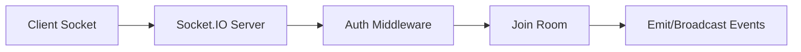

# Day 036 [Intermediate]: WebSockets with Socket.IO

## Index

- Goal
- Prerequisites
- Explanation
- Topic by Topic
- Key Concepts
- Visual Concept Map
- End-to-End Practical
- Hands-on Coding
- Mini Exercise
- Assessment Quiz
- Task
- Self Check
- Interview Questions and Answers
- Day Outcome

## Goal

Build real-time communication features in Node applications using Socket.IO with production-safe patterns.

## Prerequisites

- Day 035 testing fundamentals
- Basic HTTP and Express knowledge

## Explanation

WebSockets provide bidirectional communication between client and server. Socket.IO simplifies connection management, events, and reconnection handling.

## Topic by Topic

### Topic 1: Real-time Communication Basics

Theory:
Unlike request-response HTTP, WebSockets keep persistent connections.

Practical:
Emit real-time events when server state changes.

**Explanation:** Real-time communication basics matter because WebSockets and event-driven messaging behave differently from normal request-response APIs.

**Key Points:**

- Real-time systems keep connections open.
- Communication becomes event-based rather than request-based.
- This changes design and debugging patterns.

### Topic 2: Socket.IO Event Model

Theory:
Communication uses named events with payloads.

Practical:
Define consistent event names like `chat:message` and `user:typing`.

**Explanation:** The Socket.IO event model makes real-time flows easier to build by organizing communication around named events.

**Key Points:**

- Events are the main unit of communication.
- Clear event naming improves maintainability.
- Event contracts should be predictable.

### Topic 3: Rooms and Namespaces

Theory:
Rooms isolate groups of users (for example, one chat room per project).

Practical:
Join users to room-based channels and broadcast selectively.

**Explanation:** Rooms and namespaces help separate communication scope, which becomes important when apps support multiple users, channels, or contexts.

**Key Points:**

- Rooms help target subsets of connected users.
- Namespaces create broader separation when needed.
- Scope control improves real-time system clarity.

### Topic 4: Connection Lifecycle

Theory:
Handle connect, disconnect, and reconnect events explicitly.

Practical:
Track online users and cleanup session state.

**Explanation:** Connection lifecycle management matters because sockets connect, disconnect, reconnect, and fail in ways REST APIs do not.

**Key Points:**

- Plan for connect and disconnect behavior.
- Reconnection logic affects user experience.
- Lifecycle events are part of app correctness.

### Topic 5: Security and Validation

Theory:
Real-time channels need auth and input validation too.

Practical:
Authenticate sockets with JWT and validate payload schema.

**Explanation:** Security and validation matter because persistent connections can expose systems to abuse if payloads and access are not controlled carefully.

**Key Points:**

- Validate real-time inputs like API inputs.
- Secure connection establishment and events.
- Persistent connections need security discipline.

### Topic 6: Delivery Acknowledgement and Scaling Basics

Theory:
Real-time systems should confirm important message delivery and plan for multi-instance scaling.

Practical:
Use Socket.IO acknowledgements for critical events and shared adapter/pub-sub for scale.

## Socket Design Table

| Concern       | Recommendation                           |
| ------------- | ---------------------------------------- |
| Event naming  | Use domain-style names (`order:created`) |
| Payload shape | Keep consistent JSON contract            |
| Room strategy | Room per entity/project/user-group       |
| Auth          | Verify token on handshake                |

**Explanation:** Delivery acknowledgement and scaling basics are important because real-time systems must balance responsiveness with correctness and operational growth.

**Key Points:**

- Acknowledgements improve reliability.
- Scaling real-time systems needs planning.
- Delivery guarantees affect product behavior.

## Key Concepts

- Persistent connection model
- Event-driven real-time messaging
- Scoped broadcasting with rooms
- Reliable connection lifecycle handling
- Secure socket handshake patterns
- Event acknowledgement for critical actions
- Multi-instance realtime scaling awareness

## Visual Concept Map



## End-to-End Practical

1. Create Express + Socket.IO server.
2. Add JWT-based socket auth middleware.
3. Implement join room and message event.
4. Broadcast typing indicators.
5. Handle disconnect cleanup.

## Hands-on Coding

### Example 1: Case - Basic Socket Server Setup

Scenario:
Project app needs real-time status updates.

```js
const http = require("http");
const express = require("express");
const { Server } = require("socket.io");

const app = express();
const server = http.createServer(app);
const io = new Server(server, { cors: { origin: "*" } });

io.on("connection", (socket) => {
  console.log("connected", socket.id);
});
```

### Example 2: Case - Room-based Messaging

Scenario:
Team chat should broadcast only to selected room.

```js
io.on("connection", (socket) => {
  socket.on("chat:join", ({ roomId }) => {
    socket.join(roomId);
  });

  socket.on("chat:message", ({ roomId, text, user }) => {
    io.to(roomId).emit("chat:message", { text, user, at: Date.now() });
  });
});
```

### Example 3: Case - Socket Auth Middleware

Scenario:
Only authenticated users can connect.

```js
const jwt = require("jsonwebtoken");

io.use((socket, next) => {
  try {
    const token = socket.handshake.auth?.token;
    socket.user = jwt.verify(token, process.env.JWT_ACCESS_SECRET);
    next();
  } catch {
    next(new Error("Unauthorized"));
  }
});
```

### Example 4: Case - Event Acknowledgement Callback

Scenario:
Client should know if message save succeeded.

```js
socket.on("chat:message", async (payload, ack) => {
  try {
    // save message in DB in real implementation
    io.to(payload.roomId).emit("chat:message", payload);
    ack({ ok: true });
  } catch {
    ack({ ok: false, error: "message_save_failed" });
  }
});
```

### Example 5: Case - Multi-instance Scaling Concept

Scenario:
App runs on multiple servers and events must reach all nodes.

```js
// Concept: use shared pub/sub adapter for cross-instance broadcasts
// so io.to(room).emit(...) works across all app instances.
```

## Mini Exercise

Scenario:
Build a live notification channel where users join personal rooms and receive `notification:new` events.

Expected output:

- Authenticated socket connection
- User-specific room subscription
- Targeted event broadcast

## Assessment Quiz

### Quiz Questions

1. Why prefer Socket.IO over polling for live features?
2. What is a room in Socket.IO?
3. True or False: WebSocket messages do not need validation.
4. Why handle disconnect events?
5. Why are event acknowledgements useful?

### Quiz Answers

1. Lower latency and efficient bidirectional communication.
2. A logical channel for scoped event broadcasting.
3. False.
4. To clean presence state and prevent stale sessions.
5. They confirm delivery/processing outcome for critical actions.

## Task

- Implement one room-based real-time feature
- Add handshake auth and event validation
- Complete mini exercise and quiz

## Self Check

- You can build and secure Socket.IO channels
- You can model event flows with rooms
- You can answer at least 4 out of 5 quiz questions

## Interview Questions and Answers

### Beginner

Question: What is the core benefit of WebSockets?

Answer: Persistent two-way communication for instant updates.

### Middle

Question: How do rooms improve real-time architecture?

Answer: They allow scoped broadcasts so only relevant clients receive events.

### Advanced

Question: What scaling concerns arise in Socket.IO systems?

Answer: Multi-instance synchronization, sticky sessions, and shared pub/sub for cross-node events.

## Day 036 Outcome

- You can design and implement practical Socket.IO features
- You can apply security and lifecycle best practices
- You are ready for a real-time chat mini project in Day 037
