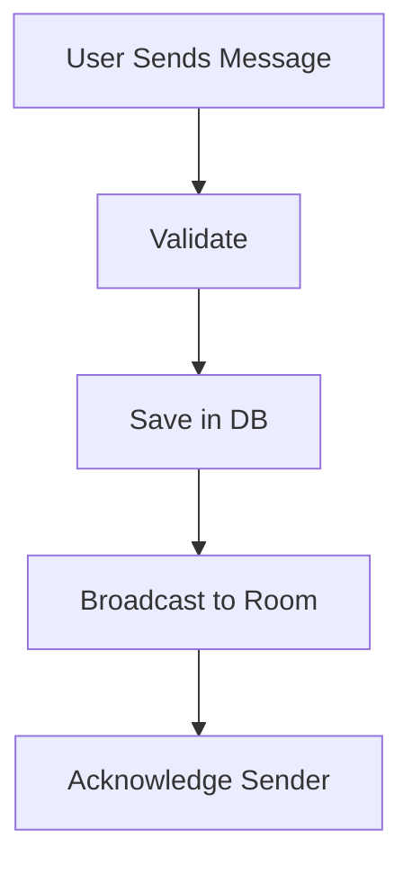

# Day 037 [Intermediate]: Real-time Chat Mini Project

## Index

- Goal
- Prerequisites
- Explanation
- Topic by Topic
- Key Concepts
- Visual Concept Map
- End-to-End Practical
- Hands-on Coding
- Mini Exercise
- Assessment Quiz
- Task
- Self Check
- Interview Questions and Answers
- Day Outcome

## Goal

Build a production-style real-time chat mini project using Socket.IO, room management, and persistence strategy.

## Prerequisites

- Day 036 Socket.IO fundamentals
- Basic database CRUD skills

## Explanation

This mini project combines sockets, auth, room design, and message persistence into a realistic backend collaboration feature.

## Topic by Topic

### Topic 1: Project Architecture

Theory:
Split responsibilities: socket gateway, message service, persistence layer.

Practical:
Keep event handlers lightweight and delegate logic to services.

**Explanation:** Project architecture matters because a chat system combines sockets, message handling, presence, and persistence concerns in one product flow.

**Key Points:**

- Clear architecture keeps the mini project manageable.
- Separate connection, message, and user concerns.
- Structure affects how easy the project is to extend.

### Topic 2: Message Lifecycle

Theory:
Message flow: validate -> persist -> broadcast -> acknowledge.

Practical:
Emit confirmation to sender and broadcast to room.

**Explanation:** Message lifecycle design matters because sending, receiving, confirming, and storing messages involve more than just one event.

**Key Points:**

- Model messages as part of a lifecycle.
- Think beyond send-only behavior.
- Reliability improves when lifecycle states are explicit.

### Topic 3: Presence and Typing Indicators

Theory:
Presence is volatile state and should be managed in memory/cache.

Practical:
Track online user list by room.

**Explanation:** Presence and typing indicators improve user experience, but they also require careful event design to avoid noisy or misleading updates.

**Key Points:**

- Presence state should reflect reality closely.
- Typing signals should remain lightweight.
- UX events still need clean system rules.

### Topic 4: Delivery and Reliability

Theory:
Real-time delivery can fail due to disconnects.

Practical:
Support message fetch on reconnect from DB.

**Explanation:** Delivery and reliability matter because users expect chat to feel immediate while still avoiding dropped or duplicated messages.

**Key Points:**

- Real-time UX depends on reliable delivery.
- Reliability requires more than fast message send.
- Delivery behavior should be intentional.

### Topic 5: Moderation and Safety

Theory:
Chat systems need spam filtering and abuse controls.

Practical:
Add rate limit and content validation per socket.

**Explanation:** Moderation and safety matter because chat systems often become abuse targets if guardrails are not considered early.

**Key Points:**

- Safety features matter even in small chat systems.
- Moderate harmful or invalid behavior deliberately.
- Product quality includes misuse prevention.

### Topic 6: Ordering and Delivery Acknowledgement

Theory:
In real chat systems, users care about message order and delivery confirmation.

Practical:
Store server timestamp/sequence and use ack callbacks for sender confirmation.

## Event Contract Table

| Event          | Direction        | Payload                  |
| -------------- | ---------------- | ------------------------ |
| `chat:join`    | client -> server | `{ roomId }`             |
| `chat:message` | client -> server | `{ roomId, text }`       |
| `chat:message` | server -> room   | `{ id, user, text, at }` |
| `chat:typing`  | client -> server | `{ roomId, isTyping }`   |

**Explanation:** Ordering and delivery acknowledgement matter because multi-user chat needs consistent sequencing and clear delivery feedback to feel trustworthy.

**Key Points:**

- Order matters in conversational systems.
- Acknowledgements improve user confidence.
- Correctness and UX are tightly connected here.

## Key Concepts

- Real-time project decomposition
- Durable message lifecycle design
- Presence and typing state management
- Reconnect recovery strategy
- Chat safety controls
- Message ordering and acknowledgement basics
- Maintainability and testing readiness

## Visual Concept Map



## End-to-End Practical

1. Create chat rooms and membership endpoints.
2. Add socket events for join/message/typing.
3. Persist messages to database.
4. Add reconnect message-sync endpoint.
5. Add basic anti-spam throttling.

## Hands-on Coding

### Example 1: Case - Persist then Broadcast

Scenario:
Chat message must not vanish after refresh.

```js
socket.on("chat:message", async ({ roomId, text }) => {
  if (!text?.trim()) return;

  const saved = await messageService.create({
    roomId,
    userId: socket.user.sub,
    text,
  });
  io.to(roomId).emit("chat:message", saved);
});
```

### Example 2: Case - Typing Indicator

Scenario:
Show typing status to room members.

```js
socket.on("chat:typing", ({ roomId, isTyping }) => {
  socket.to(roomId).emit("chat:typing", {
    userId: socket.user.sub,
    isTyping: Boolean(isTyping),
  });
});
```

### Example 3: Case - Reconnect Message Sync

Scenario:
User reconnects and requests missed messages.

```js
app.get("/api/v1/chat/:roomId/messages", authenticate, async (req, res) => {
  const since = Number(req.query.since || 0);
  const messages = await messageService.listAfter(req.params.roomId, since);
  res.json({ success: true, data: messages });
});
```

### Example 4: Case - Ack for Sender Confidence

Scenario:
Sender should know if the server accepted the message.

```js
socket.on("chat:message", async ({ roomId, text }, ack) => {
  try {
    const saved = await messageService.create({
      roomId,
      userId: socket.user.sub,
      text,
    });
    io.to(roomId).emit("chat:message", saved);
    ack?.({ ok: true, messageId: saved.id });
  } catch {
    ack?.({ ok: false, error: "message_not_saved" });
  }
});
```

### Example 5: Case - Stable Ordering Field

Scenario:
Two users send messages at nearly same time.

```js
// Save an increasing server-side ordering field (for example, createdAt or seq)
// and always return history sorted by that field.
const messages = await messageService.list({
  roomId,
  orderBy: "createdAt:asc",
});
```

## Mini Exercise

Scenario:
Build room-based chat with durable message history and typing indicators.

Expected output:

- Join and message flow works in real time
- Messages remain available after reconnect
- Typing indicator and validation included

## Assessment Quiz

### Quiz Questions

1. Why should chat messages be persisted before broadcast?
2. What is one strategy for reconnect recovery?
3. True or False: Skipping edge-case handling is acceptable in production.
4. Why separate socket handlers from business services?
5. Why is message acknowledgement useful?

### Quiz Answers

1. To prevent message loss and support history retrieval.
2. Fetch messages since last known timestamp or id.
3. False.
4. It keeps architecture maintainable and testable.
5. It confirms that server accepted or rejected a message clearly.

## Task

- Build one chat room mini project end-to-end
- Add one reliability enhancement for reconnect users
- Complete mini exercise and quiz.

## Self Check

- You can build a durable real-time chat backend.
- You can reason about reliability and scaling concerns.
- You can answer at least 4 out of 5 quiz questions.

## Interview Questions and Answers

### Beginner

Question: What is the most common first mistake in chat backend design?

Answer: Broadcasting messages without durable persistence and recovery flow.

### Middle

Question: Why does a chat project need both HTTP and WebSocket endpoints?

Answer: WebSocket handles live events; HTTP handles history, bootstrap, and admin operations.

### Advanced

Question: What is one key tradeoff in chat systems?

Answer: Lower latency and richer UX versus higher infrastructure and state-management complexity.

## Day 037 Outcome

- You can deliver a full real-time chat mini project
- You can improve resilience for reconnect and persistence
- You are ready for Redis caching strategies in Day 038
