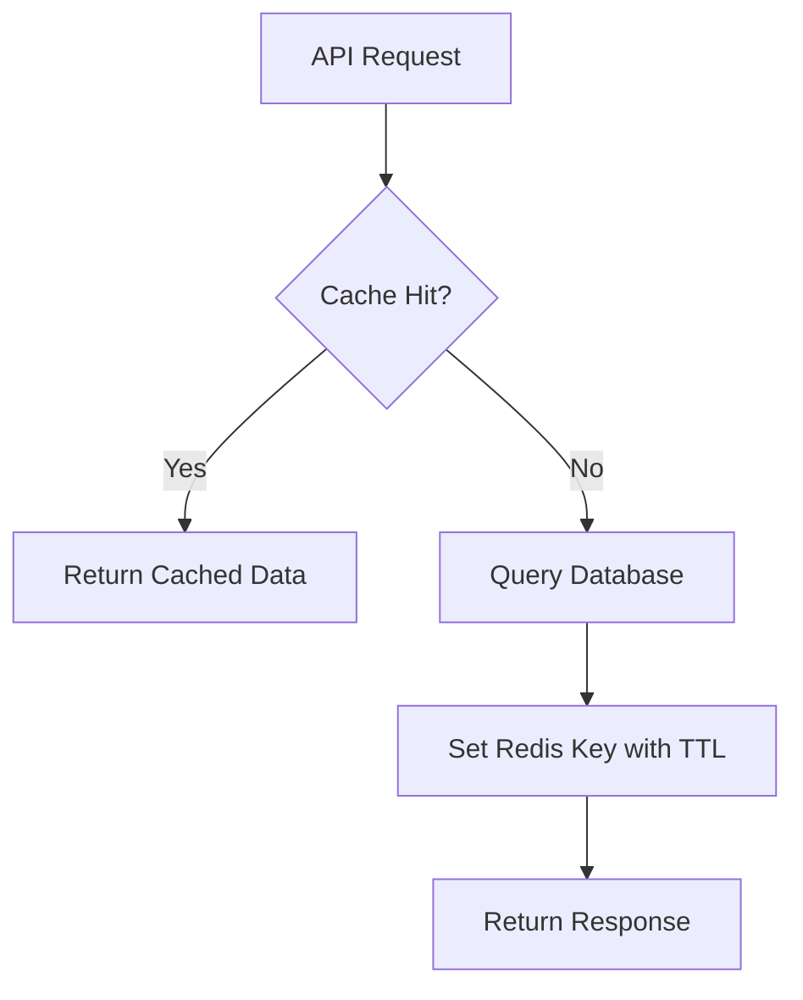

# Day 038 [Intermediate]: Caching with Redis

## Index

- Goal
- Prerequisites
- Explanation
- Topic by Topic
- Key Concepts
- Visual Concept Map
- End-to-End Practical
- Hands-on Coding
- Mini Exercise
- Assessment Quiz
- Task
- Self Check
- Interview Questions and Answers
- Day Outcome

## Goal

Apply Redis caching patterns to improve API performance while maintaining data correctness.

## Prerequisites

- Day 037 mini-project patterns
- Basic database query behavior understanding

## Explanation

Redis is an in-memory datastore used to cache frequently requested data, reducing database load and improving response time.

## Topic by Topic

### Topic 1: Caching Fundamentals

Theory:
Cache stores computed or frequently read data for quick retrieval.

Practical:
Use cache-aside pattern in read-heavy endpoints.

**Explanation:** Caching fundamentals matter because caching is a core technique for reducing repeated expensive work and improving response speed.

**Key Points:**

- Caching trades freshness for speed strategically.
- It reduces load on slower systems.
- Not every value should be cached the same way.

### Topic 2: TTL and Expiry Strategy

Theory:
TTL controls staleness and memory usage.

Practical:
Define TTL by business freshness requirements.

**Explanation:** TTL and expiry strategy determine how long cached data stays useful before it risks becoming stale.

**Key Points:**

- Expiry should match data freshness needs.
- TTL choices affect correctness and performance.
- Good expiry strategy prevents stale-cache surprises.

### Topic 3: Cache Invalidation

Theory:
Invalidation is the hardest caching problem.

Practical:
Delete or refresh relevant keys on write operations.

**Explanation:** Cache invalidation is one of the hardest caching problems because data must stay both fast and correct as it changes.

**Key Points:**

- Plan invalidation as part of design, not later.
- Stale data can be a correctness bug.
- Invalidation rules should be explicit.

### Topic 4: Key Design

Theory:
Consistent key naming prevents collisions and confusion.

Practical:
Use namespaced keys like `product:list:category:books`.

**Explanation:** Key design matters because poor cache keys create collisions, duplication, or lookup confusion.

**Key Points:**

- Use clear and stable cache keys.
- Key naming should reflect data identity.
- Key structure affects maintainability.

### Topic 5: Failure Handling

Theory:
Redis outage should degrade gracefully, not break app.

Practical:
Fallback to DB when cache is unavailable.

**Explanation:** Failure handling matters because systems should keep working reasonably even when Redis or the cache layer is unavailable.

**Key Points:**

- Plan behavior when cache access fails.
- Cache outages should not always become full app outages.
- Failure strategy is part of resilient design.

### Topic 6: Cache Stampede and Hot-key Control

Theory:
When a hot key expires, many requests can hit DB at once (stampede).

Practical:
Use short lock/single-flight logic so one request refreshes cache while others wait briefly.

## Cache Pattern Table

| Pattern        | When to Use                | Tradeoff                  |
| -------------- | -------------------------- | ------------------------- |
| Cache-aside    | Read-heavy APIs            | Possible stale reads      |
| Write-through  | Stronger consistency needs | Higher write latency      |
| TTL-only cache | Simpler systems            | Less precise invalidation |

**Explanation:** Cache stampede and hot-key control matter because popularity spikes and synchronized expiry can overwhelm backing systems.

**Key Points:**

- Prevent many clients from missing the same key at once.
- Hot keys need special attention at scale.
- Caching problems can become load problems quickly.

## Key Concepts

- Cache-aside workflow
- Expiry and staleness tradeoffs
- Invalidation strategies
- Keyspace design discipline
- Graceful fallback behavior
- Stampede protection for hot keys
- Data freshness with controlled refresh

## Visual Concept Map



## End-to-End Practical

1. Connect Redis client.
2. Implement cache-aside for products listing.
3. Add TTL for cached keys.
4. Invalidate keys on create/update/delete.
5. Add metrics for hit/miss rates.

## Hands-on Coding

### Example 1: Case - Cache-aside Read Endpoint

Scenario:
Product listing endpoint is frequently called.

```js
const key = `product:list:${category || "all"}`;

const cached = await redis.get(key);
if (cached)
  return res.json({ success: true, source: "cache", data: JSON.parse(cached) });

const products = await productService.list({ category });
await redis.set(key, JSON.stringify(products), { EX: 120 });
res.json({ success: true, source: "db", data: products });
```

### Example 2: Case - Invalidate on Update

Scenario:
Product update should not serve stale cache.

```js
await productService.update(productId, payload);
await redis.del("product:list:all");
await redis.del(`product:detail:${productId}`);
```

### Example 3: Case - Graceful Redis Fallback

Scenario:
Redis temporarily unavailable during traffic spike.

```js
let products;
try {
  const hit = await redis.get("product:list:all");
  if (hit) return res.json(JSON.parse(hit));
} catch (error) {
  logger.warn({ error: error.message }, "cache.unavailable");
}

products = await productService.list();
res.json(products);
```

### Example 4: Case - Simple Stampede Guard

Scenario:
Many requests miss same key after TTL expiry.

```js
const cacheKey = "product:list:all";
const lockKey = `${cacheKey}:lock`;

const cached = await redis.get(cacheKey);
if (cached) return res.json(JSON.parse(cached));

const gotLock = await redis.set(lockKey, "1", { NX: true, EX: 5 });
if (gotLock) {
  const fresh = await productService.list();
  await redis.set(cacheKey, JSON.stringify(fresh), { EX: 120 });
  await redis.del(lockKey);
  return res.json(fresh);
}

const retry = await redis.get(cacheKey);
if (retry) return res.json(JSON.parse(retry));
return res.json(await productService.list());
```

### Example 5: Case - Versioned Cache Key

Scenario:
Schema changed and old cached payload should be ignored safely.

```js
const version = "v2";
const key = `product:list:${version}:${category || "all"}`;
```

## Mini Exercise

Scenario:
Add Redis caching to users list endpoint with key invalidation and fallback behavior.

Expected output:

- Endpoint returns cache hit and miss paths
- Update invalidates affected keys
- Redis outage fallback still serves data

## Assessment Quiz

### Quiz Questions

1. Why is cache invalidation critical?
2. What is cache-aside pattern?
3. True or False: Skipping edge-case handling is acceptable in production.
4. Why should cache keys be namespaced?
5. What problem does cache stampede protection solve?

### Quiz Answers

1. Without it, stale data can break user trust and correctness.
2. Read cache first, fallback to DB, then populate cache.
3. False.
4. To avoid collisions and simplify maintenance.
5. It prevents sudden DB overload when hot cache keys expire.

## Task

- Add one cached API endpoint using Redis
- Implement invalidation on write operation
- Complete mini exercise and quiz.

## Self Check

- You can design reliable Redis caching flows.
- You can balance performance and consistency.
- You can answer at least 4 out of 5 quiz questions.

## Interview Questions and Answers

### Beginner

Question: Why does caching improve performance?

Answer: In-memory reads are much faster than repeating heavy database queries.

### Middle

Question: Is longer TTL always better?

Answer: No, longer TTL may increase stale data risk.

### Advanced

Question: What is the main cache tradeoff?

Answer: Better speed versus additional complexity in invalidation and consistency management.

## Day 038 Outcome

- You can implement Redis caching with practical safety controls
- You can monitor and tune cache effectiveness
- You are ready for background jobs with BullMQ in Day 039
