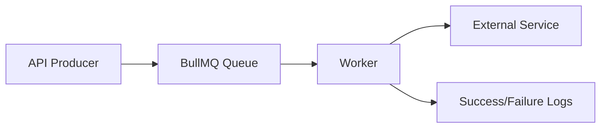

# Day 039 [Intermediate]: Background Jobs with BullMQ

## Index

- Goal
- Prerequisites
- Explanation
- Topic by Topic
- Key Concepts
- Visual Concept Map
- End-to-End Practical
- Hands-on Coding
- Mini Exercise
- Assessment Quiz
- Task
- Self Check
- Interview Questions and Answers
- Day Outcome

## Goal

Design and implement reliable background job processing with BullMQ for non-blocking backend workflows.

## Prerequisites

- Day 038 Redis caching fundamentals
- Basic async queue concepts

## Explanation

Background jobs move slow or retry-prone tasks (emails, report generation, webhooks) out of request path to improve API responsiveness and reliability.

## Topic by Topic

### Topic 1: Queue Fundamentals

Theory:
Producer enqueues jobs, worker consumes asynchronously.

Practical:
API returns fast while worker handles heavy task.

**Explanation:** Queue fundamentals matter because background jobs let systems move non-immediate work out of the main request path.

**Key Points:**

- Queues improve responsiveness for slow tasks.
- Background work still needs structure and reliability.
- Queue design affects system behavior significantly.

### Topic 2: Job Retry Strategy

Theory:
Temporary failures need retries with backoff.

Practical:
Configure attempts and exponential delay.

**Explanation:** Job retry strategy matters because background tasks often fail temporarily and need safe retry behavior.

**Key Points:**

- Retries should be deliberate, not infinite.
- Failure patterns shape retry rules.
- Retries can help or harm depending on design.

### Topic 3: Idempotency

Theory:
Duplicate job execution can happen and must be safe.

Practical:
Use idempotency keys for external side effects.

**Explanation:** Idempotency is important because retries and duplicate delivery are common in queue-based systems.

**Key Points:**

- Jobs may run more than once.
- Idempotent design prevents duplicate side effects.
- Reliable job systems assume repetition is possible.

### Topic 4: Monitoring and DLQ

Theory:
Failed jobs should be observable and recoverable.

Practical:
Capture failures and inspect dead-letter queues.

**Explanation:** Monitoring and dead-letter handling matter because failed background tasks must be visible and manageable.

**Key Points:**

- Failed jobs should not disappear silently.
- Monitoring keeps queue health visible.
- DLQ handling supports operational recovery.

### Topic 5: Queue Design at Scale

Theory:
Separate queues by workload type and priority.

Practical:
Use dedicated queues for emails, reports, and webhooks.

**Explanation:** Queue design at scale matters because job volume, priority, and worker behavior change system performance and reliability.

**Key Points:**

- Queue structure affects throughput.
- Scale introduces coordination challenges.
- Design queues for future growth, not only current volume.

### Topic 6: Worker Concurrency and Graceful Shutdown

Theory:
Workers should process enough jobs for throughput, but shutdown safely to avoid half-processed work.

Practical:
Set controlled concurrency and close workers cleanly on process signals.

## Job Configuration Table

| Setting          | Purpose                        |
| ---------------- | ------------------------------ |
| attempts         | Number of retries              |
| backoff          | Delay strategy between retries |
| removeOnComplete | Keep queue clean               |
| jobId            | Idempotency and dedupe control |

**Explanation:** Worker concurrency and graceful shutdown matter because job processors must scale safely without dropping or corrupting in-flight work.

**Key Points:**

- Concurrency affects throughput and safety.
- Shutdown should stop workers cleanly.
- Job infrastructure needs operational discipline.

## Key Concepts

- Producer-worker separation
- Retry and backoff behavior
- Idempotent job handling
- Queue observability
- Priority-based workload design
- Safe concurrency tuning
- Graceful worker shutdown

## Visual Concept Map



## End-to-End Practical

1. Create BullMQ queue and worker.
2. Enqueue email notification jobs from API.
3. Add retry and exponential backoff.
4. Add failed-job logging and alert.
5. Add idempotency guard for duplicate jobs.

## Hands-on Coding

### Example 1: Case - Queue and Producer

Scenario:
Order confirmation email should be processed asynchronously.

```js
const { Queue } = require("bullmq");

const emailQueue = new Queue("email-jobs", {
  connection: { host: "127.0.0.1", port: 6379 },
});

await emailQueue.add(
  "send-order-email",
  {
    orderId: "ORD-1001",
    to: "user@example.com",
  },
  {
    attempts: 3,
    backoff: { type: "exponential", delay: 2000 },
  },
);
```

### Example 2: Case - Worker Processor

Scenario:
Worker handles email sending and retries on failure.

```js
const { Worker } = require("bullmq");

const worker = new Worker(
  "email-jobs",
  async (job) => {
    await emailService.sendOrderConfirmation(job.data.to, job.data.orderId);
  },
  { connection: { host: "127.0.0.1", port: 6379 } },
);

worker.on("failed", (job, err) => {
  logger.error({ jobId: job.id, err: err.message }, "job.failed");
});
```

### Example 3: Case - Idempotent Job Key

Scenario:
Prevent duplicate email jobs for same order event.

```js
await emailQueue.add(
  "send-order-email",
  { orderId, to },
  { jobId: `order-email:${orderId}` },
);
```

### Example 4: Case - Worker Concurrency

Scenario:
Email traffic spikes during sale events.

```js
const worker = new Worker(
  "email-jobs",
  async (job) => {
    await emailService.sendOrderConfirmation(job.data.to, job.data.orderId);
  },
  {
    connection: { host: "127.0.0.1", port: 6379 },
    concurrency: 20,
  },
);
```

### Example 5: Case - Graceful Shutdown

Scenario:
App is restarting and should stop accepting new jobs safely.

```js
process.on("SIGTERM", async () => {
  await worker.close();
  await emailQueue.close();
  process.exit(0);
});
```

## Mini Exercise

Scenario:
Implement order-email background processing with retries and failed-job logging.

Expected output:

- API quickly enqueues jobs
- Worker retries temporary failures
- Duplicate job protection in place

## Assessment Quiz

### Quiz Questions

1. Why move heavy tasks to background jobs?
2. What does attempts + backoff provide?
3. True or False: Skipping edge-case handling is acceptable in production.
4. Why is idempotency important for job workers?
5. Why is graceful shutdown important for workers?

### Quiz Answers

1. Better API latency and resilient asynchronous processing.
2. Controlled retry behavior for transient failures.
3. False.
4. Retries can cause duplicate side effects without safeguards.
5. It prevents abrupt stop that can lose in-flight work or create inconsistent state.

## Task

- Build one producer-worker job flow with BullMQ
- Add retry, backoff, and idempotency guard
- Complete mini exercise and quiz.

## Self Check

- You can design non-blocking backend workflows.
- You can improve reliability through queue controls.
- You can answer at least 4 out of 5 quiz questions.

## Interview Questions and Answers

### Beginner

Question: What is the main purpose of BullMQ?

Answer: To process asynchronous tasks reliably outside request-response cycle.

### Middle

Question: Should every async task use a queue?

Answer: Not always; queues are best for heavy, retry-prone, or delayed tasks.

### Advanced

Question: What is queue architecture tradeoff?

Answer: Higher reliability and throughput with added operational complexity.

## Day 039 Outcome

- You can implement BullMQ workflows for backend reliability
- You can handle retries, failures, and idempotency correctly
- You are ready for email and notification orchestration in Day 040
