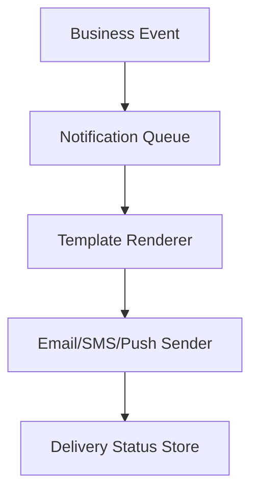

# Day 040 [Intermediate]: Email and Notification Workflows

## Index

- Goal
- Prerequisites
- Explanation
- Topic by Topic
- Key Concepts
- Visual Concept Map
- End-to-End Practical
- Hands-on Coding
- Mini Exercise
- Assessment Quiz
- Task
- Self Check
- Interview Questions and Answers
- Day Outcome

## Goal

Build reliable multi-channel email and notification workflows with templates, queues, and delivery tracking.

## Prerequisites

- Day 039 BullMQ queue workflows
- Basic understanding of transactional events

## Explanation

Production notification systems must be timely, retriable, observable, and user-preference aware. This lesson covers backend patterns for those requirements.

## Topic by Topic

### Topic 1: Notification Architecture

Theory:
Event-driven architecture decouples core actions from messaging side effects.

Practical:
Emit event on order/payment/signup and process asynchronously.

**Explanation:** Notification architecture matters because messaging workflows often touch multiple services, triggers, and delivery channels.

**Key Points:**

- Notifications are a system, not just one send call.
- Architecture affects reliability and maintainability.
- Good design supports multiple message types.

### Topic 2: Template and Personalization

Theory:
Templates keep notifications consistent and maintainable.

Practical:
Render dynamic placeholders like userName, orderId.

**Explanation:** Templates and personalization help notifications stay consistent while still feeling relevant to each user or event.

**Key Points:**

- Templates reduce repeated formatting logic.
- Personalization improves message usefulness.
- Keep dynamic content controlled and safe.

### Topic 3: Delivery Channels and Fallbacks

Theory:
Email, SMS, and push have different latency and reliability profiles.

Practical:
Fallback to secondary channel when primary fails critically.

**Explanation:** Delivery channels and fallbacks matter because email, SMS, push, and other options have different strengths and failure patterns.

**Key Points:**

- Match channel to use case and urgency.
- Fallbacks improve delivery resilience.
- Multi-channel systems need clear routing rules.

### Topic 4: User Preferences and Consent

Theory:
Users should control notification categories and channels.

Practical:
Respect opt-in and do-not-disturb rules.

**Explanation:** User preferences and consent are essential because notification systems must respect both product settings and privacy expectations.

**Key Points:**

- Let users control message preferences.
- Consent rules affect what can be sent.
- Respectful messaging is part of system quality.

### Topic 5: Tracking and Observability

Theory:
Track queued, sent, delivered, bounced, and failed states.

Practical:
Store delivery logs with correlation ids.

**Explanation:** Tracking and observability matter because delivery systems need visibility into sends, failures, opens, or bounce events.

**Key Points:**

- Observe notification success and failure paths.
- Tracking helps debugging and product insight.
- Visibility supports better operations.

### Topic 6: Idempotency and Provider Webhooks

Theory:
Notification providers send asynchronous webhooks (delivered, bounced, opened), and duplicates can happen.

Practical:
Use idempotency keys and dedupe webhook events before updating status.

## Channel Strategy Table

| Notification Type  | Preferred Channel | Fallback |
| ------------------ | ----------------- | -------- |
| Order confirmation | Email             | SMS      |
| OTP/Login alert    | SMS/Push          | Email    |
| Weekly digest      | Email             | None     |

**Explanation:** Idempotency and provider webhooks matter because delivery providers often send repeated events and asynchronous callbacks.

**Key Points:**

- Handle repeated events safely.
- Webhooks should be verified and processed carefully.
- Notification reliability depends on these patterns.

## Key Concepts

- Event-driven notification orchestration
- Template-driven messaging
- Channel fallback logic
- Preference-aware delivery
- Delivery state observability
- Idempotent send workflow
- Webhook-driven status reconciliation

## Visual Concept Map



## End-to-End Practical

1. Emit event from order service.
2. Enqueue notification job.
3. Render template with user context.
4. Send via preferred channel.
5. Persist delivery status and retry failures.

## Hands-on Coding

### Example 1: Case - Queue Notification Job

Scenario:
Order placement should trigger confirmation email asynchronously.

```js
await notificationQueue.add("order-confirmation", {
  userId,
  orderId,
  channel: "email",
});
```

### Example 2: Case - Render Template and Send

Scenario:
Worker uses template placeholders and delivery provider.

```js
const template = "Hi {{name}}, your order {{orderId}} is confirmed.";

function renderMessage(tpl, data) {
  return tpl
    .replace("{{name}}", data.name)
    .replace("{{orderId}}", data.orderId);
}

const message = renderMessage(template, { name: "Asha", orderId: "ORD-1020" });
await emailProvider.send({
  to: "asha@example.com",
  subject: "Order Confirmed",
  text: message,
});
```

### Example 3: Case - Preference and Fallback Logic

Scenario:
User disabled email for promos; fallback to push for account alerts.

```js
async function sendByPreference(user, payload) {
  if (payload.type === "promo" && !user.pref.emailPromo) return "skipped";

  try {
    return await emailProvider.send(payload);
  } catch {
    if (payload.type === "security-alert") {
      return pushProvider.send({ userId: user.id, text: payload.text });
    }
    throw new Error("delivery failed");
  }
}
```

### Example 4: Case - Idempotent Notification Job

Scenario:
Order event is retried by producer and should not send duplicate email.

```js
await notificationQueue.add(
  "order-confirmation",
  { userId, orderId, channel: "email" },
  { jobId: `notify:order-confirmation:${orderId}` },
);
```

### Example 5: Case - Webhook Dedupe Update

Scenario:
Provider sends same delivery event more than once.

```js
app.post("/webhooks/provider", async (req, res) => {
  const eventId = req.body.eventId;
  const alreadyProcessed = await webhookEventRepo.exists(eventId);
  if (alreadyProcessed) return res.status(200).json({ ok: true });

  await webhookEventRepo.save(eventId);
  await deliveryRepo.updateStatus(req.body.messageId, req.body.status);
  return res.status(200).json({ ok: true });
});
```

## Mini Exercise

Scenario:
Implement order notification pipeline with template rendering, retries, and delivery status tracking.

Expected output:

- Notification job queue wired to worker
- User preference checks applied
- Delivery status persisted and monitored

## Assessment Quiz

### Quiz Questions

1. Why should notifications usually be async jobs?
2. What is a template-driven notification benefit?
3. True or False: Skipping edge-case handling is acceptable in production.
4. Why track delivery states explicitly?
5. Why dedupe webhook events?

### Quiz Answers

1. Faster API response and resilient retry handling.
2. Reuse, consistency, and easier content updates.
3. False.
4. It enables troubleshooting and delivery analytics.
5. Providers may retry events, and dedupe avoids duplicate or incorrect status updates.

## Task

- Build one multi-step notification workflow
- Add preference filtering and fallback handling
- Complete mini exercise and quiz.

## Self Check

- You can design practical backend notification pipelines.
- You can improve reliability with queues and tracking.
- You can answer at least 4 out of 5 quiz questions.

## Interview Questions and Answers

### Beginner

Question: Why not send emails directly inside request handler?

Answer: It slows responses and fails badly during provider latency/outages.

### Middle

Question: Should every notification have fallback channel?

Answer: Not always; fallback should be based on message criticality and cost.

### Advanced

Question: What is the main notification-system tradeoff?

Answer: Better reliability and observability with higher orchestration complexity.

## Day 040 Outcome

- You can implement robust email and notification workflows
- You can design fallback and preference-aware delivery
- You are ready for observability and production operations topics next
