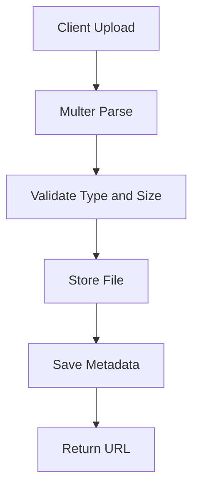

# Day 041 [Intermediate]: File Uploads and Storage

## Index

- Goal
- Prerequisites
- Explanation
- Topic by Topic
- Key Concepts
- Visual Concept Map
- End-to-End Practical
- Hands-on Coding
- Mini Exercise
- Assessment Quiz
- Task
- Self Check
- Interview Questions and Answers
- Day Outcome

## Goal

Implement secure and scalable file upload workflows in Node APIs.

## Prerequisites

- Day 040 notification workflow basics
- Express middleware understanding

## Explanation

File uploads are common for profile photos, invoices, and reports. A robust implementation needs validation, size limits, safe naming, and proper storage decisions.

## Topic by Topic

### Topic 1: Upload Pipeline Basics

Theory:
File upload pipeline includes parsing multipart form data, validation, storage, and metadata persistence.

Practical:
Use multer middleware for controlled upload parsing.

**Explanation:**
This topic explains Upload Pipeline Basics in a practical Node.js backend context so you can build reliable, production-ready APIs and services.

**Key Points:**
- Understand the core idea behind Upload Pipeline Basics.
- Apply the practical pattern with safe defaults and validation.
- Keep the implementation observable, maintainable, and secure where relevant.

### Topic 2: Validation and Limits

Theory:
Validate file type, size, and count to reduce abuse and storage waste.

Practical:
Reject unsupported MIME types and oversize files.

**Explanation:**
This topic explains Validation and Limits in a practical Node.js backend context so you can build reliable, production-ready APIs and services.

**Key Points:**
- Understand the core idea behind Validation and Limits.
- Apply the practical pattern with safe defaults and validation.
- Keep the implementation observable, maintainable, and secure where relevant.

### Topic 3: Local vs Cloud Storage

Theory:
Local disk is simple for development; cloud storage is better for distributed production setups.

Practical:
Abstract storage adapter to switch between local and cloud.

**Explanation:**
This topic explains Local vs Cloud Storage in a practical Node.js backend context so you can build reliable, production-ready APIs and services.

**Key Points:**
- Understand the core idea behind Local vs Cloud Storage.
- Apply the practical pattern with safe defaults and validation.
- Keep the implementation observable, maintainable, and secure where relevant.

### Topic 4: Metadata Management

Theory:
Store file metadata (name, owner, URL, size, contentType) in DB.

Practical:
Create file record after successful storage.

**Explanation:**
This topic explains Metadata Management in a practical Node.js backend context so you can build reliable, production-ready APIs and services.

**Key Points:**
- Understand the core idea behind Metadata Management.
- Apply the practical pattern with safe defaults and validation.
- Keep the implementation observable, maintainable, and secure where relevant.

### Topic 5: Security Controls

Theory:
Never trust filename or MIME from client without checks.

Practical:
Use generated names, scan where required, and restrict public access.

**Explanation:**
This topic explains Security Controls in a practical Node.js backend context so you can build reliable, production-ready APIs and services.

**Key Points:**
- Understand the core idea behind Security Controls.
- Apply the practical pattern with safe defaults and validation.
- Keep the implementation observable, maintainable, and secure where relevant.

### Topic 6: Content Verification and Secure File Access

Theory:
MIME type from client can be spoofed. File access should also verify ownership.

Practical:
Check file signature (magic bytes) for sensitive uploads and enforce auth on download endpoints.

**Explanation:**
This topic explains Content Verification and Secure File Access in a practical Node.js backend context so you can build reliable, production-ready APIs and services.

**Key Points:**
- Understand the core idea behind Content Verification and Secure File Access.
- Apply the practical pattern with safe defaults and validation.
- Keep the implementation observable, maintainable, and secure where relevant.

## Storage Decision Table

| Option               | Best For                  | Limitation                       |
| -------------------- | ------------------------- | -------------------------------- |
| Local disk           | Dev and small deployments | Hard to scale across instances   |
| Cloud object storage | Production scale and CDN  | More setup and policy complexity |

## Key Concepts

- Multipart upload handling
- Size/type validation strategies
- Storage abstraction pattern
- Metadata persistence
- Upload security best practices
- Signature-level content verification
- Authorized file retrieval patterns

## Visual Concept Map



## End-to-End Practical

1. Create upload endpoint.
2. Add file validation middleware.
3. Store file in chosen backend.
4. Save metadata in database.
5. Return secure file reference.

## Hands-on Coding

### Example 1: Case - Multer Setup with Limits

Scenario:
User profile image upload must limit size and file type.

```js
const multer = require("multer");

const upload = multer({
  storage: multer.memoryStorage(),
  limits: { fileSize: 2 * 1024 * 1024 },
  fileFilter: (req, file, cb) => {
    const allowed = ["image/png", "image/jpeg", "image/webp"];
    cb(null, allowed.includes(file.mimetype));
  },
});

app.post("/api/v1/upload/avatar", upload.single("avatar"), handler);
```

### Example 2: Case - Safe Filename and Local Storage

Scenario:
Local storage is used for staging environment.

```js
const fs = require("fs/promises");
const path = require("path");
const crypto = require("crypto");

async function saveLocalFile(file) {
  const ext = file.originalname.split(".").pop();
  const fileName = `${crypto.randomUUID()}.${ext}`;
  const fullPath = path.join(process.cwd(), "uploads", fileName);
  await fs.mkdir(path.dirname(fullPath), { recursive: true });
  await fs.writeFile(fullPath, file.buffer);
  return { fileName, fullPath };
}
```

### Example 3: Case - Metadata Persistence

Scenario:
API returns persisted metadata record for future retrieval.

```js
app.post("/api/v1/upload/avatar", upload.single("avatar"), async (req, res) => {
  const stored = await saveLocalFile(req.file);
  const record = await FileAsset.create({
    ownerId: req.user.sub,
    fileName: stored.fileName,
    mimeType: req.file.mimetype,
    size: req.file.size,
  });

  res.status(201).json({ success: true, data: record });
});
```

### Example 4: Case - Magic-byte Verification (Simple)

Scenario:
Reject files that pretend to be images by MIME only.

```js
function isPng(buffer) {
  const pngHeader = [0x89, 0x50, 0x4e, 0x47];
  return pngHeader.every((byte, idx) => buffer[idx] === byte);
}

if (req.file.mimetype === "image/png" && !isPng(req.file.buffer)) {
  return res
    .status(400)
    .json({ success: false, message: "Invalid PNG content" });
}
```

### Example 5: Case - Authorized File Download

Scenario:
Only owner of file can request download URL.

```js
app.get("/api/v1/files/:id", authenticate, async (req, res) => {
  const file = await FileAsset.findById(req.params.id);
  if (!file || file.ownerId !== req.user.sub) {
    return res.status(404).json({ success: false, message: "File not found" });
  }
  res.json({ success: true, data: file });
});
```

## Mini Exercise

Scenario:
Build a document upload endpoint that accepts only PDF files up to 5MB and stores metadata in DB.

Expected output:

- Upload endpoint with multer validation
- Stored file reference
- Metadata record with owner and size

## Assessment Quiz

### Quiz Questions

1. Why validate file type and size on server side?
2. What is one advantage of memoryStorage in multer?
3. True or False: Client-provided filename is always safe to store directly.
4. Why keep upload metadata in DB?
5. Why is ownership check important on file read endpoints?

### Quiz Answers

1. To prevent abuse and malicious uploads.
2. Easy processing before final storage destination.
3. False.
4. For ownership, audit, and retrieval workflows.
5. It prevents unauthorized users from accessing private files.

## Task

- Implement one secure upload endpoint
- Add validation and metadata persistence
- Complete mini exercise and quiz

## Self Check

- You can build safe file upload APIs
- You can explain storage tradeoffs clearly
- You can answer at least 4 out of 5 quiz questions

## Interview Questions and Answers

### Beginner

Question: Why is file upload logic sensitive in backend systems?

Answer: It can introduce security and storage abuse risks if not validated.

### Middle

Question: How do you prevent filename collisions?

Answer: Generate server-side unique names using UUID or hash-based keys.

### Advanced

Question: What architecture helps switch storage providers later?

Answer: A storage adapter/service layer that abstracts file operations from route handlers.

## Day 041 Outcome

- You can implement secure upload and storage workflows
- You can persist and manage file metadata reliably
- You are ready for cloud object storage integration in Day 042
