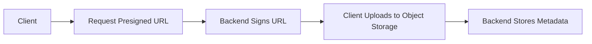

# Day 042 [Intermediate]: Cloud Object Storage Integration

## Index

- Goal
- Prerequisites
- Explanation
- Topic by Topic
- Key Concepts
- Visual Concept Map
- End-to-End Practical
- Hands-on Coding
- Mini Exercise
- Assessment Quiz
- Task
- Self Check
- Interview Questions and Answers
- Day Outcome

## Goal

Integrate Node APIs with cloud object storage for scalable file management.

## Prerequisites

- Day 041 file upload basics
- Basic cloud credentials and IAM awareness

## Explanation

Cloud object storage services such as AWS S3, GCP Cloud Storage, or Azure Blob are common production choices for durable and scalable file storage.

## Topic by Topic

### Topic 1: Object Storage Model

Theory:
Data is stored as objects in buckets/containers with metadata.

Practical:
Map uploaded files to object keys and metadata tags.

**Explanation:**
This topic explains Object Storage Model in a practical Node.js backend context so you can build reliable, production-ready APIs and services.

**Key Points:**
- Understand the core idea behind Object Storage Model.
- Apply the practical pattern with safe defaults and validation.
- Keep the implementation observable, maintainable, and secure where relevant.

### Topic 2: Upload Strategies

Theory:
Common options are server-proxy uploads and presigned direct uploads.

Practical:
Use presigned URLs for large client uploads.

**Explanation:**
This topic explains Upload Strategies in a practical Node.js backend context so you can build reliable, production-ready APIs and services.

**Key Points:**
- Understand the core idea behind Upload Strategies.
- Apply the practical pattern with safe defaults and validation.
- Keep the implementation observable, maintainable, and secure where relevant.

### Topic 3: Access Control and Security

Theory:
Use least privilege IAM and private buckets by default.

Practical:
Serve private files through signed URLs.

**Explanation:**
This topic explains Access Control and Security in a practical Node.js backend context so you can build reliable, production-ready APIs and services.

**Key Points:**
- Understand the core idea behind Access Control and Security.
- Apply the practical pattern with safe defaults and validation.
- Keep the implementation observable, maintainable, and secure where relevant.

### Topic 4: Performance and Cost

Theory:
Lifecycle and tiering policies impact storage cost.

Practical:
Move old objects to cold tier and auto-delete temporary files.

**Explanation:**
This topic explains Performance and Cost in a practical Node.js backend context so you can build reliable, production-ready APIs and services.

**Key Points:**
- Understand the core idea behind Performance and Cost.
- Apply the practical pattern with safe defaults and validation.
- Keep the implementation observable, maintainable, and secure where relevant.

### Topic 5: Failure Recovery

Theory:
Network failures and partial uploads must be handled.

Practical:
Add retries and idempotent key design.

**Explanation:**
This topic explains Failure Recovery in a practical Node.js backend context so you can build reliable, production-ready APIs and services.

**Key Points:**
- Understand the core idea behind Failure Recovery.
- Apply the practical pattern with safe defaults and validation.
- Keep the implementation observable, maintainable, and secure where relevant.

### Topic 6: Object Key Hygiene and Upload Confirmation

Theory:
Unsafe keys can cause collisions and confusing paths. Also, presign success does not guarantee upload completion.

Practical:
Generate normalized object keys server-side and confirm upload before marking file as ready.

**Explanation:**
This topic explains Object Key Hygiene and Upload Confirmation in a practical Node.js backend context so you can build reliable, production-ready APIs and services.

**Key Points:**
- Understand the core idea behind Object Key Hygiene and Upload Confirmation.
- Apply the practical pattern with safe defaults and validation.
- Keep the implementation observable, maintainable, and secure where relevant.

## Upload Strategy Table

| Strategy                | Best For                      | Tradeoff                     |
| ----------------------- | ----------------------------- | ---------------------------- |
| Server proxy upload     | Simpler control path          | Backend bandwidth usage      |
| Presigned direct upload | Large files, mobile/web scale | Extra client flow complexity |

## Key Concepts

- Cloud object storage fundamentals
- Presigned URL upload pattern
- Secure access with signed URLs
- Cost and lifecycle governance
- Resilient upload retry handling
- Safe object-key design
- Upload completion verification

## Visual Concept Map



## End-to-End Practical

1. Configure cloud SDK credentials securely.
2. Create endpoint for presigned upload URL.
3. Upload object from client using presigned URL.
4. Save object key metadata in DB.
5. Provide signed download URL for private access.

## Hands-on Coding

### Example 1: Case - Generate Presigned Upload URL

Scenario:
Frontend app uploads invoice files directly to object storage.

```js
const { S3Client, PutObjectCommand } = require("@aws-sdk/client-s3");
const { getSignedUrl } = require("@aws-sdk/s3-request-presigner");

const s3 = new S3Client({ region: process.env.AWS_REGION });

app.post("/api/v1/storage/presign", async (req, res) => {
  const key = `invoices/${Date.now()}-${req.body.fileName}`;
  const command = new PutObjectCommand({
    Bucket: process.env.S3_BUCKET,
    Key: key,
    ContentType: req.body.contentType,
  });

  const uploadUrl = await getSignedUrl(s3, command, { expiresIn: 300 });
  res.json({ success: true, key, uploadUrl });
});
```

### Example 2: Case - Signed Download URL

Scenario:
Private documents should be downloadable only by authorized users.

```js
const { GetObjectCommand } = require("@aws-sdk/client-s3");

app.get("/api/v1/storage/download-url/:key", authenticate, async (req, res) => {
  const command = new GetObjectCommand({
    Bucket: process.env.S3_BUCKET,
    Key: req.params.key,
  });

  const downloadUrl = await getSignedUrl(s3, command, { expiresIn: 120 });
  res.json({ success: true, downloadUrl });
});
```

### Example 3: Case - Metadata Record Write

Scenario:
After upload, backend records object metadata for querying.

```js
await FileAsset.create({
  ownerId: req.user.sub,
  objectKey: req.body.key,
  bucket: process.env.S3_BUCKET,
  contentType: req.body.contentType,
  size: req.body.size,
});
```

### Example 4: Case - Server-generated Safe Object Key

Scenario:
Prevent user-provided filenames from directly shaping storage paths.

```js
const crypto = require("crypto");

function buildObjectKey(folder, originalName) {
  const ext = (originalName.split(".").pop() || "bin").toLowerCase();
  return `${folder}/${crypto.randomUUID()}.${ext}`;
}
```

### Example 5: Case - Confirm Upload Before Finalize

Scenario:
Mark file as "ready" only after object exists in bucket.

```js
const { HeadObjectCommand } = require("@aws-sdk/client-s3");

app.post("/api/v1/storage/finalize", authenticate, async (req, res) => {
  await s3.send(
    new HeadObjectCommand({
      Bucket: process.env.S3_BUCKET,
      Key: req.body.key,
    }),
  );

  const record = await FileAsset.create({
    ownerId: req.user.sub,
    objectKey: req.body.key,
    status: "ready",
  });

  res.status(201).json({ success: true, data: record });
});
```

## Mini Exercise

Scenario:
Implement avatar upload via presigned URL with private download access.

Expected output:

- Presigned upload flow working
- Private file access via signed URL
- Metadata persistence complete

## Assessment Quiz

### Quiz Questions

1. Why prefer object storage over local disk in distributed systems?
2. What is a presigned URL?
3. True or False: Skipping edge-case handling is acceptable in production.
4. Why keep buckets private by default?
5. Why confirm upload completion before finalizing metadata?

### Quiz Answers

1. Better durability, scalability, and multi-instance consistency.
2. A temporary signed URL that permits specific object operation.
3. False.
4. Public exposure can leak sensitive files.
5. Presigned URL generation alone does not prove upload actually finished.

## Task

- Implement presigned upload and secure download flow
- Add metadata and access control checks
- Complete mini exercise and quiz.

## Self Check

- You can integrate cloud storage in production style
- You can secure access and optimize cost controls
- You can answer at least 4 out of 5 quiz questions.

## Interview Questions and Answers

### Beginner

Question: What is the key security rule for object storage?

Answer: Keep objects private by default and grant temporary access only when needed.

### Middle

Question: Why are presigned uploads popular for large file apps?

Answer: They offload file transfer from backend servers and scale better.

### Advanced

Question: What is one tradeoff of direct-to-cloud upload?

Answer: Better scalability with additional client/backend coordination complexity.

## Day 042 Outcome

- You can implement secure cloud file workflows
- You can reason about storage access and lifecycle design
- You are ready for GraphQL with Apollo in Day 043
