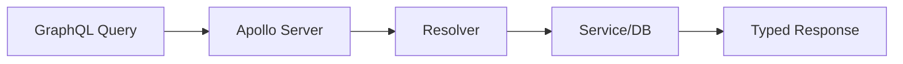

# Day 043 [Intermediate]: GraphQL Basics with Apollo

## Index

- Goal
- Prerequisites
- Explanation
- Topic by Topic
- Key Concepts
- Visual Concept Map
- End-to-End Practical
- Hands-on Coding
- Mini Exercise
- Assessment Quiz
- Task
- Self Check
- Interview Questions and Answers
- Day Outcome

## Goal

Build a practical GraphQL API using Apollo Server with query and mutation fundamentals.

## Prerequisites

- REST API and schema basics
- Day 042 storage integration concepts

## Explanation

GraphQL lets clients request exactly the data they need through a typed schema. Apollo Server offers a developer-friendly runtime for GraphQL APIs in Node.

## Topic by Topic

### Topic 1: GraphQL Mental Model

Theory:
Schema defines types and operations (Query and Mutation).

Practical:
Model domain objects and expose focused operations.

**Explanation:**
This topic explains GraphQL Mental Model in a practical Node.js backend context so you can build reliable, production-ready APIs and services.

**Key Points:**
- Understand the core idea behind GraphQL Mental Model.
- Apply the practical pattern with safe defaults and validation.
- Keep the implementation observable, maintainable, and secure where relevant.

### Topic 2: Apollo Server Setup

Theory:
Apollo binds schema and resolvers into executable API.

Practical:
Start a minimal Apollo server integrated with Express.

**Explanation:**
This topic explains Apollo Server Setup in a practical Node.js backend context so you can build reliable, production-ready APIs and services.

**Key Points:**
- Understand the core idea behind Apollo Server Setup.
- Apply the practical pattern with safe defaults and validation.
- Keep the implementation observable, maintainable, and secure where relevant.

### Topic 3: Query and Mutation Patterns

Theory:
Use Query for reads and Mutation for writes.

Practical:
Implement product list query and create product mutation.

**Explanation:**
This topic explains Query and Mutation Patterns in a practical Node.js backend context so you can build reliable, production-ready APIs and services.

**Key Points:**
- Understand the core idea behind Query and Mutation Patterns.
- Apply the practical pattern with safe defaults and validation.
- Keep the implementation observable, maintainable, and secure where relevant.

### Topic 4: Context and Auth

Theory:
Context carries user/session info into resolvers.

Practical:
Attach authenticated user in Apollo context.

**Explanation:**
This topic explains Context and Auth in a practical Node.js backend context so you can build reliable, production-ready APIs and services.

**Key Points:**
- Understand the core idea behind Context and Auth.
- Apply the practical pattern with safe defaults and validation.
- Keep the implementation observable, maintainable, and secure where relevant.

### Topic 5: Error Handling and Validation

Theory:
Typed API still needs business validation.

Practical:
Throw clear GraphQL errors for invalid input.

**Explanation:**
This topic explains Error Handling and Validation in a practical Node.js backend context so you can build reliable, production-ready APIs and services.

**Key Points:**
- Understand the core idea behind Error Handling and Validation.
- Apply the practical pattern with safe defaults and validation.
- Keep the implementation observable, maintainable, and secure where relevant.

### Topic 6: Query Cost and Depth Control

Theory:
Flexible queries are powerful, but very deep or very large queries can overload server resources.

Practical:
Set depth and complexity limits for safer production usage.

**Explanation:**
This topic explains Query Cost and Depth Control in a practical Node.js backend context so you can build reliable, production-ready APIs and services.

**Key Points:**
- Understand the core idea behind Query Cost and Depth Control.
- Apply the practical pattern with safe defaults and validation.
- Keep the implementation observable, maintainable, and secure where relevant.

## REST vs GraphQL Snapshot

| Concern               | REST    | GraphQL |
| --------------------- | ------- | ------- |
| Over-fetch control    | Lower   | Higher  |
| Single endpoint model | No      | Yes     |
| Schema introspection  | Limited | Native  |

## Key Concepts

- Schema-first API design
- Apollo resolver wiring
- Query and mutation separation
- Context-based auth integration
- GraphQL error surface design
- Query-depth safety controls
- Maintainability and testing readiness

## Visual Concept Map



## End-to-End Practical

1. Define schema types and operations.
2. Implement resolvers for query and mutation.
3. Attach auth context.
4. Add validation and error handling.
5. Test via GraphQL playground/client.

## Hands-on Coding

### Example 1: Case - Schema and Resolver Basics

Scenario:
Catalog team needs flexible product querying for web and mobile.

```js
const typeDefs = `#graphql
  type Product {
    id: ID!
    name: String!
    price: Float!
  }

  type Query {
    products: [Product!]!
  }
`;

const resolvers = {
  Query: {
    products: () => productService.list(),
  },
};
```

### Example 2: Case - Mutation with Input Validation

Scenario:
Product creation should reject invalid price.

```js
const typeDefs2 = `#graphql
  input CreateProductInput {
    name: String!
    price: Float!
  }

  type Mutation {
    createProduct(input: CreateProductInput!): Product!
  }
`;

const mutationResolvers = {
  Mutation: {
    createProduct: async (_, { input }) => {
      if (input.price <= 0) throw new Error("price must be positive");
      return productService.create(input);
    },
  },
};
```

### Example 3: Case - Context-based Auth Check

Scenario:
Only admin users can create products.

```js
createProduct: async (_, { input }, context) => {
  if (!context.user || context.user.role !== "admin") {
    throw new Error("forbidden");
  }
  return productService.create(input);
};
```

### Example 4: Case - Depth Limit Guard

Scenario:
Prevent extremely deep nested queries from consuming too many resources.

```js
const depthLimit = require("graphql-depth-limit");

const server = new ApolloServer({
  typeDefs,
  resolvers,
  validationRules: [depthLimit(6)],
});
```

### Example 5: Case - Typed GraphQL Error

Scenario:
Client should distinguish validation errors from unknown server failures.

```js
const { GraphQLError } = require("graphql");

if (input.price <= 0) {
  throw new GraphQLError("price must be positive", {
    extensions: { code: "BAD_USER_INPUT" },
  });
}
```

## Mini Exercise

Scenario:
Build GraphQL products API with list query and admin-protected create mutation.

Expected output:

- Query and mutation both functional
- Validation error path tested
- Auth check integrated in resolver context

## Assessment Quiz

### Quiz Questions

1. Why might clients prefer GraphQL over multiple REST endpoints?
2. What does Apollo context provide to resolvers?
3. True or False: Skipping edge-case handling is acceptable in production.
4. Why should schema design avoid over-generic types?
5. Why apply query depth limits in production?

### Quiz Answers

1. Single request can fetch exact required fields.
2. Shared request-specific data like auth user and services.
3. False.
4. It makes contracts unclear and harder to evolve safely.
5. To protect server resources from expensive or abusive query shapes.

## Task

- Build one GraphQL module with query and mutation
- Add validation and role-based mutation guard
- Complete mini exercise and quiz.

## Self Check

- You can set up Apollo with typed schema and resolvers.
- You can secure and validate GraphQL operations.
- You can answer at least 4 out of 5 quiz questions.

## Interview Questions and Answers

### Beginner

Question: What is one major benefit of GraphQL for frontend teams?

Answer: They can request precise fields without backend endpoint explosion.

### Middle

Question: Should GraphQL replace REST in all systems?

Answer: Not always; choice depends on client needs, team skill, and operational complexity.

### Advanced

Question: What is a common GraphQL tradeoff?

Answer: Flexible querying with extra complexity in caching, auth rules, and query cost control.

## Day 043 Outcome

- You can build practical GraphQL APIs with Apollo
- You can model secure query and mutation patterns
- You are ready for resolver and schema design depth in Day 044
