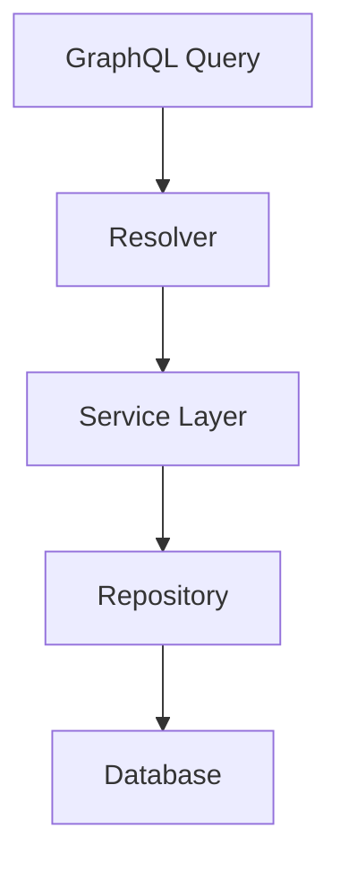

# Day 044 [Intermediate]: GraphQL Resolvers and Schema Design

## Index

- Goal
- Prerequisites
- Explanation
- Topic by Topic
- Key Concepts
- Visual Concept Map
- End-to-End Practical
- Hands-on Coding
- Mini Exercise
- Assessment Quiz
- Task
- Self Check
- Interview Questions and Answers
- Day Outcome

## Goal

Design maintainable GraphQL schemas and resolvers with strong boundaries, performance awareness, and clear contracts.

## Prerequisites

- Day 043 GraphQL Apollo basics
- Basic domain modeling experience

## Explanation

Schema and resolver quality directly impacts API usability, performance, and long-term evolution. Good design avoids breaking clients and reduces backend complexity.

## Topic by Topic

### Topic 1: Schema-first Domain Modeling

Theory:
Types should reflect domain language, not database table names.

Practical:
Define Product, Category, and User types with clear relationships.

**Explanation:**
This topic explains Schema-first Domain Modeling in a practical Node.js backend context so you can build reliable, production-ready APIs and services.

**Key Points:**
- Understand the core idea behind Schema-first Domain Modeling.
- Apply the practical pattern with safe defaults and validation.
- Keep the implementation observable, maintainable, and secure where relevant.

### Topic 2: Resolver Layering

Theory:
Resolvers should orchestrate, not contain heavy business logic.

Practical:
Delegate to services and repositories.

**Explanation:**
This topic explains Resolver Layering in a practical Node.js backend context so you can build reliable, production-ready APIs and services.

**Key Points:**
- Understand the core idea behind Resolver Layering.
- Apply the practical pattern with safe defaults and validation.
- Keep the implementation observable, maintainable, and secure where relevant.

### Topic 3: N+1 Query Problem

Theory:
Nested resolvers can trigger repeated DB calls.

Practical:
Use DataLoader for batched fetches.

**Explanation:**
This topic explains N+1 Query Problem in a practical Node.js backend context so you can build reliable, production-ready APIs and services.

**Key Points:**
- Understand the core idea behind N+1 Query Problem.
- Apply the practical pattern with safe defaults and validation.
- Keep the implementation observable, maintainable, and secure where relevant.

### Topic 4: Input Types and Validation

Theory:
Explicit input types improve readability and versioning.

Practical:
Use Create and Update input objects with clear required fields.

**Explanation:**
This topic explains Input Types and Validation in a practical Node.js backend context so you can build reliable, production-ready APIs and services.

**Key Points:**
- Understand the core idea behind Input Types and Validation.
- Apply the practical pattern with safe defaults and validation.
- Keep the implementation observable, maintainable, and secure where relevant.

### Topic 5: Schema Evolution

Theory:
Additive changes are safer than breaking removals.

Practical:
Deprecate fields before removal.

**Explanation:**
This topic explains Schema Evolution in a practical Node.js backend context so you can build reliable, production-ready APIs and services.

**Key Points:**
- Understand the core idea behind Schema Evolution.
- Apply the practical pattern with safe defaults and validation.
- Keep the implementation observable, maintainable, and secure where relevant.

### Topic 6: Pagination and Error Contract Discipline

Theory:
Large lists need predictable pagination, and clients need consistent error codes.

Practical:
Use cursor-based pagination for growth and standardized GraphQL error extensions.

**Explanation:**
This topic explains Pagination and Error Contract Discipline in a practical Node.js backend context so you can build reliable, production-ready APIs and services.

**Key Points:**
- Understand the core idea behind Pagination and Error Contract Discipline.
- Apply the practical pattern with safe defaults and validation.
- Keep the implementation observable, maintainable, and secure where relevant.

## Schema Design Checklist

| Rule                                 | Why it helps                |
| ------------------------------------ | --------------------------- |
| Use descriptive type names           | Better client understanding |
| Separate query and mutation payloads | Clear operation intent      |
| Avoid leaking DB internals           | Stable API contract         |
| Mark deprecated fields               | Safer evolution             |

## Key Concepts

- Domain-first schema modeling
- Thin resolver and service boundaries
- N+1 mitigation strategy
- Input contract clarity
- Backward-compatible schema evolution
- Pagination strategy for large datasets
- Consistent error contract for clients

## Visual Concept Map



## End-to-End Practical

1. Model schema for products and categories.
2. Implement query and mutation resolvers.
3. Add DataLoader for category lookup.
4. Add input validation and typed errors.
5. Mark one field deprecated and document migration path.

## Hands-on Coding

### Example 1: Case - Clean Schema Design

Scenario:
Marketplace API needs stable public contract.

```js
const typeDefs = `#graphql
  type Category {
    id: ID!
    name: String!
  }

  type Product {
    id: ID!
    name: String!
    price: Float!
    category: Category!
  }

  type Query {
    product(id: ID!): Product
    products(limit: Int = 20): [Product!]!
  }
`;
```

### Example 2: Case - Resolver Delegation

Scenario:
Keep resolver logic thin and testable.

```js
const resolvers = {
  Query: {
    products: (_, { limit }, { services }) =>
      services.productService.list({ limit }),
  },
  Product: {
    category: (product, _, { loaders }) =>
      loaders.categoryById.load(product.categoryId),
  },
};
```

### Example 3: Case - DataLoader for N+1 Prevention

Scenario:
Batch category lookups in one query.

```js
const DataLoader = require("dataloader");

const categoryById = new DataLoader(async (ids) => {
  const rows = await categoryRepo.findManyByIds(ids);
  const byId = new Map(rows.map((r) => [String(r.id), r]));
  return ids.map((id) => byId.get(String(id)) || null);
});
```

### Example 4: Case - Cursor Pagination Shape

Scenario:
Products list is growing and offset pagination becomes unstable.

```js
const typeDefs2 = `#graphql
  type ProductEdge {
    cursor: String!
    node: Product!
  }

  type ProductConnection {
    edges: [ProductEdge!]!
    hasNextPage: Boolean!
    endCursor: String
  }

  extend type Query {
    productsConnection(first: Int = 20, after: String): ProductConnection!
  }
`;
```

### Example 5: Case - Standard Error Code

Scenario:
Frontend should handle domain errors consistently.

```js
const { GraphQLError } = require("graphql");

if (!product) {
  throw new GraphQLError("product not found", {
    extensions: { code: "NOT_FOUND" },
  });
}
```

## Mini Exercise

Scenario:
Design a GraphQL schema for products and reviews with optimized nested resolver behavior.

Expected output:

- Clear schema and input contracts
- Resolvers delegated to services
- N+1 mitigation in nested fields

## Assessment Quiz

### Quiz Questions

1. Why should schema names align with domain language?
2. What causes N+1 in GraphQL?
3. True or False: Skipping edge-case handling is acceptable in production.
4. Why avoid heavy business logic directly in resolvers?
5. Why choose cursor pagination for large dynamic lists?

### Quiz Answers

1. It makes API easier for clients to understand and adopt.
2. Per-item nested fetches causing repeated queries.
3. False.
4. Harder testing and reduced reuse.
5. It handles inserts/deletes better and gives stable traversal at scale.

## Task

- Build one schema with nested relation and DataLoader
- Add one deprecation example in schema
- Complete mini exercise and quiz.

## Self Check

- You can design maintainable GraphQL contracts.
- You can implement scalable resolver patterns.
- You can answer at least 4 out of 5 quiz questions.

## Interview Questions and Answers

### Beginner

Question: Why is resolver architecture important?

Answer: It affects performance, maintainability, and correctness of GraphQL APIs.

### Middle

Question: What does DataLoader solve?

Answer: It batches and caches related fetches to prevent N+1 query issues.

### Advanced

Question: What is a key tradeoff in advanced schema design?

Answer: Better long-term API clarity with higher upfront modeling effort.

## Day 044 Outcome

- You can build scalable resolver and schema designs
- You can prevent common GraphQL performance pitfalls
- You are ready for gRPC and Protobuf fundamentals in Day 045
