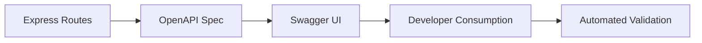

# Day 046 [Intermediate]: OpenAPI and Swagger Docs

## Index

- Goal
- Prerequisites
- Explanation
- Topic by Topic
- Key Concepts
- Visual Concept Map
- End-to-End Practical
- Hands-on Coding
- Mini Exercise
- Assessment Quiz
- Task
- Self Check
- Interview Questions and Answers
- Day Outcome

## Goal

Create accurate, production-friendly API documentation using OpenAPI and Swagger UI.

## Prerequisites

- Day 045 gRPC and protobuf basics
- REST endpoint design knowledge

## Explanation

OpenAPI gives a machine-readable contract for your API. Swagger UI turns that contract into interactive documentation for frontend teams, testers, and partners.

## Topic by Topic

### Topic 1: Contract-first API Documentation

Theory:
API docs should be source of truth, not an afterthought.

Practical:
Define paths, methods, schemas, and errors in OpenAPI spec.

**Explanation:**
This topic explains Contract-first API Documentation in a practical Node.js backend context so you can build reliable, production-ready APIs and services.

**Key Points:**
- Understand the core idea behind Contract-first API Documentation.
- Apply the practical pattern with safe defaults and validation.
- Keep the implementation observable, maintainable, and secure where relevant.

### Topic 2: Swagger UI Integration

Theory:
Swagger UI lets teams explore and test endpoints quickly.

Practical:
Mount Swagger UI route in Express app.

**Explanation:**
This topic explains Swagger UI Integration in a practical Node.js backend context so you can build reliable, production-ready APIs and services.

**Key Points:**
- Understand the core idea behind Swagger UI Integration.
- Apply the practical pattern with safe defaults and validation.
- Keep the implementation observable, maintainable, and secure where relevant.

### Topic 3: Request/Response Schema Modeling

Theory:
Reusable component schemas prevent duplication and drift.

Practical:
Create Product and ErrorResponse reusable schemas.

**Explanation:**
This topic explains Request/Response Schema Modeling in a practical Node.js backend context so you can build reliable, production-ready APIs and services.

**Key Points:**
- Understand the core idea behind Request/Response Schema Modeling.
- Apply the practical pattern with safe defaults and validation.
- Keep the implementation observable, maintainable, and secure where relevant.

### Topic 4: Security Documentation

Theory:
Auth flow must be documented for consumers.

Practical:
Add BearerAuth scheme and protected route examples.

**Explanation:**
This topic explains Security Documentation in a practical Node.js backend context so you can build reliable, production-ready APIs and services.

**Key Points:**
- Understand the core idea behind Security Documentation.
- Apply the practical pattern with safe defaults and validation.
- Keep the implementation observable, maintainable, and secure where relevant.

### Topic 5: Sync Strategy and Governance

Theory:
Outdated docs break integrations.

Practical:
Add CI check for OpenAPI validation and version updates.

**Explanation:**
This topic explains Sync Strategy and Governance in a practical Node.js backend context so you can build reliable, production-ready APIs and services.

**Key Points:**
- Understand the core idea behind Sync Strategy and Governance.
- Apply the practical pattern with safe defaults and validation.
- Keep the implementation observable, maintainable, and secure where relevant.

### Topic 6: Examples and Standard Error Contracts

Theory:
Good docs should show realistic request and response examples, including errors.

Practical:
Add reusable error schema and example payloads for common status codes.

**Explanation:**
This topic explains Examples and Standard Error Contracts in a practical Node.js backend context so you can build reliable, production-ready APIs and services.

**Key Points:**
- Understand the core idea behind Examples and Standard Error Contracts.
- Apply the practical pattern with safe defaults and validation.
- Keep the implementation observable, maintainable, and secure where relevant.

## OpenAPI Essentials Table

| Section                      | Purpose                            |
| ---------------------------- | ---------------------------------- |
| `paths`                      | Endpoint operations                |
| `components.schemas`         | Reusable data models               |
| `components.securitySchemes` | Auth definitions                   |
| `responses`                  | Standardized success/error outputs |

## Key Concepts

- Contract-driven API collaboration
- Interactive API discovery
- Reusable schema components
- Security and auth documentation
- Documentation quality governance
- Example-driven API usability
- Standardized error response contracts

## Visual Concept Map



## End-to-End Practical

1. Add OpenAPI base spec.
2. Document one resource endpoints.
3. Add reusable schemas and error responses.
4. Integrate Swagger UI route.
5. Validate spec in CI step.

## Hands-on Coding

### Example 1: Case - Basic OpenAPI Spec in Express

Scenario:
Internal API team needs discoverable docs for products service.

```js
const swaggerUi = require("swagger-ui-express");

const openapiSpec = {
  openapi: "3.0.3",
  info: { title: "Products API", version: "1.0.0" },
  paths: {
    "/api/v1/products": {
      get: {
        summary: "List products",
        responses: {
          200: { description: "Success" },
        },
      },
    },
  },
};

app.use("/docs", swaggerUi.serve, swaggerUi.setup(openapiSpec));
```

### Example 2: Case - Reusable Component Schema

Scenario:
Multiple endpoints return product payload.

```js
openapiSpec.components = {
  schemas: {
    Product: {
      type: "object",
      required: ["id", "name", "price"],
      properties: {
        id: { type: "string" },
        name: { type: "string" },
        price: { type: "number" },
      },
    },
  },
};
```

### Example 3: Case - Bearer Auth Documentation

Scenario:
Profile endpoint requires JWT token.

```js
openapiSpec.components.securitySchemes = {
  BearerAuth: {
    type: "http",
    scheme: "bearer",
    bearerFormat: "JWT",
  },
};

openapiSpec.paths["/api/v1/me"] = {
  get: {
    security: [{ BearerAuth: [] }],
    responses: { 200: { description: "Current user profile" } },
  },
};
```

### Example 4: Case - Reusable Error Schema and Response

Scenario:
Frontend needs consistent error shape across endpoints.

```js
openapiSpec.components.schemas.ErrorResponse = {
  type: "object",
  required: ["success", "error"],
  properties: {
    success: { type: "boolean", example: false },
    error: {
      type: "object",
      required: ["code", "message"],
      properties: {
        code: { type: "string", example: "VALIDATION_ERROR" },
        message: { type: "string", example: "name is required" },
      },
    },
  },
};

openapiSpec.paths["/api/v1/products"].post = {
  summary: "Create product",
  responses: {
    201: { description: "Created" },
    400: {
      description: "Validation error",
      content: {
        "application/json": {
          schema: { $ref: "#/components/schemas/ErrorResponse" },
        },
      },
    },
  },
};
```

### Example 5: Case - OpenAPI Validation in CI

Scenario:
Block PR if API spec is invalid.

```json
{
  "scripts": {
    "openapi:validate": "swagger-cli validate openapi.yaml"
  }
}
```

## Mini Exercise

Scenario:
Document users API with list/create/get-by-id routes, reusable User schema, and bearer auth for protected route.

Expected output:

- Working Swagger UI at docs route
- Reusable schemas for request/response
- Security definitions included

## Assessment Quiz

### Quiz Questions

1. Why is OpenAPI valuable for team collaboration?
2. What does Swagger UI provide on top of OpenAPI JSON/YAML?
3. True or False: API docs can lag behind implementation safely.
4. Why define reusable component schemas?
5. Why include error examples in docs?

### Quiz Answers

1. It gives a clear, shared contract for consumers and producers.
2. Interactive documentation and request testing experience.
3. False.
4. To reduce duplication and ensure consistency.
5. They help clients implement correct failure handling quickly.

## Task

- Add OpenAPI docs for one existing module
- Include response schemas and auth section
- Complete mini exercise and quiz

## Self Check

- You can document endpoints using OpenAPI
- You can expose usable docs through Swagger UI
- You can answer at least 4 out of 5 quiz questions

## Interview Questions and Answers

### Beginner

Question: What is OpenAPI in simple terms?

Answer: A standard format to describe REST APIs in a machine-readable way.

### Middle

Question: How do you prevent documentation drift?

Answer: Keep docs in repo with CI validation and review updates in PRs.

### Advanced

Question: What governance model works for API contracts at scale?

Answer: Contract-first development, linting rules, versioning policy, and backward-compatibility checks.

## Day 046 Outcome

- You can create practical OpenAPI documentation for real APIs
- You can integrate Swagger UI and auth schema contracts
- You are ready for API versioning and deprecation in Day 047
