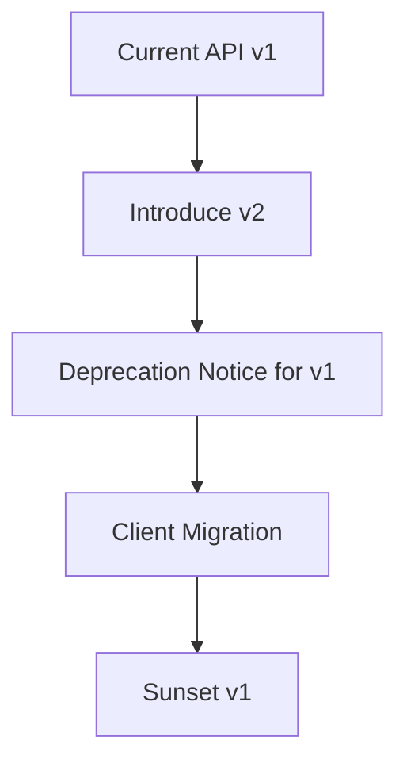

# Day 047 [Intermediate]: API Versioning and Deprecation

## Index

- Goal
- Prerequisites
- Explanation
- Topic by Topic
- Key Concepts
- Visual Concept Map
- End-to-End Practical
- Hands-on Coding
- Mini Exercise
- Assessment Quiz
- Task
- Self Check
- Interview Questions and Answers
- Day Outcome

## Goal

Design API evolution strategy with safe versioning, deprecation communication, and migration plans.

## Prerequisites

- Day 046 OpenAPI documentation
- Basic API lifecycle understanding

## Explanation

APIs evolve. Versioning and deprecation policies let you introduce improvements without breaking existing clients unexpectedly.

## Topic by Topic

### Topic 1: Why Version APIs

Theory:
Breaking changes need controlled rollout.

Practical:
Introduce v2 while supporting v1 during migration window.

**Explanation:**
This topic explains Why Version APIs in a practical Node.js backend context so you can build reliable, production-ready APIs and services.

**Key Points:**
- Understand the core idea behind Why Version APIs.
- Apply the practical pattern with safe defaults and validation.
- Keep the implementation observable, maintainable, and secure where relevant.

### Topic 2: Versioning Styles

Theory:
Common styles: URI versioning, header versioning, media-type versioning.

Practical:
Use URI versioning for clarity in beginner-to-mid APIs.

**Explanation:**
This topic explains Versioning Styles in a practical Node.js backend context so you can build reliable, production-ready APIs and services.

**Key Points:**
- Understand the core idea behind Versioning Styles.
- Apply the practical pattern with safe defaults and validation.
- Keep the implementation observable, maintainable, and secure where relevant.

### Topic 3: Deprecation Communication

Theory:
Clients need explicit notice and migration guidance.

Practical:
Return deprecation headers and changelog references.

**Explanation:**
This topic explains Deprecation Communication in a practical Node.js backend context so you can build reliable, production-ready APIs and services.

**Key Points:**
- Understand the core idea behind Deprecation Communication.
- Apply the practical pattern with safe defaults and validation.
- Keep the implementation observable, maintainable, and secure where relevant.

### Topic 4: Backward Compatibility Rules

Theory:
Additive changes are safer than removals/renames.

Practical:
Add new field before removing old one.

**Explanation:**
This topic explains Backward Compatibility Rules in a practical Node.js backend context so you can build reliable, production-ready APIs and services.

**Key Points:**
- Understand the core idea behind Backward Compatibility Rules.
- Apply the practical pattern with safe defaults and validation.
- Keep the implementation observable, maintainable, and secure where relevant.

### Topic 5: Migration and Sunset Policy

Theory:
Define support period and sunset date for old versions.

Practical:
Monitor usage and coordinate client migration.

**Explanation:**
This topic explains Migration and Sunset Policy in a practical Node.js backend context so you can build reliable, production-ready APIs and services.

**Key Points:**
- Understand the core idea behind Migration and Sunset Policy.
- Apply the practical pattern with safe defaults and validation.
- Keep the implementation observable, maintainable, and secure where relevant.

### Topic 6: Version Telemetry and Contract Testing

Theory:
Safe deprecation needs evidence. You should know who is still on v1 and prevent accidental contract breaks.

Practical:
Track per-version usage metrics and add contract tests for both v1 and v2.

**Explanation:**
This topic explains Version Telemetry and Contract Testing in a practical Node.js backend context so you can build reliable, production-ready APIs and services.

**Key Points:**
- Understand the core idea behind Version Telemetry and Contract Testing.
- Apply the practical pattern with safe defaults and validation.
- Keep the implementation observable, maintainable, and secure where relevant.

## Versioning Strategy Table

| Style      | Example                               | Strength                   | Limitation                      |
| ---------- | ------------------------------------- | -------------------------- | ------------------------------- |
| URI        | `/api/v2/users`                       | Explicit and easy to route | URL changes across versions     |
| Header     | `X-API-Version: 2`                    | Cleaner URLs               | Harder debugging/manual testing |
| Media type | `Accept: application/vnd.app.v2+json` | Fine-grained evolution     | Complex for consumers           |

## Key Concepts

- Breaking-change management
- Version-routing architecture
- Deprecation communication discipline
- Compatibility-first API evolution
- Sunset and migration operations
- Version adoption telemetry
- Multi-version contract test discipline

## Visual Concept Map



## End-to-End Practical

1. Add v2 route namespace.
2. Keep v1 behavior stable.
3. Add deprecation headers on v1 responses.
4. Publish migration guide and examples.
5. Track version usage and plan sunset.

## Hands-on Coding

### Example 1: Case - URI Version Routing

Scenario:
Users endpoint introduces new response shape in v2.

```js
app.use("/api/v1/users", usersV1Router);
app.use("/api/v2/users", usersV2Router);
```

### Example 2: Case - Deprecation Headers

Scenario:
Notify consumers that v1 will be retired.

```js
app.use("/api/v1", (req, res, next) => {
  res.setHeader("Deprecation", "true");
  res.setHeader("Sunset", "Wed, 31 Dec 2026 23:59:59 GMT");
  res.setHeader("Link", '</docs/migration-v2>; rel="deprecation"');
  next();
});
```

### Example 3: Case - Compatibility Fallback

Scenario:
v1 returns legacy field while internally using new model.

```js
function mapUserForV1(user) {
  return {
    id: user.id,
    fullName: `${user.firstName} ${user.lastName}`,
  };
}
```

### Example 4: Case - Version Usage Metric

Scenario:
Team needs daily visibility into v1 vs v2 traffic before sunset.

```js
app.use("/api", (req, res, next) => {
  const version = req.path.startsWith("/v2/") ? "v2" : "v1";
  metrics.counter("api.version.requests", 1, { version });
  next();
});
```

### Example 5: Case - Contract Test for Both Versions

Scenario:
Response shape must stay stable during migration window.

```js
test("v1 users response keeps legacy fullName", async () => {
  const res = await request(app).get("/api/v1/users").expect(200);
  expect(res.body.data[0]).toHaveProperty("fullName");
});

test("v2 users response returns firstName/lastName", async () => {
  const res = await request(app).get("/api/v2/users").expect(200);
  expect(res.body.data[0]).toHaveProperty("firstName");
  expect(res.body.data[0]).toHaveProperty("lastName");
});
```

## Mini Exercise

Scenario:
Design v2 of orders API while keeping v1 clients functional for 6 months.

Expected output:

- Both versions routable and testable
- Deprecation headers and docs added
- Migration mapping avoids abrupt breakage

## Assessment Quiz

### Quiz Questions

1. Why is versioning critical for public APIs?
2. What does deprecation header communicate?
3. True or False: Skipping edge-case handling is acceptable in production.
4. Why should support windows be explicit?
5. Why track per-version usage metrics?

### Quiz Answers

1. It prevents breaking existing clients during API evolution.
2. Endpoint/version is scheduled for retirement.
3. False.
4. Clients need predictable timelines for planning migration.
5. Metrics show migration progress and reduce sunset risk.

## Task

- Implement one versioned route set (v1 and v2)
- Add migration notice and deprecation headers
- Complete mini exercise and quiz.

## Self Check

- You can plan API evolution without disrupting clients.
- You can communicate and execute deprecation safely.
- You can answer at least 4 out of 5 quiz questions.

## Interview Questions and Answers

### Beginner

Question: When should a new API version be introduced?

Answer: When required changes are backward-incompatible for existing consumers.

### Middle

Question: Is deprecation only a technical change?

Answer: No, it also needs communication, migration support, and timeline governance.

### Advanced

Question: What is one tradeoff of supporting multiple API versions?

Answer: Better client continuity but higher maintenance and testing overhead.

## Day 047 Outcome

- You can implement practical API versioning patterns
- You can manage client migration and deprecation responsibly
- You are ready for performance profiling in Day 048
