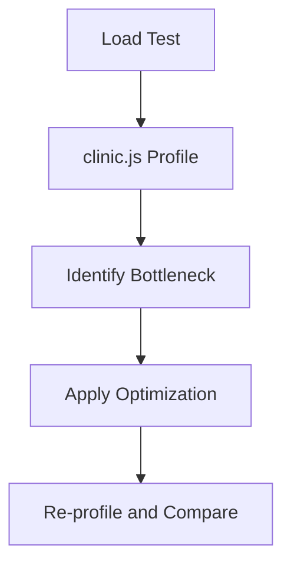

# Day 048 [Intermediate]: Performance Profiling with clinic.js

## Index

- Goal
- Prerequisites
- Explanation
- Topic by Topic
- Key Concepts
- Visual Concept Map
- End-to-End Practical
- Hands-on Coding
- Mini Exercise
- Assessment Quiz
- Task
- Self Check
- Interview Questions and Answers
- Day Outcome

## Goal

Profile Node application performance with clinic.js and turn findings into actionable optimizations.

## Prerequisites

- Day 047 API lifecycle strategies
- Basic load testing awareness

## Explanation

Performance issues are often hidden behind average metrics. clinic.js helps visualize CPU hotspots, event loop delays, and bottlenecks under realistic load.

## Topic by Topic

### Topic 1: Why Profiling Beats Guessing

Theory:
Optimizing without measurements can waste time or worsen performance.

Practical:
Capture baseline before changing code.

**Explanation:**
This topic explains Why Profiling Beats Guessing in a practical Node.js backend context so you can build reliable, production-ready APIs and services.

**Key Points:**
- Understand the core idea behind Why Profiling Beats Guessing.
- Apply the practical pattern with safe defaults and validation.
- Keep the implementation observable, maintainable, and secure where relevant.

### Topic 2: clinic.js Tool Modes

Theory:
Doctor gives high-level diagnosis, Flame shows CPU stacks, Bubbleprof reveals async flow.

Practical:
Pick the right mode based on suspected bottleneck.

**Explanation:**
This topic explains clinic.js Tool Modes in a practical Node.js backend context so you can build reliable, production-ready APIs and services.

**Key Points:**
- Understand the core idea behind clinic.js Tool Modes.
- Apply the practical pattern with safe defaults and validation.
- Keep the implementation observable, maintainable, and secure where relevant.

### Topic 3: Load Generation for Profiling

Theory:
Profiling idle app gives misleading results.

Practical:
Use autocannon to create repeatable traffic.

**Explanation:**
This topic explains Load Generation for Profiling in a practical Node.js backend context so you can build reliable, production-ready APIs and services.

**Key Points:**
- Understand the core idea behind Load Generation for Profiling.
- Apply the practical pattern with safe defaults and validation.
- Keep the implementation observable, maintainable, and secure where relevant.

### Topic 4: Optimization Workflow

Theory:
Find one hotspot, optimize, then measure again.

Practical:
Compare before/after report artifacts.

**Explanation:**
This topic explains Optimization Workflow in a practical Node.js backend context so you can build reliable, production-ready APIs and services.

**Key Points:**
- Understand the core idea behind Optimization Workflow.
- Apply the practical pattern with safe defaults and validation.
- Keep the implementation observable, maintainable, and secure where relevant.

### Topic 5: Common Bottlenecks

Theory:
Typical problems include sync blocking calls, unindexed DB queries, and inefficient serialization.

Practical:
Replace blocking loops and sync fs APIs in request path.

**Explanation:**
This topic explains Common Bottlenecks in a practical Node.js backend context so you can build reliable, production-ready APIs and services.

**Key Points:**
- Understand the core idea behind Common Bottlenecks.
- Apply the practical pattern with safe defaults and validation.
- Keep the implementation observable, maintainable, and secure where relevant.

### Topic 6: Profiling Discipline and Noise Control

Theory:
Unstable test conditions can hide real bottlenecks. Consistent runs make conclusions trustworthy.

Practical:
Warm up the app, run multiple trials, and compare p95/p99 latency not only averages.

**Explanation:**
This topic explains Profiling Discipline and Noise Control in a practical Node.js backend context so you can build reliable, production-ready APIs and services.

**Key Points:**
- Understand the core idea behind Profiling Discipline and Noise Control.
- Apply the practical pattern with safe defaults and validation.
- Keep the implementation observable, maintainable, and secure where relevant.

## Profiling Tool Table

| Tool                | Best Use                      |
| ------------------- | ----------------------------- |
| `clinic doctor`     | Overall bottleneck diagnosis  |
| `clinic flame`      | CPU hotspot visualization     |
| `clinic bubbleprof` | Async operation flow analysis |

## Key Concepts

- Baseline and repeatable benchmarking
- CPU and event-loop bottleneck analysis
- Async flow visualization
- Evidence-based optimization loop
- Performance regression prevention
- Stable experiment setup
- Percentile-based performance evaluation

## Visual Concept Map



## End-to-End Practical

1. Run baseline load test.
2. Profile app using clinic doctor.
3. Isolate main hotspot.
4. Optimize one bottleneck.
5. Re-run load and compare metrics.

## Hands-on Coding

### Example 1: Case - Collect Baseline Profile

Scenario:
Orders API latency spikes under moderate traffic.

```bash
clinic doctor --on-port 'autocannon -c 50 -d 20 http://localhost:3000/api/v1/orders' -- node server.js
```

### Example 2: Case - Flamegraph CPU Hotspot

Scenario:
Suspected CPU-heavy JSON transformation in response builder.

```bash
clinic flame --on-port 'autocannon -c 30 -d 15 http://localhost:3000/api/v1/reports' -- node server.js
```

### Example 3: Case - Replace Blocking Code

Scenario:
Synchronous file read in route blocks event loop.

```js
// Before (blocking)
// const data = fs.readFileSync("./large.json", "utf8");

// After (non-blocking)
const fs = require("fs/promises");
const data = await fs.readFile("./large.json", "utf8");
```

### Example 4: Case - Repeatable Load Script

Scenario:
Avoid random one-off benchmark conclusions.

```bash
autocannon -c 50 -d 10 http://localhost:3000/api/v1/orders > run1.txt
autocannon -c 50 -d 10 http://localhost:3000/api/v1/orders > run2.txt
autocannon -c 50 -d 10 http://localhost:3000/api/v1/orders > run3.txt
```

### Example 5: Case - Focus on Percentiles

Scenario:
Average latency looked fine, but users still report slow requests.

```txt
Before fix: p95 = 420ms, p99 = 900ms
After fix:  p95 = 210ms, p99 = 380ms
```

## Mini Exercise

Scenario:
Profile one slow endpoint, optimize it, and report before/after latency and throughput.

Expected output:

- Baseline and post-fix profiles generated
- One bottleneck identified with evidence
- Performance improved with measurable comparison

## Assessment Quiz

### Quiz Questions

1. Why should profiling be done under load?
2. What does clinic flame primarily show?
3. True or False: Skipping edge-case handling is acceptable in production.
4. Why is optimizing without baseline risky?
5. Why compare p95/p99 in addition to average latency?

### Quiz Answers

1. Real bottlenecks appear when request pressure exists.
2. CPU stack hotspot visualization.
3. False.
4. You may optimize the wrong part and waste effort.
5. Tail latency reflects real user pain that averages can hide.

## Task

- Profile one endpoint using clinic.js and autocannon
- Implement one measurable optimization
- Complete mini exercise and quiz.

## Self Check

- You can profile Node services with evidence-based approach.
- You can prioritize high-impact performance fixes.
- You can answer at least 4 out of 5 quiz questions.

## Interview Questions and Answers

### Beginner

Question: What is the first step before optimization?

Answer: Capture baseline metrics and profiling evidence.

### Middle

Question: Should every slow endpoint be optimized immediately?

Answer: No, prioritize bottlenecks with highest user impact and measurable gains.

### Advanced

Question: What tradeoff appears in aggressive optimization?

Answer: Better speed can increase complexity and reduce readability if overdone.

## Day 048 Outcome

- You can run repeatable performance diagnostics in Node
- You can translate profile data into concrete improvements
- You are ready for event loop deep dive in Day 049
