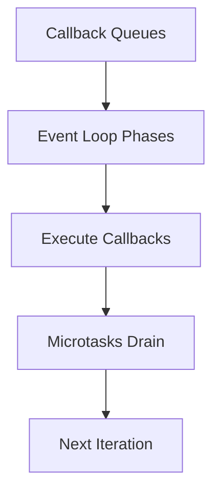

# Day 049 [Intermediate]: Node Event Loop Deep Dive

## Index

- Goal
- Prerequisites
- Explanation
- Topic by Topic
- Key Concepts
- Visual Concept Map
- End-to-End Practical
- Hands-on Coding
- Mini Exercise
- Assessment Quiz
- Task
- Self Check
- Interview Questions and Answers
- Day Outcome

## Goal

Develop deep practical understanding of Node event loop behavior to debug latency and concurrency issues.

## Prerequisites

- Day 048 profiling basics
- Async JavaScript familiarity

## Explanation

Node uses an event loop to process callbacks and async tasks. Understanding phases and task queues helps explain timing bugs and performance bottlenecks.

## Topic by Topic

### Topic 1: Event Loop Phases

Theory:
Key phases include timers, pending callbacks, poll, check, and close callbacks.

Practical:
Observe execution order with timer and I/O examples.

**Explanation:**
This topic explains Event Loop Phases in a practical Node.js backend context so you can build reliable, production-ready APIs and services.

**Key Points:**
- Understand the core idea behind Event Loop Phases.
- Apply the practical pattern with safe defaults and validation.
- Keep the implementation observable, maintainable, and secure where relevant.

### Topic 2: Microtasks vs Macrotasks

Theory:
Promise microtasks run before next macrotask cycle.

Practical:
Compare `process.nextTick`, `Promise.then`, and `setTimeout` execution order.

**Explanation:**
This topic explains Microtasks vs Macrotasks in a practical Node.js backend context so you can build reliable, production-ready APIs and services.

**Key Points:**
- Understand the core idea behind Microtasks vs Macrotasks.
- Apply the practical pattern with safe defaults and validation.
- Keep the implementation observable, maintainable, and secure where relevant.

### Topic 3: Blocking the Event Loop

Theory:
CPU-heavy synchronous code delays all other requests.

Practical:
Move heavy computation to worker threads.

**Explanation:**
This topic explains Blocking the Event Loop in a practical Node.js backend context so you can build reliable, production-ready APIs and services.

**Key Points:**
- Understand the core idea behind Blocking the Event Loop.
- Apply the practical pattern with safe defaults and validation.
- Keep the implementation observable, maintainable, and secure where relevant.

### Topic 4: Concurrency Illusions

Theory:
Node handles many concurrent I/O tasks, but not parallel CPU execution on main thread.

Practical:
Use async I/O and avoid sync APIs in request path.

**Explanation:**
This topic explains Concurrency Illusions in a practical Node.js backend context so you can build reliable, production-ready APIs and services.

**Key Points:**
- Understand the core idea behind Concurrency Illusions.
- Apply the practical pattern with safe defaults and validation.
- Keep the implementation observable, maintainable, and secure where relevant.

### Topic 5: Debugging Timing Bugs

Theory:
Race conditions and ordering assumptions often stem from misunderstood queues.

Practical:
Instrument code with timestamps and queue source labels.

**Explanation:**
This topic explains Debugging Timing Bugs in a practical Node.js backend context so you can build reliable, production-ready APIs and services.

**Key Points:**
- Understand the core idea behind Debugging Timing Bugs.
- Apply the practical pattern with safe defaults and validation.
- Keep the implementation observable, maintainable, and secure where relevant.

### Topic 6: Event Loop Lag Monitoring

Theory:
You cannot improve what you do not measure. Event loop lag tells how delayed callback execution is under load.

Practical:
Track event loop delay histogram and alert when lag crosses threshold.

**Explanation:**
This topic explains Event Loop Lag Monitoring in a practical Node.js backend context so you can build reliable, production-ready APIs and services.

**Key Points:**
- Understand the core idea behind Event Loop Lag Monitoring.
- Apply the practical pattern with safe defaults and validation.
- Keep the implementation observable, maintainable, and secure where relevant.

## Task Queue Order Table

| Construct          | Queue Type      | Typical Priority |
| ------------------ | --------------- | ---------------- |
| `process.nextTick` | nextTick queue  | Highest          |
| `Promise.then`     | microtask queue | High             |
| `setTimeout`       | timer macrotask | Later            |
| `setImmediate`     | check phase     | After poll       |

## Key Concepts

- Event loop phase model
- Microtask and macrotask ordering
- Main-thread blocking impact
- I/O concurrency behavior
- Timing bug diagnosis techniques
- Event loop lag observability
- Threshold-based performance alerting

## Visual Concept Map



## End-to-End Practical

1. Build execution-order demo script.
2. Compare timer, immediate, promise, and nextTick.
3. Add blocking CPU task and observe delay.
4. Refactor heavy logic off main thread.
5. Re-measure event loop delay.

## Hands-on Coding

### Example 1: Case - Execution Order Demo

Scenario:
Team needs clarity on async callback ordering.

```js
console.log("start");

setTimeout(() => console.log("setTimeout"), 0);
setImmediate(() => console.log("setImmediate"));

Promise.resolve().then(() => console.log("promise.then"));
process.nextTick(() => console.log("nextTick"));

console.log("end");
```

### Example 2: Case - Blocking CPU Example

Scenario:
Heavy loop causes API latency spikes.

```js
app.get("/slow", (req, res) => {
  const start = Date.now();
  while (Date.now() - start < 3000) {
    // blocks event loop intentionally
  }
  res.json({ success: true });
});
```

### Example 3: Case - Non-blocking Refactor Direction

Scenario:
Move heavy work to async background layer.

```js
app.post("/report", async (req, res) => {
  await reportQueue.add("generate", { reportId: req.body.id });
  res.status(202).json({ success: true, message: "Report queued" });
});
```

### Example 4: Case - Event Loop Lag Metric

Scenario:
Production latency spikes need direct lag evidence.

```js
const { monitorEventLoopDelay } = require("perf_hooks");

const h = monitorEventLoopDelay({ resolution: 20 });
h.enable();

setInterval(() => {
  const p95Ms = Number(h.percentile(95) / 1e6).toFixed(2);
  logger.info({ eventLoopLagP95Ms: p95Ms }, "event_loop_lag");
  h.reset();
}, 10000);
```

### Example 5: Case - setImmediate After I/O

Scenario:
After heavy I/O callback, schedule follow-up work without starving timers.

```js
fs.readFile("./input.json", "utf8", () => {
  setImmediate(() => {
    logger.info("follow-up work after I/O callback");
  });
});
```

## Mini Exercise

Scenario:
Create event-loop demo endpoint and then refactor to avoid blocking behavior.

Expected output:

- Demonstrated queue execution order
- Identified blocking operations clearly
- Refactored heavy task off request path

## Assessment Quiz

### Quiz Questions

1. Why can one slow request affect all users in Node?
2. Which runs first: promise callback or setTimeout callback?
3. True or False: Skipping edge-case handling is acceptable in production.
4. Why is process.nextTick usage risky if overused?
5. Which built-in API helps measure event loop lag?

### Quiz Answers

1. Because main thread blocking delays event loop processing for all connections.
2. Promise callback typically runs before setTimeout macrotask.
3. False.
4. It can starve I/O by continuously filling high-priority queue.
5. `perf_hooks.monitorEventLoopDelay`.

## Task

- Build one script that demonstrates queue ordering
- Refactor one blocking path to async workflow
- Complete mini exercise and quiz.

## Self Check

- You can reason precisely about Node async execution order.
- You can prevent event loop blocking regressions.
- You can answer at least 4 out of 5 quiz questions.

## Interview Questions and Answers

### Beginner

Question: Why should backend engineers learn event loop internals?

Answer: It helps debug latency, throughput, and timing bugs effectively.

### Middle

Question: Is asynchronous code always non-blocking?

Answer: Not if it contains heavy synchronous computation on main thread.

### Advanced

Question: What is one tradeoff when offloading work from event loop?

Answer: Better responsiveness with added coordination complexity across workers/queues.

## Day 049 Outcome

- You can analyze and optimize Node event loop behavior
- You can identify and fix blocking code patterns
- You are ready for worker threads and clustering in Day 050
