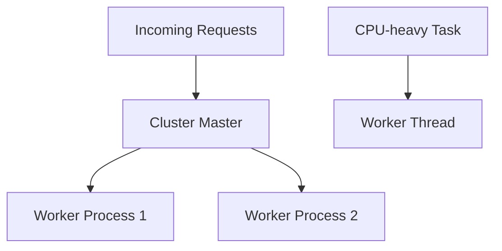

# Day 050 [Intermediate]: Worker Threads and Clustering

## Index

- Goal
- Prerequisites
- Explanation
- Topic by Topic
- Key Concepts
- Visual Concept Map
- End-to-End Practical
- Hands-on Coding
- Mini Exercise
- Assessment Quiz
- Task
- Self Check
- Interview Questions and Answers
- Day Outcome

## Goal

Use worker threads and clustering effectively to improve Node application concurrency and throughput.

## Prerequisites

- Day 049 event loop deep dive
- Basic multi-process concepts

## Explanation

Node main thread is single-threaded for JS execution. Worker threads help parallelize CPU-heavy tasks, while clustering improves HTTP throughput across CPU cores.

## Topic by Topic

### Topic 1: Worker Threads Fundamentals

Theory:
Worker threads run JS in parallel threads within same process.

Practical:
Offload heavy computations from main event loop.

**Explanation:**
This topic explains Worker Threads Fundamentals in a practical Node.js backend context so you can build reliable, production-ready APIs and services.

**Key Points:**
- Understand the core idea behind Worker Threads Fundamentals.
- Apply the practical pattern with safe defaults and validation.
- Keep the implementation observable, maintainable, and secure where relevant.

### Topic 2: Cluster Fundamentals

Theory:
Cluster launches multiple Node processes sharing one server port.

Practical:
Scale API handling across CPU cores.

**Explanation:**
This topic explains Cluster Fundamentals in a practical Node.js backend context so you can build reliable, production-ready APIs and services.

**Key Points:**
- Understand the core idea behind Cluster Fundamentals.
- Apply the practical pattern with safe defaults and validation.
- Keep the implementation observable, maintainable, and secure where relevant.

### Topic 3: Choosing the Right Tool

Theory:
Use workers for CPU tasks, cluster for handling more incoming connections.

Practical:
Map workload characteristics before implementation.

**Explanation:**
This topic explains Choosing the Right Tool in a practical Node.js backend context so you can build reliable, production-ready APIs and services.

**Key Points:**
- Understand the core idea behind Choosing the Right Tool.
- Apply the practical pattern with safe defaults and validation.
- Keep the implementation observable, maintainable, and secure where relevant.

### Topic 4: Communication and State

Theory:
Workers communicate via message passing; cluster workers do not share memory by default.

Practical:
Use Redis or DB for shared state.

**Explanation:**
This topic explains Communication and State in a practical Node.js backend context so you can build reliable, production-ready APIs and services.

**Key Points:**
- Understand the core idea behind Communication and State.
- Apply the practical pattern with safe defaults and validation.
- Keep the implementation observable, maintainable, and secure where relevant.

### Topic 5: Operational Considerations

Theory:
More processes/threads increase complexity in logs, monitoring, and deployment.

Practical:
Add worker crash restart strategy and health metrics.

**Explanation:**
This topic explains Operational Considerations in a practical Node.js backend context so you can build reliable, production-ready APIs and services.

**Key Points:**
- Understand the core idea behind Operational Considerations.
- Apply the practical pattern with safe defaults and validation.
- Keep the implementation observable, maintainable, and secure where relevant.

### Topic 6: Worker Pool and Graceful Shutdown

Theory:
Creating one worker per request can be expensive. Production systems reuse workers and stop gracefully during deploys.

Practical:
Use a bounded worker pool and close cluster workers on shutdown signals.

**Explanation:**
This topic explains Worker Pool and Graceful Shutdown in a practical Node.js backend context so you can build reliable, production-ready APIs and services.

**Key Points:**
- Understand the core idea behind Worker Pool and Graceful Shutdown.
- Apply the practical pattern with safe defaults and validation.
- Keep the implementation observable, maintainable, and secure where relevant.

## Worker vs Cluster Table

| Aspect           | Worker Threads       | Cluster                 |
| ---------------- | -------------------- | ----------------------- |
| Best for         | CPU-heavy tasks      | Network concurrency     |
| Unit of scaling  | Thread               | Process                 |
| Memory isolation | Shared process space | Separate process memory |
| Communication    | MessagePort          | IPC/process messaging   |

## Key Concepts

- CPU offloading with worker threads
- Multi-core request scaling with cluster
- Workload-driven architecture choice
- Inter-worker communication constraints
- Reliability and observability in parallel systems
- Worker-pool efficiency
- Graceful shutdown reliability

## Visual Concept Map



## End-to-End Practical

1. Identify CPU-heavy API endpoint.
2. Offload computation to worker thread.
3. Enable cluster mode for API server.
4. Add process crash auto-restart.
5. Compare throughput before and after.

## Hands-on Coding

### Example 1: Case - Worker Thread for CPU Task

Scenario:
PDF analytics processing blocks response time.

```js
const { Worker } = require("worker_threads");

function runHeavyTask(payload) {
  return new Promise((resolve, reject) => {
    const worker = new Worker("./workers/analyze.js", { workerData: payload });
    worker.on("message", resolve);
    worker.on("error", reject);
    worker.on("exit", (code) => {
      if (code !== 0) reject(new Error(`Worker exited: ${code}`));
    });
  });
}
```

### Example 2: Case - Cluster Setup

Scenario:
API needs better throughput under high concurrent load.

```js
const cluster = require("cluster");
const os = require("os");

if (cluster.isPrimary) {
  const cpuCount = os.cpus().length;
  for (let i = 0; i < cpuCount; i += 1) cluster.fork();
  cluster.on("exit", () => cluster.fork());
} else {
  require("./server");
}
```

### Example 3: Case - Endpoint Using Worker Offload

Scenario:
Main API remains responsive while heavy job executes.

```js
app.post("/api/v1/reports/analyze", async (req, res, next) => {
  try {
    const result = await runHeavyTask(req.body);
    res.json({ success: true, data: result });
  } catch (error) {
    next(error);
  }
});
```

### Example 4: Case - Basic Worker Pool Limit

Scenario:
Avoid spawning unlimited workers during traffic bursts.

```js
const PQueue = require("p-queue");

const cpuQueue = new PQueue({ concurrency: 4 });

function runHeavyTaskPooled(payload) {
  return cpuQueue.add(() => runHeavyTask(payload));
}
```

### Example 5: Case - Graceful Cluster Shutdown

Scenario:
During deployment, stop accepting new requests before process exit.

```js
if (cluster.isPrimary) {
  process.on("SIGTERM", () => {
    for (const id in cluster.workers) {
      cluster.workers[id].send("shutdown");
    }
  });
} else {
  process.on("message", (msg) => {
    if (msg === "shutdown") process.exit(0);
  });
}
```

## Mini Exercise

Scenario:
Scale report-processing API using worker threads for CPU tasks and cluster for request throughput.

Expected output:

- CPU-heavy task removed from main thread
- Cluster workers improve concurrent handling
- Worker crash recovery strategy included

## Assessment Quiz

### Quiz Questions

1. When should you choose worker threads over clustering?
2. Why can clustering improve API throughput?
3. True or False: Skipping edge-case handling is acceptable in production.
4. Why should shared state not live only in process memory with cluster?
5. Why use a worker pool instead of spawning unlimited workers?

### Quiz Answers

1. For CPU-intensive computation offloading.
2. Multiple processes can handle requests in parallel across cores.
3. False.
4. Each worker has isolated memory, causing inconsistency across processes.
5. It controls resource usage and keeps system stable under spikes.

## Task

- Implement one worker-thread offload use case
- Enable and benchmark clustered server mode
- Complete mini exercise and quiz.

## Self Check

- You can parallelize Node workloads with appropriate strategy.
- You can evaluate concurrency tradeoffs in production architecture.
- You can answer at least 4 out of 5 quiz questions.

## Interview Questions and Answers

### Beginner

Question: Are worker threads and clustering competing solutions?

Answer: They solve different bottlenecks and are often used together.

### Middle

Question: What is a simple rule to choose between them?

Answer: CPU-heavy task => worker threads, high request concurrency => cluster.

### Advanced

Question: What is a major tradeoff in multi-worker setups?

Answer: Better performance with increased deployment, debugging, and observability complexity.

## Day 050 Outcome

- You can build Node services that scale CPU and connection workloads
- You can choose worker threads and cluster based on real bottlenecks
- You are ready for advanced architecture and observability tracks next
