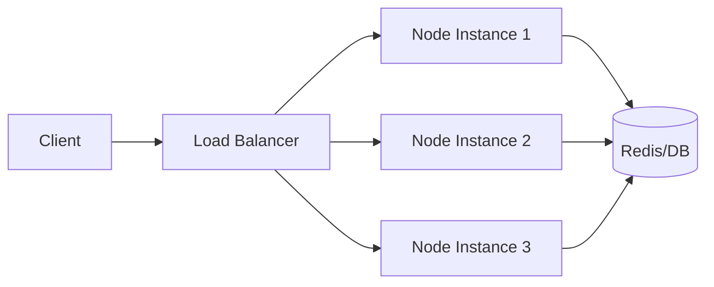

# Day 051 [Intermediate]: Scaling Node Apps Horizontally

## Index

- Goal
- Prerequisites
- Explanation
- Topic by Topic
- Key Concepts
- Visual Concept Map
- End-to-End Practical
- Hands-on Coding
- Mini Exercise
- Assessment Quiz
- Task
- Self Check
- Interview Questions and Answers
- Day Outcome

## Goal

Scale Node APIs across multiple instances while keeping sessions, traffic routing, and reliability under control.

## Prerequisites

- Day 050 worker threads and clustering
- Basic reverse proxy/load balancer understanding

## Explanation

Horizontal scaling means running many app instances instead of one bigger machine. This increases throughput and availability but requires stateless design and shared infrastructure for cross-instance data.

## Topic by Topic

### Topic 1: Vertical vs Horizontal Scaling

Theory:
Vertical scaling increases machine resources. Horizontal scaling adds more app instances.

Practical:
Pick horizontal scaling for traffic spikes and failure resilience.

**Explanation:**
This topic explains Vertical vs Horizontal Scaling in a practical Node.js backend context so you can build reliable, production-ready APIs and services.

**Key Points:**
- Understand the core idea behind Vertical vs Horizontal Scaling.
- Apply the practical pattern with safe defaults and validation.
- Keep the implementation observable, maintainable, and secure where relevant.

### Topic 2: Stateless Service Design

Theory:
Instance-local memory cannot be relied on in multi-instance setups.

Practical:
Move sessions, cache, and locks to Redis/DB.

**Explanation:**
This topic explains Stateless Service Design in a practical Node.js backend context so you can build reliable, production-ready APIs and services.

**Key Points:**
- Understand the core idea behind Stateless Service Design.
- Apply the practical pattern with safe defaults and validation.
- Keep the implementation observable, maintainable, and secure where relevant.

### Topic 3: Load Balancing and Health Checks

Theory:
Load balancers distribute requests and remove unhealthy nodes.

Practical:
Expose `/health` and `/ready` endpoints.

**Explanation:**
This topic explains Load Balancing and Health Checks in a practical Node.js backend context so you can build reliable, production-ready APIs and services.

**Key Points:**
- Understand the core idea behind Load Balancing and Health Checks.
- Apply the practical pattern with safe defaults and validation.
- Keep the implementation observable, maintainable, and secure where relevant.

### Topic 4: Shared State and Background Jobs

Theory:
Job queues and shared stores coordinate work across instances.

Practical:
Use queue-based report generation instead of in-process timers.

**Explanation:**
This topic explains Shared State and Background Jobs in a practical Node.js backend context so you can build reliable, production-ready APIs and services.

**Key Points:**
- Understand the core idea behind Shared State and Background Jobs.
- Apply the practical pattern with safe defaults and validation.
- Keep the implementation observable, maintainable, and secure where relevant.

### Topic 5: Failure and Recovery Patterns

Theory:
Instances will fail; systems should recover automatically.

Practical:
Use rolling restart, auto-retry, and idempotent request handling.

**Explanation:**
This topic explains Failure and Recovery Patterns in a practical Node.js backend context so you can build reliable, production-ready APIs and services.

**Key Points:**
- Understand the core idea behind Failure and Recovery Patterns.
- Apply the practical pattern with safe defaults and validation.
- Keep the implementation observable, maintainable, and secure where relevant.

### Topic 6: Readiness and Connection Draining

Theory:
During deploy, a node may be alive but not ready for new traffic. Draining avoids dropping in-flight requests.

Practical:
Use readiness checks for traffic routing and stop new requests before shutdown.

**Explanation:**
This topic explains Readiness and Connection Draining in a practical Node.js backend context so you can build reliable, production-ready APIs and services.

**Key Points:**
- Understand the core idea behind Readiness and Connection Draining.
- Apply the practical pattern with safe defaults and validation.
- Keep the implementation observable, maintainable, and secure where relevant.

## Scaling Decision Table

| Concern          | Single Instance         | Horizontal Setup              |
| ---------------- | ----------------------- | ----------------------------- |
| Throughput       | Limited                 | High with multiple nodes      |
| Availability     | Single point of failure | Better with redundancy        |
| Session handling | In-memory possible      | External session store needed |
| Deployment risk  | One blast radius        | Rolling deployment possible   |

## Key Concepts

- Stateless API architecture
- Load balancing fundamentals
- Shared session/cache architecture
- Failure-tolerant deployment strategy
- Metrics-driven scaling decisions
- Liveness vs readiness distinction
- Graceful connection draining

## Visual Concept Map



## End-to-End Practical

1. Add `/health` endpoint to app.
2. Make app stateless by moving session storage to Redis.
3. Run multiple app instances on different ports.
4. Add reverse proxy/load balancer config.
5. Execute traffic test and compare latency/throughput.

## Hands-on Coding

### Example 1: Case - Health Endpoint

Scenario:
Load balancer needs a quick way to detect unhealthy instances.

```js
app.get("/health", (req, res) => {
  res.status(200).json({ status: "ok", uptime: process.uptime() });
});
```

### Example 2: Case - Redis-backed Session Store

Scenario:
Users bounce between instances and must remain logged in.

```js
const session = require("express-session");
const RedisStore = require("connect-redis").default;

app.use(
  session({
    store: new RedisStore({ client: redisClient }),
    secret: process.env.SESSION_SECRET,
    resave: false,
    saveUninitialized: false,
  }),
);
```

### Example 3: Case - PM2 Horizontal Start

Scenario:
Quickly run one process per CPU core.

```bash
pm2 start server.js -i max --name orders-api
pm2 status
```

### Example 4: Case - Readiness Endpoint

Scenario:
Instance should receive traffic only when dependencies are available.

```js
app.get("/ready", async (req, res) => {
  const dbOk = await db.ping();
  const redisOk = await redis.ping();
  if (!dbOk || !redisOk) return res.status(503).json({ ready: false });
  res.status(200).json({ ready: true });
});
```

### Example 5: Case - Graceful Shutdown and Draining

Scenario:
Deployment should not cut active requests abruptly.

```js
const server = app.listen(3000);
let isShuttingDown = false;

app.use((req, res, next) => {
  if (isShuttingDown) return res.status(503).json({ message: "shutting down" });
  next();
});

process.on("SIGTERM", () => {
  isShuttingDown = true;
  server.close(() => process.exit(0));
});
```

## Mini Exercise

Scenario:
Scale an orders API from 1 instance to 3 instances behind a load balancer, while preserving authenticated sessions.

Expected output:

- Three healthy app instances
- Shared session behavior across instances
- Basic throughput improvement report

## Assessment Quiz

### Quiz Questions

1. Why does horizontal scaling require stateless application behavior?
2. What role does a load balancer play in availability?
3. True or False: In-memory sessions are safe with many instances.
4. Why is a shared store important for multi-instance apps?
5. Why is readiness different from liveness?

### Quiz Answers

1. Requests can hit any instance, so state cannot live in one process memory.
2. It routes traffic and avoids unhealthy instances.
3. False.
4. It keeps sessions/cache/job state consistent across nodes.
5. Liveness means process is running, readiness means it can safely serve traffic.

## Task

- Add a health endpoint and readiness logic
- Migrate one in-memory state to shared infrastructure
- Complete mini exercise and quiz

## Self Check

- You can explain horizontal scaling tradeoffs clearly
- You can make a Node service stateless for multi-instance runs
- You can answer at least 4 out of 5 quiz questions

## Interview Questions and Answers

### Beginner

Question: What is horizontal scaling?

Answer: Running multiple instances of the same app to handle more load.

### Middle

Question: Why do session bugs appear after scaling out?

Answer: Because users may switch instances and lose in-memory session data if no shared store exists.

### Advanced

Question: How do you design zero-downtime scale-out under traffic spikes?

Answer: Use health checks, rolling deploys, connection draining, autoscaling triggers, and idempotent request handling.

## Day 051 Outcome

- You can scale Node apps horizontally with stateless architecture
- You can integrate load balancing and shared state safely
- You are ready for Dockerizing Node applications in Day 052
