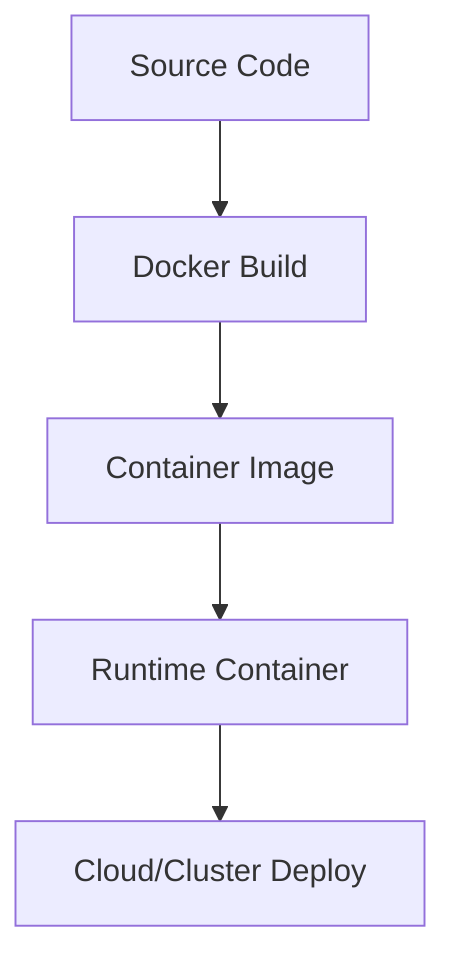

# Day 052 [Intermediate]: Dockerizing Node Applications

## Index

- Goal
- Prerequisites
- Explanation
- Topic by Topic
- Key Concepts
- Visual Concept Map
- End-to-End Practical
- Hands-on Coding
- Mini Exercise
- Assessment Quiz
- Task
- Self Check
- Interview Questions and Answers
- Day Outcome

## Goal

Package Node applications into secure, reproducible Docker images suitable for local development and production deployment.

## Prerequisites

- Day 051 scaling concepts
- Basic Linux command familiarity

## Explanation

Docker solves environment inconsistency by packaging app code, runtime, and dependencies into immutable images. Good Dockerfiles also reduce image size and attack surface.

## Topic by Topic

### Topic 1: Container Fundamentals

Theory:
Containers isolate app execution with predictable runtime behavior.

Practical:
Run Node app in a base image and expose HTTP port.

**Explanation:**
This topic explains Container Fundamentals in a practical Node.js backend context so you can build reliable, production-ready APIs and services.

**Key Points:**
- Understand the core idea behind Container Fundamentals.
- Apply the practical pattern with safe defaults and validation.
- Keep the implementation observable, maintainable, and secure where relevant.

### Topic 2: Multi-stage Builds

Theory:
Separate build and runtime stages to keep images small.

Practical:
Install dev dependencies only in build stage.

**Explanation:**
This topic explains Multi-stage Builds in a practical Node.js backend context so you can build reliable, production-ready APIs and services.

**Key Points:**
- Understand the core idea behind Multi-stage Builds.
- Apply the practical pattern with safe defaults and validation.
- Keep the implementation observable, maintainable, and secure where relevant.

### Topic 3: Runtime Security

Theory:
Containers should not run as root and should include only required files.

Practical:
Use non-root user and `.dockerignore`.

**Explanation:**
This topic explains Runtime Security in a practical Node.js backend context so you can build reliable, production-ready APIs and services.

**Key Points:**
- Understand the core idea behind Runtime Security.
- Apply the practical pattern with safe defaults and validation.
- Keep the implementation observable, maintainable, and secure where relevant.

### Topic 4: Configuration and Secrets

Theory:
Environment-specific values should not be hardcoded into image.

Practical:
Inject env vars at runtime.

**Explanation:**
This topic explains Configuration and Secrets in a practical Node.js backend context so you can build reliable, production-ready APIs and services.

**Key Points:**
- Understand the core idea behind Configuration and Secrets.
- Apply the practical pattern with safe defaults and validation.
- Keep the implementation observable, maintainable, and secure where relevant.

### Topic 5: Local Orchestration

Theory:
Compose simplifies running app + db + cache together.

Practical:
Create `docker-compose.yml` for Node + Postgres.

**Explanation:**
This topic explains Local Orchestration in a practical Node.js backend context so you can build reliable, production-ready APIs and services.

**Key Points:**
- Understand the core idea behind Local Orchestration.
- Apply the practical pattern with safe defaults and validation.
- Keep the implementation observable, maintainable, and secure where relevant.

### Topic 6: Health Checks and Image Supply-chain Safety

Theory:
Containers should prove they are healthy, and base images/dependencies should be controlled for security.

Practical:
Add HEALTHCHECK, pin image digest where possible, and scan image in CI.

**Explanation:**
This topic explains Health Checks and Image Supply-chain Safety in a practical Node.js backend context so you can build reliable, production-ready APIs and services.

**Key Points:**
- Understand the core idea behind Health Checks and Image Supply-chain Safety.
- Apply the practical pattern with safe defaults and validation.
- Keep the implementation observable, maintainable, and secure where relevant.

## Docker Best Practices Table

| Practice          | Why it matters                             |
| ----------------- | ------------------------------------------ |
| Multi-stage build | Smaller images and faster pulls            |
| Non-root user     | Reduces privilege risk                     |
| `.dockerignore`   | Prevents secrets/noise from entering image |
| Pinned base image | Stable and repeatable builds               |

## Key Concepts

- Containerized runtime consistency
- Image optimization techniques
- Secure-by-default Docker patterns
- Runtime configuration management
- Local multi-service orchestration
- Runtime health signaling
- Supply-chain and vulnerability hygiene

## Visual Concept Map



## End-to-End Practical

1. Write Dockerfile for Node API.
2. Add `.dockerignore`.
3. Build and run image locally.
4. Add compose setup for dependent services.
5. Validate logs, health, and environment configs.

## Hands-on Coding

### Example 1: Case - Multi-stage Dockerfile

Scenario:
Team needs lightweight production image for Node API.

```dockerfile
FROM node:20-alpine AS deps
WORKDIR /app
COPY package*.json ./
RUN npm ci

FROM node:20-alpine AS runtime
WORKDIR /app
COPY --from=deps /app/node_modules ./node_modules
COPY . .
ENV NODE_ENV=production
EXPOSE 3000
USER node
CMD ["node", "server.js"]
```

### Example 2: Case - .dockerignore for Safety

Scenario:
Prevent local secrets and unnecessary files from being copied.

```txt
node_modules
.env
.git
npm-debug.log
coverage
```

### Example 3: Case - Compose for App + Postgres

Scenario:
Developers need one command to run API and database.

```yaml
services:
  api:
    build: .
    ports:
      - "3000:3000"
    environment:
      - DATABASE_URL=postgres://postgres:postgres@db:5432/app
    depends_on:
      - db
  db:
    image: postgres:16-alpine
    environment:
      - POSTGRES_PASSWORD=postgres
      - POSTGRES_DB=app
```

### Example 4: Case - Dockerfile Healthcheck

Scenario:
Orchestrator should restart unhealthy container automatically.

```dockerfile
HEALTHCHECK --interval=30s --timeout=5s --retries=3 CMD wget -qO- http://localhost:3000/health || exit 1
```

### Example 5: Case - Image Scan in CI

Scenario:
Prevent deploying image with known high-severity vulnerabilities.

```bash
docker build -t orders-api:ci .
trivy image --exit-code 1 --severity HIGH,CRITICAL orders-api:ci
```

## Mini Exercise

Scenario:
Containerize an existing Node API, add local database dependency, and prove reproducible startup.

Expected output:

- Reproducible container startup
- Smaller image with multi-stage build
- Secure runtime basics applied

## Assessment Quiz

### Quiz Questions

1. Why use multi-stage builds in Node Dockerfiles?
2. Why should containers avoid root user?
3. True or False: Skipping edge-case handling is acceptable in production.
4. Why should `.env` never be copied into image?
5. Why add container health checks?

### Quiz Answers

1. They reduce final image size and runtime surface.
2. To reduce impact of container compromise.
3. False.
4. It can leak secrets to registry and all deployments.
5. They allow platforms to detect broken instances and restart or remove them from traffic.

## Task

- Build and run API image with secure defaults
- Add compose stack for app dependency
- Complete mini exercise and quiz.

## Self Check

- You can create efficient and safer Node Docker images.
- You can run reproducible local multi-service stacks.
- You can answer at least 4 out of 5 quiz questions.

## Interview Questions and Answers

### Beginner

Question: Why is Docker useful for backend teams?

Answer: It standardizes runtime environments across local, CI, and production.

### Middle

Question: Should production and development images be identical?

Answer: Core runtime should be consistent, but development can include debug tools not needed in production.

### Advanced

Question: What tradeoff appears when minimizing image size aggressively?

Answer: Smaller images improve speed and security but can reduce debugging convenience.

## Day 052 Outcome

- You can package Node apps in efficient, secure containers
- You can orchestrate local dependencies with Docker Compose
- You are ready for CI/CD automation in Day 053
