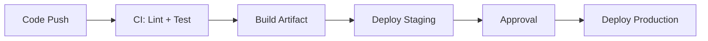

# Day 053 [Intermediate]: CI CD for Node.js

## Index

- Goal
- Prerequisites
- Explanation
- Topic by Topic
- Key Concepts
- Visual Concept Map
- End-to-End Practical
- Hands-on Coding
- Mini Exercise
- Assessment Quiz
- Task
- Self Check
- Interview Questions and Answers
- Day Outcome

## Goal

Build reliable CI/CD pipelines for Node.js that validate quality and deploy safely.

## Prerequisites

- Day 052 Docker basics
- Git workflow familiarity

## Explanation

CI/CD automates build, test, and release flow. The objective is not just speed, but repeatability, confidence, and controlled deployment risk.

## Topic by Topic

### Topic 1: CI vs CD

Theory:
CI verifies every change quickly; CD deploys validated artifacts safely.

Practical:
Trigger pipeline on pull request and merge to main.

**Explanation:**
This topic explains CI vs CD in a practical Node.js backend context so you can build reliable, production-ready APIs and services.

**Key Points:**
- Understand the core idea behind CI vs CD.
- Apply the practical pattern with safe defaults and validation.
- Keep the implementation observable, maintainable, and secure where relevant.

### Topic 2: Pipeline Stages

Theory:
Common stages: install, lint, test, build, scan, deploy.

Practical:
Fail fast in early stages to save compute and time.

**Explanation:**
This topic explains Pipeline Stages in a practical Node.js backend context so you can build reliable, production-ready APIs and services.

**Key Points:**
- Understand the core idea behind Pipeline Stages.
- Apply the practical pattern with safe defaults and validation.
- Keep the implementation observable, maintainable, and secure where relevant.

### Topic 3: Artifact and Environment Strategy

Theory:
Build once, promote same artifact across environments.

Practical:
Tag image with commit SHA and deploy that exact tag.

**Explanation:**
This topic explains Artifact and Environment Strategy in a practical Node.js backend context so you can build reliable, production-ready APIs and services.

**Key Points:**
- Understand the core idea behind Artifact and Environment Strategy.
- Apply the practical pattern with safe defaults and validation.
- Keep the implementation observable, maintainable, and secure where relevant.

### Topic 4: Deployment Safety Controls

Theory:
Progressive rollout and rollback reduce incident impact.

Practical:
Use canary or blue-green strategy.

**Explanation:**
This topic explains Deployment Safety Controls in a practical Node.js backend context so you can build reliable, production-ready APIs and services.

**Key Points:**
- Understand the core idea behind Deployment Safety Controls.
- Apply the practical pattern with safe defaults and validation.
- Keep the implementation observable, maintainable, and secure where relevant.

### Topic 5: Secret and Permission Management

Theory:
Pipelines should use least privilege and secret stores.

Practical:
Use CI secret variables and avoid plaintext tokens in repo.

**Explanation:**
This topic explains Secret and Permission Management in a practical Node.js backend context so you can build reliable, production-ready APIs and services.

**Key Points:**
- Understand the core idea behind Secret and Permission Management.
- Apply the practical pattern with safe defaults and validation.
- Keep the implementation observable, maintainable, and secure where relevant.

### Topic 6: Deployment Concurrency and Approval Controls

Theory:
Two deployments at the same time can overwrite each other. Sensitive environments also need explicit approvals.

Practical:
Cancel outdated runs and require manual approval before production release.

**Explanation:**
This topic explains Deployment Concurrency and Approval Controls in a practical Node.js backend context so you can build reliable, production-ready APIs and services.

**Key Points:**
- Understand the core idea behind Deployment Concurrency and Approval Controls.
- Apply the practical pattern with safe defaults and validation.
- Keep the implementation observable, maintainable, and secure where relevant.

## Pipeline Stage Table

| Stage         | Purpose                    | Fail Condition              |
| ------------- | -------------------------- | --------------------------- |
| Lint          | Coding standards           | Style or static errors      |
| Test          | Behavioral validation      | Failing tests               |
| Build         | Create deployable artifact | Build error                 |
| Security scan | Detect vulnerabilities     | Severity threshold exceeded |
| Deploy        | Release artifact           | Health check fails          |

## Key Concepts

- Automated quality gates
- Artifact immutability
- Progressive delivery patterns
- Rollback-ready deployment flow
- Secure pipeline practices
- Deployment concurrency control
- Production approval governance

## Visual Concept Map



## End-to-End Practical

1. Configure CI workflow for lint and tests.
2. Build Docker image tagged with commit SHA.
3. Push image to registry.
4. Deploy to staging automatically.
5. Promote to production with controlled strategy.

## Hands-on Coding

### Example 1: Case - GitHub Actions CI Pipeline

Scenario:
Team wants pull requests blocked if lint/tests fail.

```yaml
name: ci
on: [pull_request]
jobs:
  test:
    runs-on: ubuntu-latest
    steps:
      - uses: actions/checkout@v4
      - uses: actions/setup-node@v4
        with:
          node-version: 20
      - run: npm ci
      - run: npm run lint
      - run: npm test
```

### Example 2: Case - Build and Tag Docker Image

Scenario:
Need immutable artifact per commit.

```bash
docker build -t ghcr.io/acme/orders-api:${GITHUB_SHA} .
docker push ghcr.io/acme/orders-api:${GITHUB_SHA}
```

### Example 3: Case - Safe Deployment Gate

Scenario:
Promote only when staging health checks pass.

```bash
curl -f https://staging.acme.com/health
if [ $? -ne 0 ]; then
  echo "Staging unhealthy, aborting deploy"
  exit 1
fi
```

### Example 4: Case - Cancel Outdated Pipeline Runs

Scenario:
Only latest commit on a branch should continue deployment.

```yaml
concurrency:
  group: deploy-${{ github.ref }}
  cancel-in-progress: true
```

### Example 5: Case - Protected Production Environment

Scenario:
Production deployment must wait for reviewer approval.

```yaml
jobs:
  deploy-production:
    environment: production
    runs-on: ubuntu-latest
    steps:
      - run: echo "deploying approved artifact"
```

## Mini Exercise

Scenario:
Create CI pipeline for a Node API and add one production deployment safety gate.

Expected output:

- Pull request checks enforced
- Immutable artifact generated
- Deployment gate prevents unsafe release

## Assessment Quiz

### Quiz Questions

1. Why should CI run on every pull request?
2. Why is artifact immutability important?
3. True or False: Skipping edge-case handling is acceptable in production.
4. Why must deployment include rollback planning?
5. Why cancel outdated deployment runs?

### Quiz Answers

1. It catches defects early and protects main branch quality.
2. Same tested build can be promoted safely across environments.
3. False.
4. Rollback limits incident duration when bad release escapes.
5. It prevents older commits from overwriting newer validated releases.

## Task

- Implement CI checks and build artifact stage
- Add one controlled deploy gate and rollback note
- Complete mini exercise and quiz.

## Self Check

- You can design practical CI/CD flow for Node apps.
- You can reduce release risk with clear gates.
- You can answer at least 4 out of 5 quiz questions.

## Interview Questions and Answers

### Beginner

Question: What is the minimum useful CI for a Node project?

Answer: Install dependencies, run lint, run tests, and report status on pull requests.

### Middle

Question: Why separate CI from production deployment permissions?

Answer: It enforces controlled release governance and least privilege access.

### Advanced

Question: What tradeoff appears with strict pipelines?

Answer: More reliability and consistency, with longer setup and occasional slower merges.

## Day 053 Outcome

- You can automate build-test-release lifecycle for Node services
- You can apply practical deployment safety mechanisms
- You are ready for cloud deployment strategy in Day 054
