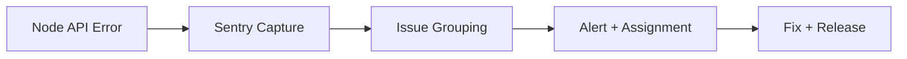

# Day 056 [Intermediate]: Error Monitoring with Sentry

## Index

- Goal
- Prerequisites
- Explanation
- Topic by Topic
- Key Concepts
- Visual Concept Map
- End-to-End Practical
- Hands-on Coding
- Mini Exercise
- Assessment Quiz
- Task
- Self Check
- Interview Questions and Answers
- Day Outcome

## Goal

Instrument a Node backend with Sentry to detect, triage, and resolve production errors faster.

## Prerequisites

- Day 055 observability basics
- Express error-handling flow knowledge

## Explanation

Logs tell you what happened, but Sentry helps group crashes, attach stack traces, and prioritize issues by impact. In production, this sharply reduces mean time to detect and mean time to resolution.

## Topic by Topic

### Topic 1: Why Error Monitoring Matters

Theory:
Some failures only happen in real user environments. You need centralized error capture.

Practical:
Track unhandled exceptions and request-context errors automatically.

**Explanation:**
This topic explains Why Error Monitoring Matters in a practical Node.js backend context so you can build reliable, production-ready APIs and services.

**Key Points:**
- Understand the core idea behind Why Error Monitoring Matters.
- Apply the practical pattern with safe defaults and validation.
- Keep the implementation observable, maintainable, and secure where relevant.

### Topic 2: Sentry SDK Setup

Theory:
Initialize SDK early so startup and runtime errors are captured.

Practical:
Configure DSN, environment, and release metadata.

**Explanation:**
This topic explains Sentry SDK Setup in a practical Node.js backend context so you can build reliable, production-ready APIs and services.

**Key Points:**
- Understand the core idea behind Sentry SDK Setup.
- Apply the practical pattern with safe defaults and validation.
- Keep the implementation observable, maintainable, and secure where relevant.

### Topic 3: Context and Breadcrumbs

Theory:
Debugging is easier when each event includes user, request, and business context.

Practical:
Attach requestId, route, tenantId, and recent actions.

**Explanation:**
This topic explains Context and Breadcrumbs in a practical Node.js backend context so you can build reliable, production-ready APIs and services.

**Key Points:**
- Understand the core idea behind Context and Breadcrumbs.
- Apply the practical pattern with safe defaults and validation.
- Keep the implementation observable, maintainable, and secure where relevant.

### Topic 4: Filtering and Sampling

Theory:
Noise creates alert fatigue. Filter expected errors and control volume.

Practical:
Ignore validation errors and sample high-volume endpoints.

**Explanation:**
This topic explains Filtering and Sampling in a practical Node.js backend context so you can build reliable, production-ready APIs and services.

**Key Points:**
- Understand the core idea behind Filtering and Sampling.
- Apply the practical pattern with safe defaults and validation.
- Keep the implementation observable, maintainable, and secure where relevant.

### Topic 5: Incident Response Workflow

Theory:
Error monitoring is useful only if tied to ownership and release workflow.

Practical:
Use issue assignment rules, release tags, and regression detection.

**Explanation:**
This topic explains Incident Response Workflow in a practical Node.js backend context so you can build reliable, production-ready APIs and services.

**Key Points:**
- Understand the core idea behind Incident Response Workflow.
- Apply the practical pattern with safe defaults and validation.
- Keep the implementation observable, maintainable, and secure where relevant.

### Topic 6: Source Maps and Issue Grouping Control

Theory:
Minified/transpiled stacks are hard to debug without source maps. Grouping control prevents one bug from being split into many noisy issues.

Practical:
Upload source maps in CI and use fingerprinting for stable issue grouping.

**Explanation:**
This topic explains Source Maps and Issue Grouping Control in a practical Node.js backend context so you can build reliable, production-ready APIs and services.

**Key Points:**
- Understand the core idea behind Source Maps and Issue Grouping Control.
- Apply the practical pattern with safe defaults and validation.
- Keep the implementation observable, maintainable, and secure where relevant.

## Sentry Decision Table

| Concern          | Recommended Practice                    |
| ---------------- | --------------------------------------- |
| Sensitive data   | Scrub headers/body fields in beforeSend |
| Alert fatigue    | Use issue filters and severity routing  |
| Release tracking | Set release to commit SHA               |
| Debug speed      | Include requestId and user context      |

## Key Concepts

- Centralized exception tracking
- Context-rich event payloads
- Signal-to-noise control
- Release-aware debugging
- Production incident triage
- Source-map assisted debugging
- Intentional issue grouping strategy

## Visual Concept Map



## End-to-End Practical

1. Install and initialize Sentry in Express app.
2. Add request context and error middleware integration.
3. Configure filtering and sampling.
4. Trigger test error and verify event in dashboard.
5. Link event to release and assign ownership.

## Hands-on Coding

### Example 1: Case - Sentry Initialization

Scenario:
Backend team needs production crash visibility.

```js
const Sentry = require("@sentry/node");

Sentry.init({
  dsn: process.env.SENTRY_DSN,
  environment: process.env.NODE_ENV,
  release: process.env.GIT_SHA,
  tracesSampleRate: 0.2,
});
```

### Example 2: Case - Express Error Capture

Scenario:
Unhandled route exceptions must be visible with stack traces.

```js
app.use(Sentry.Handlers.requestHandler());

app.get("/explode", () => {
  throw new Error("Intentional crash for test");
});

app.use(Sentry.Handlers.errorHandler());
```

### Example 3: Case - Context Enrichment and Scrubbing

Scenario:
Need useful debugging data without leaking secrets.

```js
Sentry.configureScope((scope) => {
  scope.setTag("service", "orders-api");
});

Sentry.init({
  dsn: process.env.SENTRY_DSN,
  beforeSend(event) {
    if (event.request && event.request.headers) {
      delete event.request.headers.authorization;
    }
    return event;
  },
});
```

### Example 4: Case - Stable Fingerprint for Known Domain Error

Scenario:
Same business failure appears with different messages and creates noisy issue splits.

```js
Sentry.init({
  dsn: process.env.SENTRY_DSN,
  beforeSend(event, hint) {
    const original = hint?.originalException;
    if (original?.code === "PAYMENT_PROVIDER_TIMEOUT") {
      event.fingerprint = ["payment-provider-timeout"];
    }
    return event;
  },
});
```

### Example 5: Case - Source Map Upload in CI

Scenario:
Stack traces should point to original source during production incidents.

```bash
sentry-cli releases new "$GIT_SHA"
sentry-cli releases files "$GIT_SHA" upload-sourcemaps ./dist --rewrite
sentry-cli releases finalize "$GIT_SHA"
```

## Mini Exercise

Scenario:
Add Sentry monitoring to one API module, generate a controlled error, and document triage steps.

Expected output:

- Error visible in Sentry with stack trace
- Request or user context attached
- One noise-reduction rule configured

## Assessment Quiz

### Quiz Questions

1. Why should Sentry include release metadata?
2. What is the purpose of beforeSend?
3. True or False: Sending authorization headers to Sentry is acceptable.
4. Why are breadcrumbs useful during incident analysis?
5. Why upload source maps for production releases?

### Quiz Answers

1. It links errors to deployment versions and regressions.
2. To transform, filter, or sanitize event payloads before sending.
3. False.
4. They show the sequence of actions before failure.
5. They map runtime stack traces back to original source code for faster debugging.

## Task

- Integrate Sentry into your Node app
- Add context plus one sanitization rule
- Complete mini exercise and quiz

## Self Check

- You can instrument server-side error monitoring
- You can reduce monitoring noise safely
- You can answer at least 4 out of 5 quiz questions

## Interview Questions and Answers

### Beginner

Question: What problem does Sentry solve for backend teams?

Answer: It centralizes runtime errors with stack traces and context for faster debugging.

### Middle

Question: How do you avoid leaking sensitive information to Sentry?

Answer: Sanitize events in beforeSend and avoid capturing confidential request fields.

### Advanced

Question: How would you design error budget-aware alerting with Sentry?

Answer: Route alerts by severity and service ownership, tune sampling, and prioritize regressions tied to high-user-impact releases.

## Day 056 Outcome

- You can implement Sentry monitoring in Node production flows
- You can enrich errors with context while protecting sensitive data
- You are ready for feature flags and controlled rollout in Day 057
