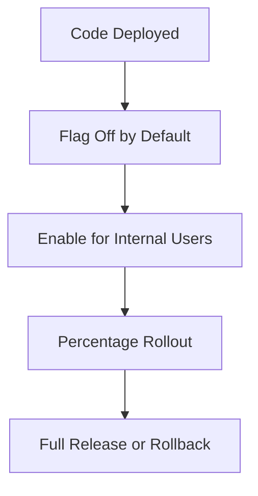

# Day 057 [Intermediate]: Feature Flags and Config Rollout

## Index

- Goal
- Prerequisites
- Explanation
- Topic by Topic
- Key Concepts
- Visual Concept Map
- End-to-End Practical
- Hands-on Coding
- Mini Exercise
- Assessment Quiz
- Task
- Self Check
- Interview Questions and Answers
- Day Outcome

## Goal

Use feature flags and configuration rollout patterns to ship safely without full redeploys.

## Prerequisites

- Day 056 error monitoring
- Environment-based config management

## Explanation

Feature flags separate deployment from release. You can merge code early, release gradually, and roll back quickly by changing configuration rather than rebuilding the app.

## Topic by Topic

### Topic 1: Release vs Deploy

Theory:
Deploying code and exposing behavior are different operations.

Practical:
Enable new checkout flow only for internal users first.

**Explanation:**
This topic explains Release vs Deploy in a practical Node.js backend context so you can build reliable, production-ready APIs and services.

**Key Points:**
- Understand the core idea behind Release vs Deploy.
- Apply the practical pattern with safe defaults and validation.
- Keep the implementation observable, maintainable, and secure where relevant.

### Topic 2: Flag Types

Theory:
Common types include release flags, experiment flags, ops kill switches.

Practical:
Add one kill switch for expensive recommendation endpoint.

**Explanation:**
This topic explains Flag Types in a practical Node.js backend context so you can build reliable, production-ready APIs and services.

**Key Points:**
- Understand the core idea behind Flag Types.
- Apply the practical pattern with safe defaults and validation.
- Keep the implementation observable, maintainable, and secure where relevant.

### Topic 3: Rollout Strategies

Theory:
Percentage rollout lowers blast radius.

Practical:
Start at 5%, move to 25%, then 100% after monitoring.

**Explanation:**
This topic explains Rollout Strategies in a practical Node.js backend context so you can build reliable, production-ready APIs and services.

**Key Points:**
- Understand the core idea behind Rollout Strategies.
- Apply the practical pattern with safe defaults and validation.
- Keep the implementation observable, maintainable, and secure where relevant.

### Topic 4: Configuration Governance

Theory:
Flags become debt when never removed.

Practical:
Add owner, expiry date, and cleanup checklist for every flag.

**Explanation:**
This topic explains Configuration Governance in a practical Node.js backend context so you can build reliable, production-ready APIs and services.

**Key Points:**
- Understand the core idea behind Configuration Governance.
- Apply the practical pattern with safe defaults and validation.
- Keep the implementation observable, maintainable, and secure where relevant.

### Topic 5: Incident Rollback via Flags

Theory:
Fast disable path can protect uptime during incidents.

Practical:
Disable problematic feature instantly and observe recovery.

**Explanation:**
This topic explains Incident Rollback via Flags in a practical Node.js backend context so you can build reliable, production-ready APIs and services.

**Key Points:**
- Understand the core idea behind Incident Rollback via Flags.
- Apply the practical pattern with safe defaults and validation.
- Keep the implementation observable, maintainable, and secure where relevant.

### Topic 6: Evaluation Consistency and Audit Trail

Theory:
Flag decisions should be consistent for the same user and safely traceable during incidents.

Practical:
Use deterministic targeting keys and log who changed which flag and when.

**Explanation:**
This topic explains Evaluation Consistency and Audit Trail in a practical Node.js backend context so you can build reliable, production-ready APIs and services.

**Key Points:**
- Understand the core idea behind Evaluation Consistency and Audit Trail.
- Apply the practical pattern with safe defaults and validation.
- Keep the implementation observable, maintainable, and secure where relevant.

## Flag Governance Table

| Field            | Why it matters                         |
| ---------------- | -------------------------------------- |
| Owner            | Someone is accountable for lifecycle   |
| Expiry date      | Prevents stale flags from accumulating |
| Rollout plan     | Enables controlled user exposure       |
| Kill switch path | Reduces incident response time         |

## Key Concepts

- Progressive feature release
- Operational kill-switch patterns
- Percentage-based targeting
- Flag lifecycle management
- Config-driven risk control
- Deterministic flag evaluation
- Change-audit discipline for operations

## Visual Concept Map



## End-to-End Practical

1. Define feature flag schema with defaults.
2. Wrap new logic behind flag gate.
3. Add user-segment targeting.
4. Perform staged rollout with monitoring.
5. Document cleanup and ownership.

## Hands-on Coding

### Example 1: Case - Simple Flag Gate

Scenario:
Enable new discount engine only when flag is on.

```js
function isEnabled(flags, key) {
  return Boolean(flags[key]);
}

app.get("/price", (req, res) => {
  const useNewEngine = isEnabled(runtimeFlags, "newDiscountEngine");
  const price = useNewEngine ? getPriceV2() : getPriceV1();
  res.json({ price, strategy: useNewEngine ? "v2" : "v1" });
});
```

### Example 2: Case - Percentage Rollout

Scenario:
Expose feature to 10% of users first.

```js
function inRollout(userId, percentage) {
  const bucket = Math.abs(hashCode(userId)) % 100;
  return bucket < percentage;
}

const enabled = inRollout(req.user.id, 10);
```

### Example 3: Case - Emergency Kill Switch

Scenario:
Third-party dependency latency spikes; disable feature immediately.

```js
if (runtimeFlags.disableRecommendations) {
  return res.json({ items: [], source: "kill-switch" });
}
```

### Example 4: Case - Stable User Bucketing

Scenario:
User should not randomly switch between old and new behavior.

```js
function rolloutBucket(userKey) {
  return Math.abs(hashCode(String(userKey))) % 100;
}

function isFeatureOn(userKey, percentage) {
  return rolloutBucket(userKey) < percentage;
}
```

### Example 5: Case - Flag Change Audit Log

Scenario:
Team needs traceability for emergency toggles.

```js
function updateFlag(name, value, actor) {
  runtimeFlags[name] = value;
  logger.warn(
    { flag: name, value, actor, at: new Date().toISOString() },
    "flag.changed",
  );
}
```

## Mini Exercise

Scenario:
Ship a new endpoint behind a flag, roll out gradually, then rollback using kill switch during simulated incident.

Expected output:

- Flag-controlled endpoint behavior
- Gradual exposure by user segment or percentage
- Rollback path that needs no redeploy

## Assessment Quiz

### Quiz Questions

1. Why separate deploy from release?
2. What is the advantage of percentage rollout?
3. True or False: Skipping edge-case handling is acceptable in production.
4. Why should every flag have an owner and expiry?
5. Why keep an audit trail for flag changes?

### Quiz Answers

1. It reduces release risk while keeping delivery velocity.
2. It limits impact while collecting real usage signals.
3. False.
4. To prevent long-lived dead paths and operational confusion.
5. It speeds incident investigation and clarifies accountability.

## Task

- Implement one release flag and one kill switch
- Document rollout and cleanup strategy
- Complete mini exercise and quiz.

## Self Check

- You can release features progressively and safely.
- You can control incidents with config-based rollback.
- You can answer at least 4 out of 5 quiz questions.

## Interview Questions and Answers

### Beginner

Question: What is a feature flag?

Answer: A runtime switch that controls whether specific functionality is active.

### Middle

Question: When are feature flags most valuable?

Answer: During risky releases, experiments, and staged production rollouts.

### Advanced

Question: What tradeoff do flags introduce?

Answer: Safer releases but added code-path complexity and governance overhead.

## Day 057 Outcome

- You can implement production-grade feature rollout controls
- You can design kill-switch and cleanup workflows
- You are ready for message broker fundamentals in Day 058
