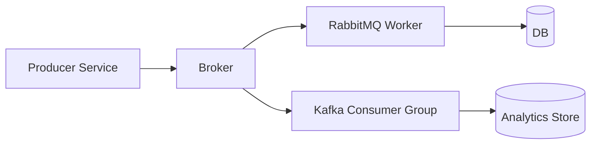

# Day 058 [Intermediate]: Message Brokers with RabbitMQ and Kafka

## Index

- Goal
- Prerequisites
- Explanation
- Topic by Topic
- Key Concepts
- Visual Concept Map
- End-to-End Practical
- Hands-on Coding
- Mini Exercise
- Assessment Quiz
- Task
- Self Check
- Interview Questions and Answers
- Day Outcome

## Goal

Understand when and how to use RabbitMQ and Kafka for reliable asynchronous communication in Node systems.

## Prerequisites

- Day 057 feature-flag rollout patterns
- Basic producer-consumer understanding

## Explanation

Message brokers decouple services and absorb traffic spikes. RabbitMQ is strong for task queues and routing flexibility, while Kafka is strong for high-throughput event streams and replay.

## Topic by Topic

### Topic 1: Why Use a Broker

Theory:
Synchronous service-to-service calls increase coupling and cascading failures.

Practical:
Publish order events and process them asynchronously.

**Explanation:**
This topic explains Why Use a Broker in a practical Node.js backend context so you can build reliable, production-ready APIs and services.

**Key Points:**
- Understand the core idea behind Why Use a Broker.
- Apply the practical pattern with safe defaults and validation.
- Keep the implementation observable, maintainable, and secure where relevant.

### Topic 2: RabbitMQ Basics

Theory:
RabbitMQ excels at work queues, routing keys, and acknowledgement control.

Practical:
Create durable queue with consumer acknowledgements.

**Explanation:**
This topic explains RabbitMQ Basics in a practical Node.js backend context so you can build reliable, production-ready APIs and services.

**Key Points:**
- Understand the core idea behind RabbitMQ Basics.
- Apply the practical pattern with safe defaults and validation.
- Keep the implementation observable, maintainable, and secure where relevant.

### Topic 3: Kafka Basics

Theory:
Kafka stores ordered event logs by partition and consumer groups.

Practical:
Produce user events and consume with scalable group.

**Explanation:**
This topic explains Kafka Basics in a practical Node.js backend context so you can build reliable, production-ready APIs and services.

**Key Points:**
- Understand the core idea behind Kafka Basics.
- Apply the practical pattern with safe defaults and validation.
- Keep the implementation observable, maintainable, and secure where relevant.

### Topic 4: Delivery Guarantees and Idempotency

Theory:
At-least-once delivery can duplicate messages.

Practical:
Store processed event IDs to avoid duplicate side effects.

**Explanation:**
This topic explains Delivery Guarantees and Idempotency in a practical Node.js backend context so you can build reliable, production-ready APIs and services.

**Key Points:**
- Understand the core idea behind Delivery Guarantees and Idempotency.
- Apply the practical pattern with safe defaults and validation.
- Keep the implementation observable, maintainable, and secure where relevant.

### Topic 5: Choosing RabbitMQ vs Kafka

Theory:
Selection depends on workload pattern, durability need, and replay requirements.

Practical:
Use queue for email jobs, stream for analytics pipeline.

**Explanation:**
This topic explains Choosing RabbitMQ vs Kafka in a practical Node.js backend context so you can build reliable, production-ready APIs and services.

**Key Points:**
- Understand the core idea behind Choosing RabbitMQ vs Kafka.
- Apply the practical pattern with safe defaults and validation.
- Keep the implementation observable, maintainable, and secure where relevant.

### Topic 6: Poison Messages and Consumer Lag

Theory:
Some messages repeatedly fail (poison messages), and slow consumers can build backlog (lag).

Practical:
Use DLQ for repeated failures and track lag/queue depth alerts.

**Explanation:**
This topic explains Poison Messages and Consumer Lag in a practical Node.js backend context so you can build reliable, production-ready APIs and services.

**Key Points:**
- Understand the core idea behind Poison Messages and Consumer Lag.
- Apply the practical pattern with safe defaults and validation.
- Keep the implementation observable, maintainable, and secure where relevant.

## Broker Comparison Table

| Criterion        | RabbitMQ               | Kafka                    |
| ---------------- | ---------------------- | ------------------------ |
| Primary pattern  | Task queue and routing | Event streaming log      |
| Replay events    | Limited                | Native and strong        |
| Ordering scope   | Queue-level with setup | Partition-level ordering |
| Typical use case | Job processing         | Analytics/event sourcing |

## Key Concepts

- Async decoupling between services
- Queue versus stream architecture
- Delivery acknowledgment semantics
- Idempotent consumer design
- Broker selection by workload
- Dead-letter handling for poison events
- Lag monitoring for operational stability

## Visual Concept Map



## End-to-End Practical

1. Publish order-created events from API.
2. Consume with RabbitMQ worker for notifications.
3. Stream same event to Kafka topic for analytics.
4. Add retry plus dead-letter handling.
5. Enforce idempotency in consumers.

## Hands-on Coding

### Example 1: Case - RabbitMQ Producer

Scenario:
Order API sends background notification jobs.

```js
const amqp = require("amqplib");

const conn = await amqp.connect(process.env.RABBITMQ_URL);
const channel = await conn.createChannel();
await channel.assertQueue("notify.order", { durable: true });

channel.sendToQueue(
  "notify.order",
  Buffer.from(JSON.stringify({ orderId: "o-101" })),
  { persistent: true },
);
```

### Example 2: Case - RabbitMQ Consumer with Ack

Scenario:
Worker confirms processing only after successful email send.

```js
channel.consume("notify.order", async (msg) => {
  try {
    const payload = JSON.parse(msg.content.toString());
    await sendOrderEmail(payload.orderId);
    channel.ack(msg);
  } catch (error) {
    channel.nack(msg, false, true);
  }
});
```

### Example 3: Case - Kafka Producer

Scenario:
Analytics pipeline needs durable event stream.

```js
const { Kafka } = require("kafkajs");

const kafka = new Kafka({ brokers: [process.env.KAFKA_BROKER] });
const producer = kafka.producer();
await producer.connect();

await producer.send({
  topic: "orders.created",
  messages: [{ key: "o-101", value: JSON.stringify({ orderId: "o-101" }) }],
});
```

### Example 4: Case - RabbitMQ Dead-letter Queue

Scenario:
Repeatedly failing messages should be isolated for manual inspection.

```js
await channel.assertExchange("orders.dlx", "direct", { durable: true });
await channel.assertQueue("notify.order.dlq", { durable: true });
await channel.bindQueue(
  "notify.order.dlq",
  "orders.dlx",
  "notify.order.failed",
);

await channel.assertQueue("notify.order", {
  durable: true,
  deadLetterExchange: "orders.dlx",
  deadLetterRoutingKey: "notify.order.failed",
});
```

### Example 5: Case - Consumer Lag Metric (Concept)

Scenario:
Analytics consumer falls behind during traffic peaks.

```js
// Track queue depth or kafka consumer lag and alert when threshold is crossed.
metrics.gauge("broker.consumer.lag", currentLag, {
  consumerGroup: "analytics-v1",
});
```

## Mini Exercise

Scenario:
Build one asynchronous order-processing flow where RabbitMQ handles transactional jobs and Kafka handles analytics stream.

Expected output:

- End-to-end producer and consumer flow
- Retry or dead-letter handling demonstrated
- Idempotent processing rule documented

## Assessment Quiz

### Quiz Questions

1. Why do brokers improve resilience compared to direct synchronous calls?
2. What is one strong reason to choose Kafka?
3. True or False: Skipping edge-case handling is acceptable in production.
4. Why must consumers be idempotent?
5. Why monitor lag or queue depth?

### Quiz Answers

1. Producers and consumers can fail independently without immediate chain failures.
2. High-throughput durable event replay capability.
3. False.
4. Retries may deliver duplicates, causing repeated side effects.
5. It warns early when consumers cannot keep up and backlog risk is rising.

## Task

- Build one producer-consumer flow with retry behavior
- Document RabbitMQ versus Kafka choice rationale
- Complete mini exercise and quiz.

## Self Check

- You can design reliable asynchronous messaging workflows.
- You can compare queue and stream broker tradeoffs.
- You can answer at least 4 out of 5 quiz questions.

## Interview Questions and Answers

### Beginner

Question: Why use a message broker in Node backend architecture?

Answer: It decouples services, supports retries, and smooths traffic spikes.

### Middle

Question: When is RabbitMQ often a better fit than Kafka?

Answer: When you need flexible routing and work-queue style task processing.

### Advanced

Question: What is a key tradeoff of broker-based architecture?

Answer: Better decoupling and resilience, but increased operational complexity and troubleshooting effort.

## Day 058 Outcome

- You can implement broker-driven asynchronous flows in Node
- You can choose RabbitMQ or Kafka based on workload characteristics
- You are ready for event-driven architecture design in Day 059
