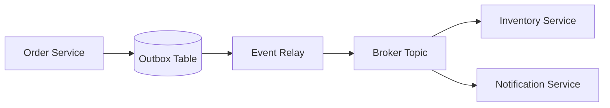

# Day 059 [Intermediate]: Event Driven Architecture

## Index

- Goal
- Prerequisites
- Explanation
- Topic by Topic
- Key Concepts
- Visual Concept Map
- End-to-End Practical
- Hands-on Coding
- Mini Exercise
- Assessment Quiz
- Task
- Self Check
- Interview Questions and Answers
- Day Outcome

## Goal

Design event-driven Node systems that are decoupled, resilient, and consistent under distributed conditions.

## Prerequisites

- Day 058 message brokers
- Service boundary design fundamentals

## Explanation

Event-driven architecture (EDA) lets services react to business events instead of calling each other directly. It improves decoupling and scalability, but requires disciplined handling of ordering, duplication, and eventual consistency.

## Topic by Topic

### Topic 1: Events as Business Facts

Theory:
Events should represent completed facts, not commands.

Practical:
Publish OrderPlaced after transaction commit.

**Explanation:**
This topic explains Events as Business Facts in a practical Node.js backend context so you can build reliable, production-ready APIs and services.

**Key Points:**
- Understand the core idea behind Events as Business Facts.
- Apply the practical pattern with safe defaults and validation.
- Keep the implementation observable, maintainable, and secure where relevant.

### Topic 2: Publisher and Subscriber Design

Theory:
Publishers emit events without knowing subscribers.

Practical:
Separate order service from inventory and notification services.

**Explanation:**
This topic explains Publisher and Subscriber Design in a practical Node.js backend context so you can build reliable, production-ready APIs and services.

**Key Points:**
- Understand the core idea behind Publisher and Subscriber Design.
- Apply the practical pattern with safe defaults and validation.
- Keep the implementation observable, maintainable, and secure where relevant.

### Topic 3: Event Schema Evolution

Theory:
Events evolve; consumers must remain backward-compatible.

Practical:
Use versioned payload schema and additive fields.

**Explanation:**
This topic explains Event Schema Evolution in a practical Node.js backend context so you can build reliable, production-ready APIs and services.

**Key Points:**
- Understand the core idea behind Event Schema Evolution.
- Apply the practical pattern with safe defaults and validation.
- Keep the implementation observable, maintainable, and secure where relevant.

### Topic 4: Exactly-once Myth and Idempotency

Theory:
Distributed systems usually provide at-least-once delivery.

Practical:
Deduplicate processing with eventId store.

**Explanation:**
This topic explains Exactly-once Myth and Idempotency in a practical Node.js backend context so you can build reliable, production-ready APIs and services.

**Key Points:**
- Understand the core idea behind Exactly-once Myth and Idempotency.
- Apply the practical pattern with safe defaults and validation.
- Keep the implementation observable, maintainable, and secure where relevant.

### Topic 5: Outbox Pattern

Theory:
Dual-write issues happen when DB write succeeds but event publish fails.

Practical:
Use transactional outbox and relay process.

**Explanation:**
This topic explains Outbox Pattern in a practical Node.js backend context so you can build reliable, production-ready APIs and services.

**Key Points:**
- Understand the core idea behind Outbox Pattern.
- Apply the practical pattern with safe defaults and validation.
- Keep the implementation observable, maintainable, and secure where relevant.

### Topic 6: Sagas and Compensation

Theory:
Some business flows span multiple services and can partially fail. Sagas coordinate steps and apply compensation instead of global transactions.

Practical:
If payment fails after inventory reserve, emit compensating event to release stock.

**Explanation:**
This topic explains Sagas and Compensation in a practical Node.js backend context so you can build reliable, production-ready APIs and services.

**Key Points:**
- Understand the core idea behind Sagas and Compensation.
- Apply the practical pattern with safe defaults and validation.
- Keep the implementation observable, maintainable, and secure where relevant.

## EDA Tradeoff Table

| Advantage               | Challenge                       |
| ----------------------- | ------------------------------- |
| Loose coupling          | Harder end-to-end tracing       |
| Scalable consumers      | Event ordering concerns         |
| Independent deployments | Event schema governance needed  |
| Better resilience       | Eventual consistency complexity |

## Key Concepts

- Domain event modeling
- Publish-subscribe decoupling
- Event schema versioning
- Idempotent consumption
- Transactional outbox reliability
- Long-running workflow coordination
- Compensation-based consistency

## Visual Concept Map



## End-to-End Practical

1. Persist order and outbox record in single DB transaction.
2. Relay outbox events to broker.
3. Consume events in two downstream services.
4. Add idempotency guard for duplicates.
5. Verify eventual consistency across read models.

## Hands-on Coding

### Example 1: Case - Domain Event Payload

Scenario:
Order service emits business event after successful creation.

```js
const event = {
  eventId: crypto.randomUUID(),
  eventType: "OrderPlaced",
  occurredAt: new Date().toISOString(),
  payload: { orderId: "o-101", customerId: "c-55", total: 129.99 },
};
```

### Example 2: Case - Idempotent Consumer Check

Scenario:
Duplicate event arrives after retry.

```js
if (await processedEventRepo.exists(event.eventId)) {
  return;
}

await inventoryService.reserve(event.payload.orderId);
await processedEventRepo.mark(event.eventId);
```

### Example 3: Case - Outbox Relay Loop

Scenario:
Relay process publishes unsent outbox records.

```js
const pending = await outboxRepo.findUnpublished(100);
for (const row of pending) {
  await broker.publish(row.topic, row.payload);
  await outboxRepo.markPublished(row.id);
}
```

### Example 4: Case - Saga-style Compensation Event

Scenario:
Payment fails after inventory was reserved.

```js
await broker.publish("orders.events", {
  eventId: crypto.randomUUID(),
  eventType: "PaymentFailed",
  payload: { orderId: "o-101", reason: "card_declined" },
});

// Inventory service listens and compensates
// PaymentFailed -> release reservation for orderId
```

### Example 5: Case - Simple Event Version Field

Scenario:
Consumer must parse old and new payload safely.

```js
const event = {
  eventId: crypto.randomUUID(),
  eventType: "OrderPlaced",
  version: 2,
  payload: {
    orderId: "o-101",
    customerId: "c-55",
    total: 129.99,
    currency: "USD",
  },
};
```

## Mini Exercise

Scenario:
Create an order pipeline where inventory and notification services react asynchronously to OrderPlaced.

Expected output:

- Asynchronous fan-out to multiple consumers
- Duplicate-processing guard in consumer
- Outbox-based publish reliability

## Assessment Quiz

### Quiz Questions

1. Why does EDA reduce service coupling?
2. What problem does outbox pattern prevent?
3. True or False: Skipping edge-case handling is acceptable in production.
4. Why should consumers support duplicate messages?
5. What does compensation mean in saga-based workflows?

### Quiz Answers

1. Publishers do not need direct dependencies on consumer availability.
2. Losing events when DB write and publish are not atomic.
3. False.
4. At-least-once delivery can replay messages.
5. Undoing or offsetting a completed step when a later step fails.

## Task

- Implement publish-subscribe flow for one business event
- Add idempotency and outbox reliability note
- Complete mini exercise and quiz.

## Self Check

- You can design resilient event-driven backend workflows.
- You can handle consistency and duplicate-event challenges.
- You can answer at least 4 out of 5 quiz questions.

## Interview Questions and Answers

### Beginner

Question: What is an event in EDA?

Answer: A record of something meaningful that already happened in the domain.

### Middle

Question: Why not use direct HTTP calls for everything?

Answer: Direct calls increase coupling, reduce resilience, and create cascading failure risk.

### Advanced

Question: What is a major tradeoff in EDA adoption?

Answer: Better scalability and decoupling at the cost of higher distributed-system complexity.

## Day 059 Outcome

- You can build practical event-driven flows in Node systems
- You can apply outbox and idempotency patterns correctly
- You are ready for microservices fundamentals in Day 060
