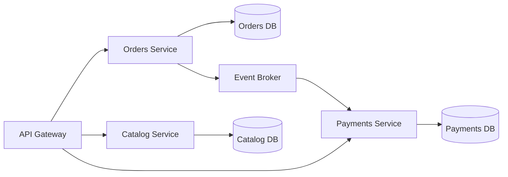

# Day 060 [Intermediate]: Microservices Fundamentals

## Index

- Goal
- Prerequisites
- Explanation
- Topic by Topic
- Key Concepts
- Visual Concept Map
- End-to-End Practical
- Hands-on Coding
- Mini Exercise
- Assessment Quiz
- Task
- Self Check
- Interview Questions and Answers
- Day Outcome

## Goal

Build a strong foundation for designing and operating Node microservices with clear boundaries, communication patterns, and reliability controls.

## Prerequisites

- Day 059 event-driven architecture
- API gateway and service communication basics

## Explanation

Microservices split a system into independently deployable services aligned to business domains. They improve team autonomy and scaling flexibility, but add operational and distributed-system complexity.

## Topic by Topic

### Topic 1: Service Boundaries and Domain Ownership

Theory:
Boundaries should follow business capabilities, not random technical layers.

Practical:
Split into orders, payments, and catalog domains.

**Explanation:**
This topic explains Service Boundaries and Domain Ownership in a practical Node.js backend context so you can build reliable, production-ready APIs and services.

**Key Points:**
- Understand the core idea behind Service Boundaries and Domain Ownership.
- Apply the practical pattern with safe defaults and validation.
- Keep the implementation observable, maintainable, and secure where relevant.

### Topic 2: Communication Patterns

Theory:
Use synchronous calls for immediate queries and events for asynchronous workflows.

Practical:
Checkout service calls pricing synchronously, publishes OrderPlaced asynchronously.

**Explanation:**
This topic explains Communication Patterns in a practical Node.js backend context so you can build reliable, production-ready APIs and services.

**Key Points:**
- Understand the core idea behind Communication Patterns.
- Apply the practical pattern with safe defaults and validation.
- Keep the implementation observable, maintainable, and secure where relevant.

### Topic 3: Data Ownership and Consistency

Theory:
Each service should own its data store to avoid tight coupling.

Practical:
Create read models from events instead of cross-service joins.

**Explanation:**
This topic explains Data Ownership and Consistency in a practical Node.js backend context so you can build reliable, production-ready APIs and services.

**Key Points:**
- Understand the core idea behind Data Ownership and Consistency.
- Apply the practical pattern with safe defaults and validation.
- Keep the implementation observable, maintainable, and secure where relevant.

### Topic 4: Reliability Patterns

Theory:
Distributed calls fail; resilience patterns are mandatory.

Practical:
Add timeout, retry with backoff, and circuit breaker.

**Explanation:**
This topic explains Reliability Patterns in a practical Node.js backend context so you can build reliable, production-ready APIs and services.

**Key Points:**
- Understand the core idea behind Reliability Patterns.
- Apply the practical pattern with safe defaults and validation.
- Keep the implementation observable, maintainable, and secure where relevant.

### Topic 5: Operational Readiness

Theory:
Microservices require strong observability and deployment discipline.

Practical:
Add per-service dashboards, trace correlation, and independent CI/CD.

**Explanation:**
This topic explains Operational Readiness in a practical Node.js backend context so you can build reliable, production-ready APIs and services.

**Key Points:**
- Understand the core idea behind Operational Readiness.
- Apply the practical pattern with safe defaults and validation.
- Keep the implementation observable, maintainable, and secure where relevant.

### Topic 6: Avoiding Distributed Monoliths

Theory:
Microservices can fail if services are too chatty and tightly coupled. This creates a distributed monolith.

Practical:
Keep APIs coarse-grained, reduce cross-service synchronous chains, and prefer async events where possible.

**Explanation:**
This topic explains Avoiding Distributed Monoliths in a practical Node.js backend context so you can build reliable, production-ready APIs and services.

**Key Points:**
- Understand the core idea behind Avoiding Distributed Monoliths.
- Apply the practical pattern with safe defaults and validation.
- Keep the implementation observable, maintainable, and secure where relevant.

## Monolith vs Microservices Table

| Aspect                 | Monolith        | Microservices               |
| ---------------------- | --------------- | --------------------------- |
| Deployment             | Single unit     | Independent service deploys |
| Team autonomy          | Lower           | Higher by domain            |
| Operational complexity | Lower initially | Higher ongoing              |
| Scaling granularity    | Whole app       | Per service                 |

## Key Concepts

- Domain-driven service decomposition
- Sync plus async communication mix
- Per-service data ownership
- Fault tolerance in distributed calls
- Operability and governance practices
- Coupling-risk detection in service meshes
- Strangler-style migration mindset

## Visual Concept Map



## End-to-End Practical

1. Define service boundaries for one domain problem.
2. Expose independent APIs per service.
3. Add synchronous and asynchronous communication paths.
4. Implement resilience patterns on network calls.
5. Add observability and deployment ownership per service.

## Hands-on Coding

### Example 1: Case - Service Boundary Definition

Scenario:
E-commerce platform separates responsibilities for maintainability.

```txt
orders-service: order lifecycle, status transitions
catalog-service: products and pricing data
payments-service: payment authorization and settlement
```

### Example 2: Case - Resilient HTTP Call

Scenario:
Orders service calls payments service with timeout and retry.

```js
async function callPayments(payload) {
  return fetch("http://payments/api/charge", {
    method: "POST",
    headers: { "content-type": "application/json" },
    body: JSON.stringify(payload),
    signal: AbortSignal.timeout(2000),
  });
}
```

### Example 3: Case - Publish Domain Event

Scenario:
Orders service publishes event instead of directly calling notification service.

```js
await broker.publish("orders.events", {
  eventType: "OrderPlaced",
  orderId: "o-101",
  occurredAt: new Date().toISOString(),
});
```

### Example 4: Case - Avoid Chatty Call Chain

Scenario:
Checkout path became fragile due to many synchronous hops.

```txt
Avoid: gateway -> orders -> pricing -> inventory -> notifications (all sync)
Prefer: gateway -> orders (sync), then orders emits OrderPlaced for async followers
```

### Example 5: Case - Strangler Migration Step

Scenario:
Move one capability from monolith to service gradually.

```js
app.get("/api/v1/orders/:id", async (req, res) => {
  const useOrdersService = featureFlags.ordersServiceRead;
  const data = useOrdersService
    ? await fetchFromOrdersService(req.params.id)
    : await fetchFromMonolith(req.params.id);

  res.json({ success: true, data });
});
```

## Mini Exercise

Scenario:
Design a mini checkout system with three services and one event-driven integration.

Expected output:

- Clear service boundaries and ownership
- One resilient inter-service call
- One async event integration

## Assessment Quiz

### Quiz Questions

1. Why should service boundaries map to business capabilities?
2. When should event-driven communication be preferred over direct HTTP?
3. True or False: Skipping edge-case handling is acceptable in production.
4. Why is shared database across services risky?
5. What is a distributed monolith risk?

### Quiz Answers

1. It aligns code ownership and change velocity with domain teams.
2. For decoupled, async workflows that do not require immediate response.
3. False.
4. It creates coupling and cross-team migration conflicts.
5. Services depend on too many synchronous internal calls, causing fragile releases and outages.

## Task

- Design one domain split into at least three services
- Add one resilience and one async integration pattern
- Complete mini exercise and quiz.

## Self Check

- You can design microservice boundaries and communication paths.
- You can reason about tradeoffs before decomposition.
- You can answer at least 4 out of 5 quiz questions.

## Interview Questions and Answers

### Beginner

Question: What is a microservice?

Answer: An independently deployable service focused on one business capability.

### Middle

Question: When should a team avoid microservices initially?

Answer: When product scope is small and operational maturity is low.

### Advanced

Question: What is the biggest tradeoff of microservices?

Answer: Better autonomy and scalability with significantly higher distributed operations complexity.

## Day 060 Outcome

- You can explain and apply core microservices architecture principles
- You can combine sync APIs and async events appropriately
- You are ready for advanced distributed-system implementation tracks next
