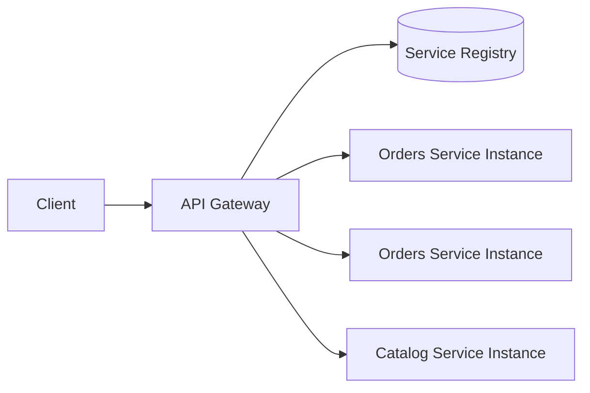

# Day 061 [Intermediate]: Service Discovery and Gateway Patterns

## Index

- Goal
- Prerequisites
- Explanation
- Topic by Topic
- Key Concepts
- Visual Concept Map
- End-to-End Practical
- Hands-on Coding
- Mini Exercise
- Assessment Quiz
- Task
- Self Check
- Interview Questions and Answers
- Day Outcome

## Goal

Design a Node microservice edge architecture using API gateway and service discovery for resilient request routing.

## Prerequisites

- Day 060 microservices fundamentals
- Basic reverse proxy and HTTP concepts

## Explanation

As microservices scale, hardcoded host:port routing fails quickly. Service discovery provides dynamic instance lookup, and API gateways centralize auth, routing, throttling, and observability at the edge.

## Topic by Topic

### Topic 1: Gateway Responsibilities

Theory:
Gateway acts as entry point for clients and enforces cross-cutting concerns.

Practical:
Implement auth check, rate limiting, and route forwarding in one edge service.

**Explanation:**
This topic explains Gateway Responsibilities in a practical Node.js backend context so you can build reliable, production-ready APIs and services.

**Key Points:**
- Understand the core idea behind Gateway Responsibilities.
- Apply the practical pattern with safe defaults and validation.
- Keep the implementation observable, maintainable, and secure where relevant.

### Topic 2: Service Discovery Models

Theory:
Client-side discovery uses registry lookup in client; server-side discovery delegates lookup to load balancer/gateway.

Practical:
Use gateway-side service lookup to simplify consumer services.

**Explanation:**
This topic explains Service Discovery Models in a practical Node.js backend context so you can build reliable, production-ready APIs and services.

**Key Points:**
- Understand the core idea behind Service Discovery Models.
- Apply the practical pattern with safe defaults and validation.
- Keep the implementation observable, maintainable, and secure where relevant.

### Topic 3: Health and Registration Lifecycle

Theory:
Instances must register on start and deregister/expire when unhealthy.

Practical:
Publish heartbeat and remove stale nodes automatically.

**Explanation:**
This topic explains Health and Registration Lifecycle in a practical Node.js backend context so you can build reliable, production-ready APIs and services.

**Key Points:**
- Understand the core idea behind Health and Registration Lifecycle.
- Apply the practical pattern with safe defaults and validation.
- Keep the implementation observable, maintainable, and secure where relevant.

### Topic 4: Failure Handling in Routing

Theory:
Service discovery still needs timeout, retry, and fallback behavior.

Practical:
Retry with different instance when one target fails.

**Explanation:**
This topic explains Failure Handling in Routing in a practical Node.js backend context so you can build reliable, production-ready APIs and services.

**Key Points:**
- Understand the core idea behind Failure Handling in Routing.
- Apply the practical pattern with safe defaults and validation.
- Keep the implementation observable, maintainable, and secure where relevant.

### Topic 5: Security and Observability at the Edge

Theory:
Gateway is ideal for request ID generation, auth token validation, and telemetry.

Practical:
Attach x-request-id and log upstream latency per route.

**Explanation:**
This topic explains Security and Observability at the Edge in a practical Node.js backend context so you can build reliable, production-ready APIs and services.

**Key Points:**
- Understand the core idea behind Security and Observability at the Edge.
- Apply the practical pattern with safe defaults and validation.
- Keep the implementation observable, maintainable, and secure where relevant.

### Topic 6: Routing Policy and Connection Reuse

Theory:
Gateway routing should balance load predictably, and reused connections reduce latency and resource cost.

Practical:
Use simple weighted or round-robin strategy and keep-alive HTTP agents for upstream calls.

**Explanation:**
This topic explains Routing Policy and Connection Reuse in a practical Node.js backend context so you can build reliable, production-ready APIs and services.

**Key Points:**
- Understand the core idea behind Routing Policy and Connection Reuse.
- Apply the practical pattern with safe defaults and validation.
- Keep the implementation observable, maintainable, and secure where relevant.

## Pattern Comparison Table

| Pattern               | Strength                       | Tradeoff                                  |
| --------------------- | ------------------------------ | ----------------------------------------- |
| API Gateway           | Centralized policy and routing | Can become bottleneck if poorly scaled    |
| Client-side discovery | Flexible and direct control    | Duplicated discovery logic in clients     |
| Server-side discovery | Simpler clients                | More gateway/load balancer responsibility |

## Key Concepts

- Edge gateway architecture
- Dynamic service resolution
- Health-aware routing
- Cross-cutting policy enforcement
- Discovery plus resilience integration
- Routing policy design
- Upstream connection reuse

## Visual Concept Map



## End-to-End Practical

1. Build gateway route `/api/orders/*`.
2. Resolve target instance from registry.
3. Proxy request with timeout and retry-once strategy.
4. Add auth middleware and rate limiting.
5. Log route, target instance, and response time.

## Hands-on Coding

### Example 1: Case - Registry-backed Service Lookup

Scenario:
Gateway needs active orders-service instance.

```js
async function resolveServiceInstance(serviceName) {
  const nodes = await registry.getHealthyInstances(serviceName);
  if (!nodes.length) throw new Error("No healthy instances");
  return nodes[Math.floor(Math.random() * nodes.length)];
}
```

### Example 2: Case - Gateway Proxy Route

Scenario:
Forward traffic from edge to discovered backend.

```js
app.use("/api/orders", async (req, res, next) => {
  try {
    const target = await resolveServiceInstance("orders-service");
    const url = `http://${target.host}:${target.port}${req.originalUrl}`;
    const response = await fetch(url, {
      method: req.method,
      signal: AbortSignal.timeout(2500),
    });
    res.status(response.status).send(await response.text());
  } catch (error) {
    next(error);
  }
});
```

### Example 3: Case - Health Registration Heartbeat

Scenario:
Instance informs registry that it is alive.

```js
setInterval(async () => {
  await registry.heartbeat({
    service: "orders-service",
    instanceId: process.env.INSTANCE_ID,
  });
}, 5000);
```

### Example 4: Case - Weighted Instance Selection

Scenario:
Send less traffic to a smaller canary instance.

```js
function pickWeighted(nodes) {
  const expanded = nodes.flatMap((n) => Array(n.weight || 1).fill(n));
  return expanded[Math.floor(Math.random() * expanded.length)];
}
```

### Example 5: Case - Keep-alive Upstream Calls

Scenario:
Gateway performs many upstream HTTP calls and should avoid repeated handshakes.

```js
const http = require("http");

const keepAliveAgent = new http.Agent({ keepAlive: true, maxSockets: 100 });

await fetch(url, {
  method: req.method,
  dispatcher: keepAliveAgent,
  signal: AbortSignal.timeout(2500),
});
```

## Mini Exercise

Scenario:
Implement a lightweight gateway for two services with registry-based resolution and fallback on failure.

Expected output:

- Two routable service paths via gateway
- Dynamic instance selection
- One failure-handling strategy documented

## Assessment Quiz

### Quiz Questions

1. Why is hardcoded service host configuration fragile in microservices?
2. What is the difference between client-side and server-side discovery?
3. True or False: A gateway can be used to centralize auth checks.
4. Why are health checks critical for discovery?
5. Why use keep-alive connections at the gateway?

### Quiz Answers

1. Instances are dynamic and scale up/down frequently.
2. Client-side resolves in caller; server-side resolves at gateway/load balancer.
3. True.
4. They prevent routing to dead or degraded instances.
5. They reduce connection overhead and improve upstream request latency.

## Task

- Build one gateway route with discovery lookup
- Add auth or rate-limiting middleware
- Complete mini exercise and quiz

## Self Check

- You can explain gateway and discovery roles clearly
- You can implement discovery-aware request routing
- You can answer at least 4 out of 5 quiz questions

## Interview Questions and Answers

### Beginner

Question: Why do microservices need service discovery?

Answer: Because service instances change dynamically and cannot be reliably hardcoded.

### Middle

Question: What should an API gateway handle versus backend services?

Answer: Gateway should handle cross-cutting concerns like auth, throttling, routing, and observability, while business logic remains in services.

### Advanced

Question: How would you avoid gateway bottlenecks at scale?

Answer: Run multiple gateway replicas, use autoscaling, cache route metadata, and monitor latency/error rate per upstream.

## Day 061 Outcome

- You can design a discovery-enabled gateway flow for Node systems
- You can apply health-aware request routing and edge policies
- You are ready for resilience patterns in Day 062
