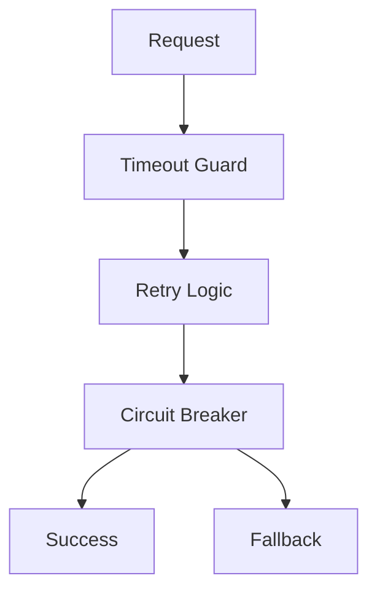

# Day 062 [Intermediate]: Resilience Patterns Retry and Circuit Breaker

## Index

- Goal
- Prerequisites
- Explanation
- Topic by Topic
- Key Concepts
- Visual Concept Map
- End-to-End Practical
- Hands-on Coding
- Mini Exercise
- Assessment Quiz
- Task
- Self Check
- Interview Questions and Answers
- Day Outcome

## Goal

Implement retry, timeout, backoff, and circuit-breaker patterns in Node services to reduce cascading failures.

## Prerequisites

- Day 061 gateway and discovery patterns
- Async JavaScript and HTTP client basics

## Explanation

Distributed systems fail in partial and unpredictable ways. Resilience patterns help your service degrade gracefully instead of timing out the whole request chain.

## Topic by Topic

### Topic 1: Retry Fundamentals

Theory:
Retries can recover from transient failures, but they can also amplify load.

Practical:
Retry only safe/idempotent operations with capped attempts.

**Explanation:**
This topic explains Retry Fundamentals in a practical Node.js backend context so you can build reliable, production-ready APIs and services.

**Key Points:**
- Understand the core idea behind Retry Fundamentals.
- Apply the practical pattern with safe defaults and validation.
- Keep the implementation observable, maintainable, and secure where relevant.

### Topic 2: Exponential Backoff and Jitter

Theory:
Backoff avoids synchronized retry storms.

Practical:
Use $delay = base * 2^attempt + jitter$.

**Explanation:**
This topic explains Exponential Backoff and Jitter in a practical Node.js backend context so you can build reliable, production-ready APIs and services.

**Key Points:**
- Understand the core idea behind Exponential Backoff and Jitter.
- Apply the practical pattern with safe defaults and validation.
- Keep the implementation observable, maintainable, and secure where relevant.

### Topic 3: Circuit Breaker States

Theory:
Circuit breaker transitions between closed, open, and half-open states.

Practical:
Stop calls quickly when downstream is unhealthy.

**Explanation:**
This topic explains Circuit Breaker States in a practical Node.js backend context so you can build reliable, production-ready APIs and services.

**Key Points:**
- Understand the core idea behind Circuit Breaker States.
- Apply the practical pattern with safe defaults and validation.
- Keep the implementation observable, maintainable, and secure where relevant.

### Topic 4: Timeout and Bulkhead

Theory:
Fast timeout and resource isolation prevent thread/connection exhaustion.

Practical:
Set per-dependency timeout and limit concurrent calls.

**Explanation:**
This topic explains Timeout and Bulkhead in a practical Node.js backend context so you can build reliable, production-ready APIs and services.

**Key Points:**
- Understand the core idea behind Timeout and Bulkhead.
- Apply the practical pattern with safe defaults and validation.
- Keep the implementation observable, maintainable, and secure where relevant.

### Topic 5: Fallback Strategy

Theory:
Fallback responses preserve partial service behavior.

Practical:
Return cached data when live dependency fails.

**Explanation:**
This topic explains Fallback Strategy in a practical Node.js backend context so you can build reliable, production-ready APIs and services.

**Key Points:**
- Understand the core idea behind Fallback Strategy.
- Apply the practical pattern with safe defaults and validation.
- Keep the implementation observable, maintainable, and secure where relevant.

### Topic 6: Retry Budget and Observability

Theory:
Retries must be limited globally, not only per call. Retry budgets prevent overload during large incidents.

Practical:
Track retry rate and enforce cap per service window.

**Explanation:**
This topic explains Retry Budget and Observability in a practical Node.js backend context so you can build reliable, production-ready APIs and services.

**Key Points:**
- Understand the core idea behind Retry Budget and Observability.
- Apply the practical pattern with safe defaults and validation.
- Keep the implementation observable, maintainable, and secure where relevant.

## Resilience Pattern Table

| Pattern         | Use Case                     | Risk if misused                |
| --------------- | ---------------------------- | ------------------------------ |
| Retry           | Transient network failure    | Retry storm                    |
| Timeout         | Slow downstream              | Premature failure if too short |
| Circuit breaker | Repeated dependency failures | Wrong thresholds can flap      |
| Fallback        | Graceful degradation         | Stale or partial data          |

## Key Concepts

- Controlled retries
- Exponential backoff with jitter
- Circuit breaker state machine
- Timeout and concurrency isolation
- Graceful degradation design
- Retry budget governance
- Resilience telemetry for tuning

## Visual Concept Map



## End-to-End Practical

1. Wrap one outbound dependency call in timeout.
2. Add bounded retry with jitter.
3. Insert circuit breaker around dependency.
4. Add fallback response path.
5. Load test downstream failure behavior.

## Hands-on Coding

### Example 1: Case - Retry with Backoff

Scenario:
Payment API occasionally returns transient 503.

```js
async function retryWithBackoff(fn, maxAttempts = 3) {
  for (let attempt = 1; attempt <= maxAttempts; attempt += 1) {
    try {
      return await fn();
    } catch (error) {
      if (attempt === maxAttempts) throw error;
      const wait = 100 * 2 ** attempt + Math.floor(Math.random() * 50);
      await new Promise((r) => setTimeout(r, wait));
    }
  }
}
```

### Example 2: Case - Circuit Breaker with opossum

Scenario:
Stop flooding an unhealthy inventory dependency.

```js
const CircuitBreaker = require("opossum");

const breaker = new CircuitBreaker(callInventoryService, {
  timeout: 2000,
  errorThresholdPercentage: 50,
  resetTimeout: 5000,
});

breaker.fallback(() => ({ available: false, source: "fallback" }));
```

### Example 3: Case - Timeout Guard

Scenario:
Prevent requests hanging on slow vendor API.

```js
const response = await fetch(vendorUrl, {
  method: "GET",
  signal: AbortSignal.timeout(1500),
});
```

### Example 4: Case - Retry Budget Check

Scenario:
During incident, retries start consuming too much traffic budget.

```js
function canRetry(serviceStats) {
  const retryRatio =
    serviceStats.retries / Math.max(serviceStats.totalCalls, 1);
  return retryRatio < 0.2;
}
```

### Example 5: Case - Retry Metrics

Scenario:
Team needs visibility into resilience behavior after rollout.

```js
metrics.counter("dependency.retry.attempts", 1, { dependency: "payments" });
metrics.counter("dependency.fallback.used", 1, { dependency: "payments" });
```

## Mini Exercise

Scenario:
Add resilience wrappers to one external API call in your service and validate behavior when downstream is slow/failing.

Expected output:

- Retry behavior with capped attempts
- Circuit opening under repeated failures
- Fallback response path validated

## Assessment Quiz

### Quiz Questions

1. Why can unlimited retries make outages worse?
2. What does an open circuit breaker do?
3. True or False: Skipping edge-case handling is acceptable in production.
4. Why is jitter important in retry delays?
5. Why use a retry budget?

### Quiz Answers

1. It increases downstream pressure and amplifies failures.
2. It fails fast without calling the unhealthy dependency.
3. False.
4. It prevents many clients retrying at the same exact moment.
5. It limits retry amplification so incidents do not overload dependencies further.

## Task

- Implement timeout, retry, and circuit breaker on one dependency call
- Document fallback behavior and tradeoff
- Complete mini exercise and quiz.

## Self Check

- You can design safer dependency calls under failures.
- You can avoid cascading outages using resilience controls.
- You can answer at least 4 out of 5 quiz questions.

## Interview Questions and Answers

### Beginner

Question: What is a circuit breaker in backend systems?

Answer: A guard that stops repeated calls to a failing dependency and recovers after a cooldown period.

### Middle

Question: Should every API call be retried?

Answer: No. Retry only idempotent operations and transient failures with bounded attempts.

### Advanced

Question: What tradeoff appears when adding many resilience layers?

Answer: Better stability under failure, but higher code complexity and tuning effort.

## Day 062 Outcome

- You can implement core resilience patterns in Node services
- You can tune retries and circuit breakers with real metrics
- You are ready for distributed transactions and saga in Day 063
