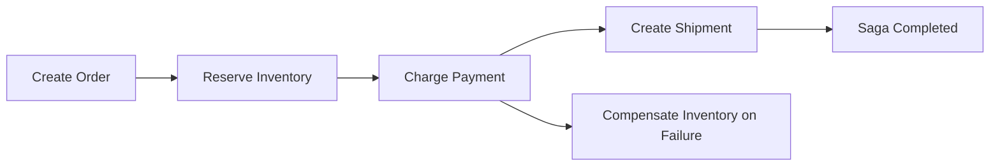

# Day 063 [Intermediate]: Distributed Transactions and Saga

## Index

- Goal
- Prerequisites
- Explanation
- Topic by Topic
- Key Concepts
- Visual Concept Map
- End-to-End Practical
- Hands-on Coding
- Mini Exercise
- Assessment Quiz
- Task
- Self Check
- Interview Questions and Answers
- Day Outcome

## Goal

Model multi-service business workflows with saga orchestration/choreography and compensation logic.

## Prerequisites

- Day 062 resilience patterns
- Event messaging fundamentals

## Explanation

In distributed systems, a single ACID transaction across services is often impractical. Saga breaks a workflow into local transactions and applies compensations when a later step fails.

## Topic by Topic

### Topic 1: Why 2PC is Rare in Microservices

Theory:
Two-phase commit adds coupling and operational complexity.

Practical:
Prefer local transactions plus asynchronous consistency.

**Explanation:**
This topic explains Why 2PC is Rare in Microservices in a practical Node.js backend context so you can build reliable, production-ready APIs and services.

**Key Points:**
- Understand the core idea behind Why 2PC is Rare in Microservices.
- Apply the practical pattern with safe defaults and validation.
- Keep the implementation observable, maintainable, and secure where relevant.

### Topic 2: Orchestrated Saga

Theory:
Central orchestrator controls step execution and compensations.

Practical:
Checkout orchestrator calls reserve inventory, charge payment, create shipment.

**Explanation:**
This topic explains Orchestrated Saga in a practical Node.js backend context so you can build reliable, production-ready APIs and services.

**Key Points:**
- Understand the core idea behind Orchestrated Saga.
- Apply the practical pattern with safe defaults and validation.
- Keep the implementation observable, maintainable, and secure where relevant.

### Topic 3: Choreographed Saga

Theory:
Services react to events without central coordinator.

Practical:
OrderCreated triggers InventoryReserved and PaymentCaptured flows.

**Explanation:**
This topic explains Choreographed Saga in a practical Node.js backend context so you can build reliable, production-ready APIs and services.

**Key Points:**
- Understand the core idea behind Choreographed Saga.
- Apply the practical pattern with safe defaults and validation.
- Keep the implementation observable, maintainable, and secure where relevant.

### Topic 4: Compensation Design

Theory:
Every forward action may need semantic undo action.

Practical:
Refund payment when shipping step fails.

**Explanation:**
This topic explains Compensation Design in a practical Node.js backend context so you can build reliable, production-ready APIs and services.

**Key Points:**
- Understand the core idea behind Compensation Design.
- Apply the practical pattern with safe defaults and validation.
- Keep the implementation observable, maintainable, and secure where relevant.

### Topic 5: Idempotency and Saga State

Theory:
Retries and duplicates are normal in distributed processing.

Practical:
Persist saga state machine and deduplicate commands/events.

**Explanation:**
This topic explains Idempotency and Saga State in a practical Node.js backend context so you can build reliable, production-ready APIs and services.

**Key Points:**
- Understand the core idea behind Idempotency and Saga State.
- Apply the practical pattern with safe defaults and validation.
- Keep the implementation observable, maintainable, and secure where relevant.

### Topic 6: Timeouts and Stuck-saga Recovery

Theory:
A saga can get stuck if one step never responds. You need timeout rules and recovery actions.

Practical:
Mark step as timed out, trigger compensation or manual review queue.

**Explanation:**
This topic explains Timeouts and Stuck-saga Recovery in a practical Node.js backend context so you can build reliable, production-ready APIs and services.

**Key Points:**
- Understand the core idea behind Timeouts and Stuck-saga Recovery.
- Apply the practical pattern with safe defaults and validation.
- Keep the implementation observable, maintainable, and secure where relevant.

## Saga Style Comparison Table

| Style         | Benefit                           | Tradeoff                              |
| ------------- | --------------------------------- | ------------------------------------- |
| Orchestration | Clear control flow and visibility | Central coordinator dependency        |
| Choreography  | Loose coupling among services     | Harder global reasoning and debugging |

## Key Concepts

- Local transaction boundaries
- Orchestration versus choreography
- Compensation logic correctness
- Durable saga state tracking
- Idempotent step execution
- Timeout-aware workflow control
- Stuck-flow recovery design

## Visual Concept Map



## End-to-End Practical

1. Define saga steps and compensations.
2. Persist saga state transitions in DB.
3. Execute forward steps with retries.
4. Trigger compensations on failure.
5. Validate final consistency state.

## Hands-on Coding

### Example 1: Case - Orchestrated Saga Step Runner

Scenario:
Checkout flow coordinates inventory and payment.

```js
async function runCheckoutSaga(order) {
  await reserveInventory(order);
  try {
    await capturePayment(order);
    await createShipment(order);
  } catch (error) {
    await releaseInventory(order);
    throw error;
  }
}
```

### Example 2: Case - Durable Saga State

Scenario:
Need restart-safe workflow progress.

```js
await sagaRepo.save({
  sagaId,
  step: "PAYMENT_CAPTURED",
  status: "IN_PROGRESS",
  updatedAt: new Date().toISOString(),
});
```

### Example 3: Case - Compensation Event

Scenario:
Shipping failed after payment success.

```js
await broker.publish("payments.events", {
  eventType: "RefundRequested",
  orderId,
  reason: "ShipmentFailed",
});
```

### Example 4: Case - Timeout Marking

Scenario:
Shipment service did not respond within workflow SLA.

```js
if (Date.now() - stepStartedAt > 30000) {
  await sagaRepo.markTimedOut(sagaId, "CREATE_SHIPMENT");
  await broker.publish("orders.events", {
    eventType: "OrderCompensationRequested",
    orderId,
  });
}
```

### Example 5: Case - Dead-letter for Failed Saga Commands

Scenario:
Compensation command keeps failing and requires human intervention.

```js
await broker.publish("saga.deadletter", {
  sagaId,
  step: "REFUND_PAYMENT",
  reason: "max_retries_exceeded",
});
```

## Mini Exercise

Scenario:
Implement a three-step saga for checkout and include one compensation path with idempotency key and timeout handling.

Expected output:

- Multi-step saga flow implemented
- Compensation triggered on controlled failure
- Durable state and idempotency recorded

## Assessment Quiz

### Quiz Questions

1. Why is saga preferred over global distributed transaction in many systems?
2. What is a compensation step?
3. True or False: Skipping edge-case handling is acceptable in production.
4. Why must saga steps be idempotent?
5. What should happen if a saga step times out?

### Quiz Answers

1. It reduces tight coupling and works better with independent services.
2. A semantic undo action for a previously successful step.
3. False.
4. Retries or duplicates can re-run steps and corrupt state without safeguards.
5. Mark it, trigger compensation or escalate for manual recovery.

## Task

- Implement one saga with at least one compensation step
- Add timeout and stuck-saga recovery strategy
- Complete mini exercise and quiz.

## Self Check

- You can design distributed transaction flow using saga patterns.
- You can reason about compensation and consistency tradeoffs.
- You can answer at least 4 out of 5 quiz questions.

## Interview Questions and Answers

### Beginner

Question: What is a saga in backend architecture?

Answer: A sequence of local transactions with compensation logic for failure handling.

### Middle

Question: When is orchestration better than choreography?

Answer: When workflow visibility and centralized control are more important than loose event-only coordination.

### Advanced

Question: What is the biggest risk in poorly designed compensation logic?

Answer: Business inconsistency such as charged payments without fulfillable orders.

## Day 063 Outcome

- You can model multi-service workflows with compensating transactions
- You can implement durable, restart-safe saga execution
- You are ready for DDD modeling in Day 064
