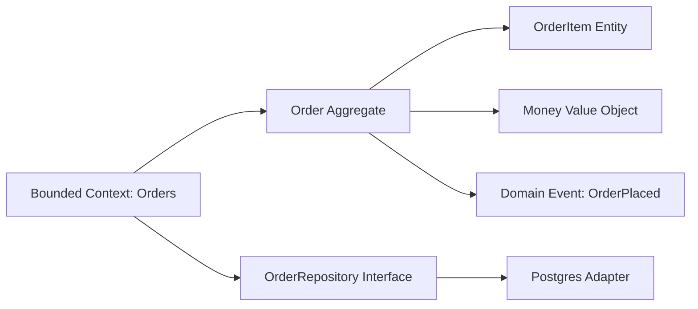

# Day 064 [Intermediate]: Domain Driven Design for Node

## Index

- Goal
- Prerequisites
- Explanation
- Topic by Topic
- Key Concepts
- Visual Concept Map
- End-to-End Practical
- Hands-on Coding
- Mini Exercise
- Assessment Quiz
- Task
- Self Check
- Interview Questions and Answers
- Day Outcome

## Goal

Apply Domain-Driven Design in Node projects to model business complexity with clear boundaries and expressive code.

## Prerequisites

- Day 063 saga modeling
- OOP and modular Node code familiarity

## Explanation

DDD is useful when domain rules are complex and evolving. It emphasizes ubiquitous language, bounded contexts, entities, value objects, and domain services so business behavior stays explicit in code.

## Topic by Topic

### Topic 1: Ubiquitous Language

Theory:
Team and code should use the same business terms.

Practical:
Rename generic classes to domain terms like OrderAggregate and PaymentAttempt.

**Explanation:**
This topic explains Ubiquitous Language in a practical Node.js backend context so you can build reliable, production-ready APIs and services.

**Key Points:**
- Understand the core idea behind Ubiquitous Language.
- Apply the practical pattern with safe defaults and validation.
- Keep the implementation observable, maintainable, and secure where relevant.

### Topic 2: Bounded Contexts

Theory:
Different subdomains can use different models for same concept.

Practical:
Customer in billing context can differ from customer in support context.

**Explanation:**
This topic explains Bounded Contexts in a practical Node.js backend context so you can build reliable, production-ready APIs and services.

**Key Points:**
- Understand the core idea behind Bounded Contexts.
- Apply the practical pattern with safe defaults and validation.
- Keep the implementation observable, maintainable, and secure where relevant.

### Topic 3: Entities and Value Objects

Theory:
Entities have identity; value objects are defined by attributes.

Practical:
Treat Money and Address as immutable value objects.

**Explanation:**
This topic explains Entities and Value Objects in a practical Node.js backend context so you can build reliable, production-ready APIs and services.

**Key Points:**
- Understand the core idea behind Entities and Value Objects.
- Apply the practical pattern with safe defaults and validation.
- Keep the implementation observable, maintainable, and secure where relevant.

### Topic 4: Aggregates and Invariants

Theory:
Aggregate root enforces consistency rules for related entities.

Practical:
Order aggregate blocks invalid state transitions.

**Explanation:**
This topic explains Aggregates and Invariants in a practical Node.js backend context so you can build reliable, production-ready APIs and services.

**Key Points:**
- Understand the core idea behind Aggregates and Invariants.
- Apply the practical pattern with safe defaults and validation.
- Keep the implementation observable, maintainable, and secure where relevant.

### Topic 5: Repository and Domain Service Patterns

Theory:
Domain layer should be persistence-agnostic.

Practical:
Use repository interfaces and infrastructure adapters.

**Explanation:**
This topic explains Repository and Domain Service Patterns in a practical Node.js backend context so you can build reliable, production-ready APIs and services.

**Key Points:**
- Understand the core idea behind Repository and Domain Service Patterns.
- Apply the practical pattern with safe defaults and validation.
- Keep the implementation observable, maintainable, and secure where relevant.

### Topic 6: Domain Events and Anti-corruption Layer

Theory:
Domain events capture important business changes. Anti-corruption layer (ACL) protects your model from external system contracts.

Practical:
Emit OrderPlaced from aggregate and map external payloads through an ACL translator.

**Explanation:**
This topic explains Domain Events and Anti-corruption Layer in a practical Node.js backend context so you can build reliable, production-ready APIs and services.

**Key Points:**
- Understand the core idea behind Domain Events and Anti-corruption Layer.
- Apply the practical pattern with safe defaults and validation.
- Keep the implementation observable, maintainable, and secure where relevant.

## DDD Building Blocks Table

| Building Block | Purpose                               |
| -------------- | ------------------------------------- |
| Entity         | Identity and lifecycle over time      |
| Value Object   | Immutable descriptive concept         |
| Aggregate      | Consistency boundary                  |
| Repository     | Abstract persistence operations       |
| Domain Service | Domain logic that does not fit entity |

## Key Concepts

- Ubiquitous language alignment
- Bounded context separation
- Rich domain models
- Aggregate invariants
- Persistence abstraction
- Domain event modeling
- Anti-corruption boundary design

## Visual Concept Map



## End-to-End Practical

1. Identify one domain and its ubiquitous language.
2. Model entity, value object, and aggregate root.
3. Add invariant checks in aggregate methods.
4. Define repository interface and adapter.
5. Test domain logic without database dependency.

## Hands-on Coding

### Example 1: Case - Value Object

Scenario:
Represent money consistently across order calculations.

```js
class Money {
  constructor(amount, currency) {
    if (amount < 0) throw new Error("Amount cannot be negative");
    this.amount = amount;
    this.currency = currency;
    Object.freeze(this);
  }
}
```

### Example 2: Case - Aggregate Invariant

Scenario:
Order cannot be paid before being confirmed.

```js
class OrderAggregate {
  markPaid() {
    if (this.status !== "CONFIRMED") throw new Error("Invalid transition");
    this.status = "PAID";
  }
}
```

### Example 3: Case - Repository Interface

Scenario:
Domain code should not know database details.

```js
class OrderRepository {
  async findById(orderId) {
    throw new Error("Not implemented");
  }
}
```

### Example 4: Case - Domain Event from Aggregate

Scenario:
Emit event after valid state transition.

```js
class OrderAggregate {
  confirm() {
    if (this.status !== "PENDING") throw new Error("Invalid transition");
    this.status = "CONFIRMED";
    return {
      eventType: "OrderConfirmed",
      orderId: this.id,
      occurredAt: new Date().toISOString(),
    };
  }
}
```

### Example 5: Case - Anti-corruption Translator

Scenario:
External payment provider payload should not leak into domain model.

```js
function mapProviderPaymentToDomain(payload) {
  return {
    paymentId: payload.txn_id,
    status: payload.state === "ok" ? "CAPTURED" : "FAILED",
    amount: Number(payload.amt_value),
  };
}
```

## Mini Exercise

Scenario:
Model one checkout domain aggregate with one value object, one repository interface, and one domain event.

Expected output:

- Ubiquitous language map
- Aggregate enforcing one invariant
- Persistence abstraction with repository interface

## Assessment Quiz

### Quiz Questions

1. Why is ubiquitous language important in DDD?
2. What is the difference between entity and value object?
3. True or False: Skipping edge-case handling is acceptable in production.
4. Why should aggregate invariants live in domain model?
5. Why use an anti-corruption layer in integrations?

### Quiz Answers

1. It aligns communication and code semantics across teams.
2. Entity has identity; value object is defined by its data.
3. False.
4. They protect consistency regardless of API or controller behavior.
5. It protects domain language from external schema leaks and churn.

## Task

- Build one aggregate with invariant and value object
- Add one domain event and ACL translator
- Complete mini exercise and quiz.

## Self Check

- You can model business logic using DDD building blocks.
- You can maintain clearer boundaries in growing Node systems.
- You can answer at least 4 out of 5 quiz questions.

## Interview Questions and Answers

### Beginner

Question: When is DDD worth the effort?

Answer: When business rules are complex and evolve frequently across teams.

### Middle

Question: Can DDD be used with simple CRUD projects?

Answer: It can, but heavy DDD patterns may be unnecessary overhead for trivial domains.

### Advanced

Question: What tradeoff does DDD introduce?

Answer: Better long-term model clarity with higher upfront design discipline.

## Day 064 Outcome

- You can apply DDD patterns in Node codebases with complex domains
- You can enforce domain rules through aggregates and value objects
- You are ready for clean architecture layering in Day 065
