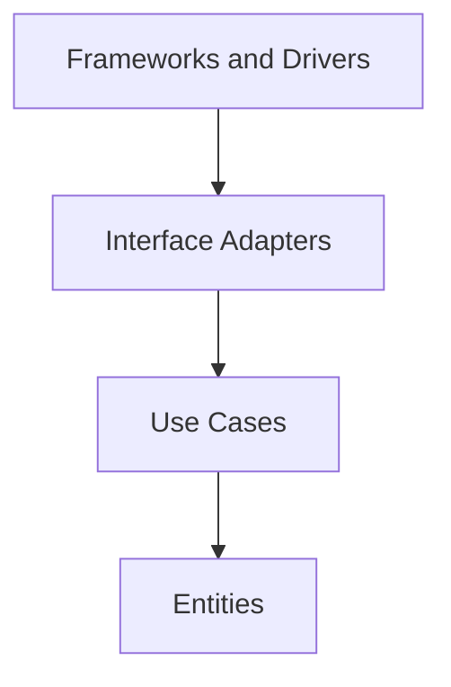

# Day 065 [Intermediate]: Clean Architecture in Node

## Index

- Goal
- Prerequisites
- Explanation
- Topic by Topic
- Key Concepts
- Visual Concept Map
- End-to-End Practical
- Hands-on Coding
- Mini Exercise
- Assessment Quiz
- Task
- Self Check
- Interview Questions and Answers
- Day Outcome

## Goal

Implement Clean Architecture in Node so business rules stay independent from frameworks and infrastructure.

## Prerequisites

- Day 064 DDD concepts
- Dependency inversion basics

## Explanation

Clean Architecture organizes code into layers with inward dependencies only. It improves maintainability, testability, and technology replacement flexibility over long-lived backend systems.

## Topic by Topic

### Topic 1: Layered Boundaries

Theory:
Core layers: entities, use cases, interface adapters, frameworks/drivers.

Practical:
Keep business policy in use-case layer, not controllers.

**Explanation:**
This topic explains Layered Boundaries in a practical Node.js backend context so you can build reliable, production-ready APIs and services.

**Key Points:**
- Understand the core idea behind Layered Boundaries.
- Apply the practical pattern with safe defaults and validation.
- Keep the implementation observable, maintainable, and secure where relevant.

### Topic 2: Dependency Rule

Theory:
Source dependencies must point inward to stable abstractions.

Practical:
Controller depends on use-case interface, not database client.

**Explanation:**
This topic explains Dependency Rule in a practical Node.js backend context so you can build reliable, production-ready APIs and services.

**Key Points:**
- Understand the core idea behind Dependency Rule.
- Apply the practical pattern with safe defaults and validation.
- Keep the implementation observable, maintainable, and secure where relevant.

### Topic 3: Use Cases and Ports

Theory:
Use cases define application behavior and depend on ports (interfaces).

Practical:
Inject repository implementation at composition root.

**Explanation:**
This topic explains Use Cases and Ports in a practical Node.js backend context so you can build reliable, production-ready APIs and services.

**Key Points:**
- Understand the core idea behind Use Cases and Ports.
- Apply the practical pattern with safe defaults and validation.
- Keep the implementation observable, maintainable, and secure where relevant.

### Topic 4: Testing Strategy by Layer

Theory:
Unit tests should focus on use cases; integration tests validate adapters.

Practical:
Test use case with fake repository, controller with HTTP test.

**Explanation:**
This topic explains Testing Strategy by Layer in a practical Node.js backend context so you can build reliable, production-ready APIs and services.

**Key Points:**
- Understand the core idea behind Testing Strategy by Layer.
- Apply the practical pattern with safe defaults and validation.
- Keep the implementation observable, maintainable, and secure where relevant.

### Topic 5: Migration from Legacy Structure

Theory:
Adopt incrementally to avoid risky big-bang rewrites.

Practical:
Move one module at a time into layered structure.

**Explanation:**
This topic explains Migration from Legacy Structure in a practical Node.js backend context so you can build reliable, production-ready APIs and services.

**Key Points:**
- Understand the core idea behind Migration from Legacy Structure.
- Apply the practical pattern with safe defaults and validation.
- Keep the implementation observable, maintainable, and secure where relevant.

### Topic 6: Composition Root and Boundary Enforcement

Theory:
Dependency injection should happen in one place, and architecture boundaries should be protected from accidental imports.

Practical:
Create a composition root module and add lint rules for allowed layer dependencies.

**Explanation:**
This topic explains Composition Root and Boundary Enforcement in a practical Node.js backend context so you can build reliable, production-ready APIs and services.

**Key Points:**
- Understand the core idea behind Composition Root and Boundary Enforcement.
- Apply the practical pattern with safe defaults and validation.
- Keep the implementation observable, maintainable, and secure where relevant.

## Layer Responsibility Table

| Layer             | Responsibility                               | Should NOT depend on               |
| ----------------- | -------------------------------------------- | ---------------------------------- |
| Entities          | Core business objects and rules              | Express, DB libraries              |
| Use Cases         | Application-specific workflows               | HTTP/ORM details                   |
| Adapters          | Convert external IO to use-case input/output | Framework internals in core logic  |
| Framework/Drivers | Web server, DB, queues                       | Nothing inward should import these |

## Key Concepts

- Inward dependency direction
- Framework-independent core logic
- Ports and adapters abstraction
- Layer-focused testing
- Incremental architecture refactoring
- Composition root discipline
- Boundary enforcement automation

## Visual Concept Map



## End-to-End Practical

1. Define use case interface for CreateOrder.
2. Implement core use case with validation rules.
3. Add repository port and infrastructure adapter.
4. Wire Express controller through dependency injection.
5. Test use case independently from framework and DB.

## Hands-on Coding

### Example 1: Case - Use Case Class

Scenario:
Business rule for order creation should be framework-agnostic.

```js
class CreateOrderUseCase {
  constructor(orderRepository) {
    this.orderRepository = orderRepository;
  }

  async execute(input) {
    if (!input.items || input.items.length === 0) {
      throw new Error("Order must contain at least one item");
    }
    return this.orderRepository.create(input);
  }
}
```

### Example 2: Case - Express Adapter

Scenario:
Controller maps HTTP input/output to use case.

```js
app.post("/orders", async (req, res, next) => {
  try {
    const output = await createOrderUseCase.execute(req.body);
    res.status(201).json(output);
  } catch (error) {
    next(error);
  }
});
```

### Example 3: Case - Composition Root Wiring

Scenario:
Inject infra implementation without leaking it into core layer.

```js
const orderRepository = new PostgresOrderRepository(pool);
const createOrderUseCase = new CreateOrderUseCase(orderRepository);
```

### Example 4: Case - Single Composition Root

Scenario:
Avoid creating dependencies inside route handlers.

```js
function buildOrderModule({ pool }) {
  const orderRepository = new PostgresOrderRepository(pool);
  const createOrderUseCase = new CreateOrderUseCase(orderRepository);
  return { createOrderUseCase };
}
```

### Example 5: Case - Boundary Rule Concept

Scenario:
Prevent use-case layer from importing infrastructure code directly.

```txt
Rule: src/use-cases/** can import only src/entities/** and src/ports/**
Rule: src/infrastructure/** can import use-cases and ports, not the reverse
```

## Mini Exercise

Scenario:
Refactor one existing endpoint into clean architecture layers with a use-case class and repository port.

Expected output:

- Clear layer separation
- Framework-free use-case logic
- Adapter-based IO boundary

## Assessment Quiz

### Quiz Questions

1. Why is dependency inversion central to Clean Architecture?
2. Which layer should contain business workflow logic?
3. True or False: Skipping edge-case handling is acceptable in production.
4. Why should entities not import framework libraries?
5. Why keep dependency wiring in a composition root?

### Quiz Answers

1. It keeps core policy independent from external tools and enables replaceability.
2. Use-case/application layer.
3. False.
4. It couples core logic to infrastructure and makes long-term change expensive.
5. It centralizes wiring, reduces duplication, and keeps core layers pure.

## Task

- Refactor one route into use case plus adapter
- Document one dependency inversion decision
- Complete mini exercise and quiz.

## Self Check

- You can separate Node code into clean, testable layers.
- You can keep business rules independent from frameworks.
- You can answer at least 4 out of 5 quiz questions.

## Interview Questions and Answers

### Beginner

Question: What is the most important rule in Clean Architecture?

Answer: Dependencies must point inward toward stable core layers.

### Middle

Question: Is Clean Architecture always necessary for small projects?

Answer: Not always; for very small short-lived apps, simpler structure may be enough.

### Advanced

Question: What tradeoff does clean architecture introduce?

Answer: Better maintainability and testability with more files, abstractions, and initial setup effort.

## Day 065 Outcome

- You can design clean layered Node backends
- You can apply dependency inversion in practical code
- You are ready for advanced system design and reliability topics next
