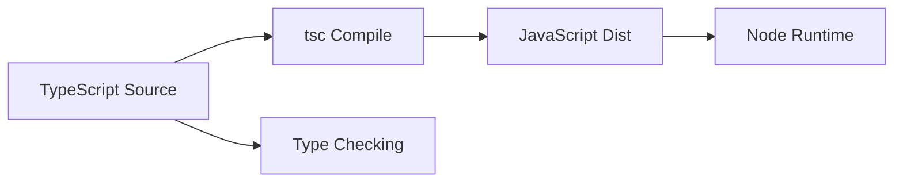

# Day 066 [Intermediate]: TypeScript with Node Basics

## Index

- Goal
- Prerequisites
- Explanation
- Topic by Topic
- Key Concepts
- Visual Concept Map
- End-to-End Practical
- Hands-on Coding
- Mini Exercise
- Assessment Quiz
- Task
- Self Check
- Interview Questions and Answers
- Day Outcome

## Goal

Set up and use TypeScript in Node projects with strict typing, safer refactoring, and production-ready build flow.

## Prerequisites

- Day 065 clean architecture concepts
- Basic JavaScript and npm workflow

## Explanation

TypeScript catches many runtime bugs at compile time. In Node backends, it improves API contracts, editor tooling, and long-term maintainability when combined with strict compiler options.

## Topic by Topic

### Topic 1: TypeScript Project Setup

Theory:
A strong tsconfig baseline prevents weak typing from spreading.

Practical:
Enable strict mode, set rootDir/outDir, and compile to dist.

**Explanation:**
This topic explains TypeScript Project Setup in a practical Node.js backend context so you can build reliable, production-ready APIs and services.

**Key Points:**
- Understand the core idea behind TypeScript Project Setup.
- Apply the practical pattern with safe defaults and validation.
- Keep the implementation observable, maintainable, and secure where relevant.

### Topic 2: Types, Interfaces, and Utility Types

Theory:
Types describe data contracts; utility types reduce duplication.

Practical:
Use interface for DTO and Partial or Pick for update payloads.

**Explanation:**
This topic explains Types, Interfaces, and Utility Types in a practical Node.js backend context so you can build reliable, production-ready APIs and services.

**Key Points:**
- Understand the core idea behind Types, Interfaces, and Utility Types.
- Apply the practical pattern with safe defaults and validation.
- Keep the implementation observable, maintainable, and secure where relevant.

### Topic 3: Async Types and Error Safety

Theory:
Async boundaries should return predictable typed results.

Practical:
Create typed service methods returning Promise<Result>.

**Explanation:**
This topic explains Async Types and Error Safety in a practical Node.js backend context so you can build reliable, production-ready APIs and services.

**Key Points:**
- Understand the core idea behind Async Types and Error Safety.
- Apply the practical pattern with safe defaults and validation.
- Keep the implementation observable, maintainable, and secure where relevant.

### Topic 4: Module Resolution and Path Aliases

Theory:
Alias imports improve readability in larger codebases.

Practical:
Add paths in tsconfig and align runtime resolution.

**Explanation:**
This topic explains Module Resolution and Path Aliases in a practical Node.js backend context so you can build reliable, production-ready APIs and services.

**Key Points:**
- Understand the core idea behind Module Resolution and Path Aliases.
- Apply the practical pattern with safe defaults and validation.
- Keep the implementation observable, maintainable, and secure where relevant.

### Topic 5: Compile, Run, and Debug Flow

Theory:
Development and production modes need separate commands.

Practical:
Use tsx for dev and tsc plus node dist for production.

**Explanation:**
This topic explains Compile, Run, and Debug Flow in a practical Node.js backend context so you can build reliable, production-ready APIs and services.

**Key Points:**
- Understand the core idea behind Compile, Run, and Debug Flow.
- Apply the practical pattern with safe defaults and validation.
- Keep the implementation observable, maintainable, and secure where relevant.

### Topic 6: Runtime Validation with Static Types

Theory:
TypeScript checks code at compile time only. External input (HTTP/body/env) still needs runtime validation.

Practical:
Validate request payload with schema library and derive TypeScript type from schema.

**Explanation:**
This topic explains Runtime Validation with Static Types in a practical Node.js backend context so you can build reliable, production-ready APIs and services.

**Key Points:**
- Understand the core idea behind Runtime Validation with Static Types.
- Apply the practical pattern with safe defaults and validation.
- Keep the implementation observable, maintainable, and secure where relevant.

## Compiler Option Table

| Option                   | Why it matters                          |
| ------------------------ | --------------------------------------- |
| strict                   | Enables strongest type safety baseline  |
| noUncheckedIndexedAccess | Prevents unsafe object and array access |
| noImplicitOverride       | Makes inheritance changes explicit      |
| esModuleInterop          | Smooth interop with commonjs packages   |

## Key Concepts

- Strict typing in backend services
- Safer async and data contracts
- Refactor confidence with compiler support
- Runtime build and execution strategy
- Type hygiene in growing projects
- Runtime input validation discipline
- Single-source schema and type derivation

## Visual Concept Map



## End-to-End Practical

1. Initialize Node project with TypeScript.
2. Configure strict tsconfig options.
3. Build one typed service plus controller.
4. Add compile and run scripts.
5. Validate build and runtime behavior.

## Hands-on Coding

### Example 1: Case - Minimal tsconfig

Scenario:
Team needs reliable defaults for new TypeScript backend.

```json
{
  "compilerOptions": {
    "target": "ES2022",
    "module": "CommonJS",
    "rootDir": "src",
    "outDir": "dist",
    "strict": true,
    "esModuleInterop": true
  }
}
```

### Example 2: Case - Typed Domain Contract

Scenario:
Define safe shape for create user input.

```ts
interface CreateUserInput {
  email: string;
  fullName: string;
  age?: number;
}

async function createUser(input: CreateUserInput): Promise<{ id: string }> {
  return { id: "u-101" };
}
```

### Example 3: Case - Build and Start Scripts

Scenario:
Use fast dev loop and stable production run.

```json
{
  "scripts": {
    "dev": "tsx watch src/index.ts",
    "build": "tsc -p tsconfig.json",
    "start": "node dist/index.js"
  }
}
```

### Example 4: Case - Validate Unknown Request Data

Scenario:
Controller receives untrusted input from external client.

```ts
import { z } from "zod";

const CreateUserSchema = z.object({
  email: z.string().email(),
  fullName: z.string().min(2),
  age: z.number().int().positive().optional(),
});

type CreateUserInput = z.infer<typeof CreateUserSchema>;
```

### Example 5: Case - Safe Parse in Route Layer

Scenario:
Return clean validation errors before service call.

```ts
const parsed = CreateUserSchema.safeParse(req.body);
if (!parsed.success) {
  return res.status(400).json({ success: false, errors: parsed.error.issues });
}

const user = await createUser(parsed.data);
res.status(201).json({ success: true, data: user });
```

## Mini Exercise

Scenario:
Convert one JavaScript module to TypeScript and enforce strict input/output types.

Expected output:

- Compilable strict TypeScript setup
- Typed service boundary
- Clear dev and prod scripts

## Assessment Quiz

### Quiz Questions

1. Why is strict mode recommended for backend TypeScript?
2. What is the difference between compile-time and runtime errors?
3. True or False: Skipping edge-case handling is acceptable in production.
4. Why is using any everywhere dangerous?
5. Why is runtime validation still needed with TypeScript?

### Quiz Answers

1. It catches unsafe assumptions before deployment.
2. Compile-time errors are caught before run; runtime errors happen during execution.
3. False.
4. It disables type protection and hides bugs.
5. External input is unchecked at compile time and can still be invalid at runtime.

## Task

- Configure strict TypeScript in one Node module
- Replace untyped payload with typed contract
- Complete mini exercise and quiz.

## Self Check

- You can set up TypeScript correctly for Node backends.
- You can write safer typed service code.
- You can answer at least 4 out of 5 quiz questions.

## Interview Questions and Answers

### Beginner

Question: Why use TypeScript in Node APIs?

Answer: It improves reliability, tooling, and maintainability by making contracts explicit.

### Middle

Question: Should teams migrate entire codebase at once?

Answer: Usually no; incremental migration is safer and easier to validate.

### Advanced

Question: What tradeoff comes with strict typing?

Answer: More upfront typing effort for significantly lower bug risk and safer refactors.

## Day 066 Outcome

- You can establish practical TypeScript foundations in Node
- You can maintain clear typed contracts in backend modules
- You are ready for typed Express APIs in Day 067
