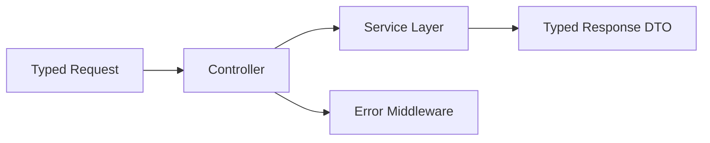

# Day 067 [Intermediate]: Typed Express APIs

## Index

- Goal
- Prerequisites
- Explanation
- Topic by Topic
- Key Concepts
- Visual Concept Map
- End-to-End Practical
- Hands-on Coding
- Mini Exercise
- Assessment Quiz
- Task
- Self Check
- Interview Questions and Answers
- Day Outcome

## Goal

Build Express APIs with strong request and response typing to reduce contract bugs and improve developer velocity.

## Prerequisites

- Day 066 TypeScript setup
- Express routing and middleware knowledge

## Explanation

Express handlers often fail due to implicit assumptions about request shapes. Typed APIs make params, body, query, and responses explicit and safer.

## Topic by Topic

### Topic 1: Typing Request Components

Theory:
Each route can type params, body, query, and response.

Practical:
Use Request generics to define route contracts.

**Explanation:**
This topic explains Typing Request Components in a practical Node.js backend context so you can build reliable, production-ready APIs and services.

**Key Points:**
- Understand the core idea behind Typing Request Components.
- Apply the practical pattern with safe defaults and validation.
- Keep the implementation observable, maintainable, and secure where relevant.

### Topic 2: Typed Controllers and Services

Theory:
Controller should map typed inputs to typed use-case calls.

Practical:
Define DTOs shared across service and API boundaries.

**Explanation:**
This topic explains Typed Controllers and Services in a practical Node.js backend context so you can build reliable, production-ready APIs and services.

**Key Points:**
- Understand the core idea behind Typed Controllers and Services.
- Apply the practical pattern with safe defaults and validation.
- Keep the implementation observable, maintainable, and secure where relevant.

### Topic 3: Typed Error Responses

Theory:
Error payloads should follow predictable schema.

Practical:
Create AppError type and centralized error middleware.

**Explanation:**
This topic explains Typed Error Responses in a practical Node.js backend context so you can build reliable, production-ready APIs and services.

**Key Points:**
- Understand the core idea behind Typed Error Responses.
- Apply the practical pattern with safe defaults and validation.
- Keep the implementation observable, maintainable, and secure where relevant.

### Topic 4: Auth Context Typing

Theory:
Middleware-injected values like req.user must be typed safely.

Practical:
Augment Express Request interface with user claims.

**Explanation:**
This topic explains Auth Context Typing in a practical Node.js backend context so you can build reliable, production-ready APIs and services.

**Key Points:**
- Understand the core idea behind Auth Context Typing.
- Apply the practical pattern with safe defaults and validation.
- Keep the implementation observable, maintainable, and secure where relevant.

### Topic 5: Testing Typed Contracts

Theory:
Type-level guarantees should be paired with runtime tests.

Practical:
Add integration tests for success and validation failure responses.

**Explanation:**
This topic explains Testing Typed Contracts in a practical Node.js backend context so you can build reliable, production-ready APIs and services.

**Key Points:**
- Understand the core idea behind Testing Typed Contracts.
- Apply the practical pattern with safe defaults and validation.
- Keep the implementation observable, maintainable, and secure where relevant.

### Topic 6: Response Contract Enforcement

Theory:
Typed responses in code can still drift at runtime if manual objects are returned incorrectly.

Practical:
Validate or normalize response payloads before sending for critical endpoints.

**Explanation:**
This topic explains Response Contract Enforcement in a practical Node.js backend context so you can build reliable, production-ready APIs and services.

**Key Points:**
- Understand the core idea behind Response Contract Enforcement.
- Apply the practical pattern with safe defaults and validation.
- Keep the implementation observable, maintainable, and secure where relevant.

## Typed API Benefit Table

| Area           | Untyped Risk                 | Typed Benefit                      |
| -------------- | ---------------------------- | ---------------------------------- |
| Request body   | Missing fields at runtime    | Compile-time detection in handlers |
| Query params   | Incorrect conversions        | Explicit parse and type guards     |
| Error payloads | Inconsistent client handling | Stable error contract              |
| Refactoring    | Silent breakage              | Type-guided safe changes           |

## Key Concepts

- Request and response contract typing
- Typed middleware context
- Centralized typed error model
- DTO-driven controller design
- Contract-safe refactoring
- Runtime-safe response shaping
- Contract drift prevention

## Visual Concept Map



## End-to-End Practical

1. Define DTO types for one resource.
2. Add typed route handler generics.
3. Type auth middleware context.
4. Implement typed error middleware.
5. Validate contracts with tests.

## Hands-on Coding

### Example 1: Case - Typed Route Handler

Scenario:
Users endpoint expects strict path and response shape.

```ts
type Params = { id: string };
type ResponseBody = { id: string; email: string };

app.get(
  "/users/:id",
  async (req: Request<Params>, res: Response<ResponseBody>) => {
    res.json({ id: req.params.id, email: "a@b.com" });
  },
);
```

### Example 2: Case - Typed Create Payload

Scenario:
Prevent missing user fields in create request.

```ts
interface CreateUserBody {
  email: string;
  fullName: string;
}

app.post("/users", (req: Request<{}, {}, CreateUserBody>, res: Response) => {
  res.status(201).json({ id: "u-1", ...req.body });
});
```

### Example 3: Case - Typed Error Middleware

Scenario:
All API errors should return consistent shape.

```ts
type ErrorBody = { code: string; message: string };

app.use(
  (err: Error, req: Request, res: Response<ErrorBody>, next: NextFunction) => {
    res.status(500).json({ code: "INTERNAL_ERROR", message: err.message });
  },
);
```

### Example 4: Case - Typed Query Parsing Helper

Scenario:
Avoid unsafe casts when reading query string values.

```ts
function parsePage(query: Request["query"]) {
  const raw = query.page;
  const page = Number(Array.isArray(raw) ? raw[0] : raw);
  return Number.isFinite(page) && page > 0 ? page : 1;
}
```

### Example 5: Case - Response Normalizer

Scenario:
Critical endpoint should always return stable response keys.

```ts
type UserResponse = { id: string; email: string; fullName: string };

function toUserResponse(input: {
  id: string;
  email: string;
  fullName?: string;
}): UserResponse {
  return {
    id: input.id,
    email: input.email,
    fullName: input.fullName ?? "",
  };
}
```

## Mini Exercise

Scenario:
Implement typed CRUD endpoints for one resource and include typed auth context in one protected route.

Expected output:

- Typed request and response contracts
- One protected typed route
- Consistent typed error payloads

## Assessment Quiz

### Quiz Questions

1. Why are typed request bodies useful in Express?
2. What should be typed first in an existing untyped API?
3. True or False: Skipping edge-case handling is acceptable in production.
4. Why is direct any casting risky in controllers?
5. Why normalize or validate responses at runtime for key endpoints?

### Quiz Answers

1. They prevent contract mismatches before runtime.
2. Request and response DTOs for frequently used routes.
3. False.
4. It bypasses type safety and hides invalid assumptions.
5. It prevents contract drift when runtime objects differ from expected API shape.

## Task

- Add typed handlers for one module
- Document one typing boundary decision
- Complete mini exercise and quiz.

## Self Check

- You can build Express APIs with strong static contracts.
- You can reduce runtime contract bugs through typing discipline.
- You can answer at least 4 out of 5 quiz questions.

## Interview Questions and Answers

### Beginner

Question: Why type Express APIs if runtime validation still exists?

Answer: Typing improves developer-time safety, while runtime validation protects actual external input.

### Middle

Question: Should types be shared across frontend and backend?

Answer: Shared contracts can reduce duplication, but boundaries should remain explicit and versioned.

### Advanced

Question: What tradeoff comes with deep generic typing?

Answer: Better safety with potentially steeper learning curve and longer type definitions.

## Day 067 Outcome

- You can implement type-safe Express endpoints
- You can maintain consistent typed API behavior across modules
- You are ready for runtime validation and contracts in Day 068
