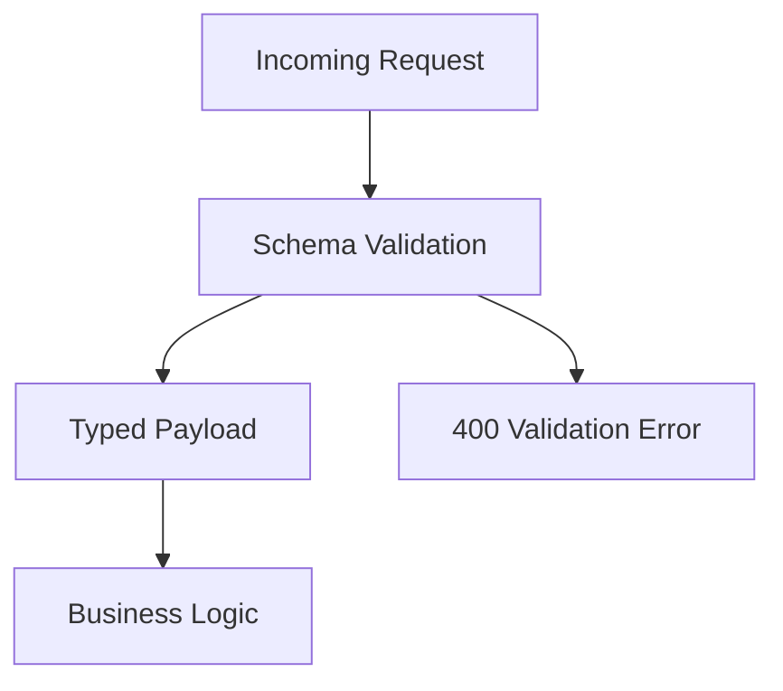

# Day 068 [Intermediate]: Runtime Validation and Contracts

## Index

- Goal
- Prerequisites
- Explanation
- Topic by Topic
- Key Concepts
- Visual Concept Map
- End-to-End Practical
- Hands-on Coding
- Mini Exercise
- Assessment Quiz
- Task
- Self Check
- Interview Questions and Answers
- Day Outcome

## Goal

Implement runtime validation and contract enforcement in Node APIs to prevent invalid data from entering core business logic.

## Prerequisites

- Day 067 typed Express APIs
- Basic schema libraries knowledge

## Explanation

TypeScript types disappear at runtime, so external inputs remain untrusted. Runtime validation libraries like Zod and Joi enforce real-world data correctness at API boundaries.

## Topic by Topic

### Topic 1: Boundary Validation Principle

Theory:
Validate input as close to entry point as possible.

Practical:
Reject invalid body/query/path before calling service layer.

**Explanation:**
This topic explains Boundary Validation Principle in a practical Node.js backend context so you can build reliable, production-ready APIs and services.

**Key Points:**
- Understand the core idea behind Boundary Validation Principle.
- Apply the practical pattern with safe defaults and validation.
- Keep the implementation observable, maintainable, and secure where relevant.

### Topic 2: Schema-first Contract Design

Theory:
Schemas are executable contracts for runtime checks.

Practical:
Define request and response schemas for one endpoint.

**Explanation:**
This topic explains Schema-first Contract Design in a practical Node.js backend context so you can build reliable, production-ready APIs and services.

**Key Points:**
- Understand the core idea behind Schema-first Contract Design.
- Apply the practical pattern with safe defaults and validation.
- Keep the implementation observable, maintainable, and secure where relevant.

### Topic 3: Validation Error Handling

Theory:
Error messages should be structured and client-friendly.

Practical:
Return 400 with field-level issues list.

**Explanation:**
This topic explains Validation Error Handling in a practical Node.js backend context so you can build reliable, production-ready APIs and services.

**Key Points:**
- Understand the core idea behind Validation Error Handling.
- Apply the practical pattern with safe defaults and validation.
- Keep the implementation observable, maintainable, and secure where relevant.

### Topic 4: Type Inference from Schemas

Theory:
One schema can power both runtime checks and compile-time types.

Practical:
Infer TypeScript type from Zod schema.

**Explanation:**
This topic explains Type Inference from Schemas in a practical Node.js backend context so you can build reliable, production-ready APIs and services.

**Key Points:**
- Understand the core idea behind Type Inference from Schemas.
- Apply the practical pattern with safe defaults and validation.
- Keep the implementation observable, maintainable, and secure where relevant.

### Topic 5: Contract Versioning

Theory:
Input/output contracts evolve and require compatibility strategy.

Practical:
Add optional fields first, deprecate later.

**Explanation:**
This topic explains Contract Versioning in a practical Node.js backend context so you can build reliable, production-ready APIs and services.

**Key Points:**
- Understand the core idea behind Contract Versioning.
- Apply the practical pattern with safe defaults and validation.
- Keep the implementation observable, maintainable, and secure where relevant.

### Topic 6: Strictness, Sanitization, and Unknown Fields

Theory:
Validation should define how to treat unknown fields. Allowing everything can create hidden bugs and security risk.

Practical:
Use strict schemas for public APIs or explicit strip/passthrough policy.

**Explanation:**
This topic explains Strictness, Sanitization, and Unknown Fields in a practical Node.js backend context so you can build reliable, production-ready APIs and services.

**Key Points:**
- Understand the core idea behind Strictness, Sanitization, and Unknown Fields.
- Apply the practical pattern with safe defaults and validation.
- Keep the implementation observable, maintainable, and secure where relevant.

## Validation Strategy Table

| Layer             | Responsibility              | Example                       |
| ----------------- | --------------------------- | ----------------------------- |
| API boundary      | Input shape and constraints | email format, required fields |
| Domain layer      | Business invariants         | order total must be positive  |
| Persistence layer | Storage constraints         | unique keys and FK integrity  |

## Key Concepts

- Runtime trust boundaries
- Schema-driven contracts
- Structured validation errors
- Type inference from schema
- Safe contract evolution
- Unknown-field policy design
- Input sanitization discipline

## Visual Concept Map



## End-to-End Practical

1. Define schema for create endpoint.
2. Add middleware for request validation.
3. Standardize validation error response.
4. Infer types from schema in controller.
5. Add tests for invalid payloads.

## Hands-on Coding

### Example 1: Case - Zod Request Schema

Scenario:
Protect user creation endpoint from malformed payload.

```ts
const createUserSchema = z.object({
  email: z.string().email(),
  fullName: z.string().min(2),
  age: z.number().int().positive().optional(),
});
```

### Example 2: Case - Validation Middleware

Scenario:
Reject invalid requests before business logic executes.

```ts
function validateBody(schema: ZodSchema) {
  return (req: Request, res: Response, next: NextFunction) => {
    const parsed = schema.safeParse(req.body);
    if (!parsed.success) {
      return res
        .status(400)
        .json({ code: "VALIDATION_ERROR", issues: parsed.error.issues });
    }
    req.body = parsed.data;
    next();
  };
}
```

### Example 3: Case - Type Inference

Scenario:
Keep runtime and compile-time contracts synchronized.

```ts
type CreateUserInput = z.infer<typeof createUserSchema>;

async function createUser(input: CreateUserInput) {
  return userRepo.insert(input);
}
```

### Example 4: Case - Strict Object Policy

Scenario:
Public API should reject unexpected extra fields.

```ts
const strictCreateUserSchema = z
  .object({
    email: z.string().email(),
    fullName: z.string().min(2),
  })
  .strict();
```

### Example 5: Case - Strip Unknown Keys

Scenario:
Internal API accepts extra keys but keeps only known safe fields.

```ts
const internalSchema = z
  .object({
    email: z.string().email(),
    fullName: z.string().min(2),
  })
  .strip();
```

## Mini Exercise

Scenario:
Add runtime validation to two endpoints and verify invalid payloads are rejected consistently.

Expected output:

- Schema-backed runtime guardrails
- Consistent validation error format
- Contract and type alignment

## Assessment Quiz

### Quiz Questions

1. Why is TypeScript alone insufficient for API input safety?
2. What advantage does schema type inference provide?
3. True or False: Skipping edge-case handling is acceptable in production.
4. Why should validation errors be standardized?
5. Why define policy for unknown input fields?

### Quiz Answers

1. TypeScript does not validate external runtime payloads.
2. Single source of truth for both validation and TypeScript types.
3. False.
4. Clients and monitoring become predictable and easier to debug.
5. It prevents hidden input drift and reduces accidental or malicious data acceptance.

## Task

- Add runtime schemas to one module
- Document one contract-evolution decision
- Complete mini exercise and quiz.

## Self Check

- You can enforce runtime data contracts in Node APIs.
- You can combine static typing and runtime validation effectively.
- You can answer at least 4 out of 5 quiz questions.

## Interview Questions and Answers

### Beginner

Question: What does runtime validation protect against?

Answer: Invalid or malicious external input reaching internal business logic.

### Middle

Question: Should validation exist in only one layer?

Answer: Entry-point validation is primary, with domain invariants as a second safety layer.

### Advanced

Question: What tradeoff does schema validation introduce?

Answer: Slight runtime overhead in exchange for major correctness and security gains.

## Day 068 Outcome

- You can implement robust runtime contract checks
- You can align schemas with TypeScript contracts cleanly
- You are ready for monorepo tooling in Day 069
