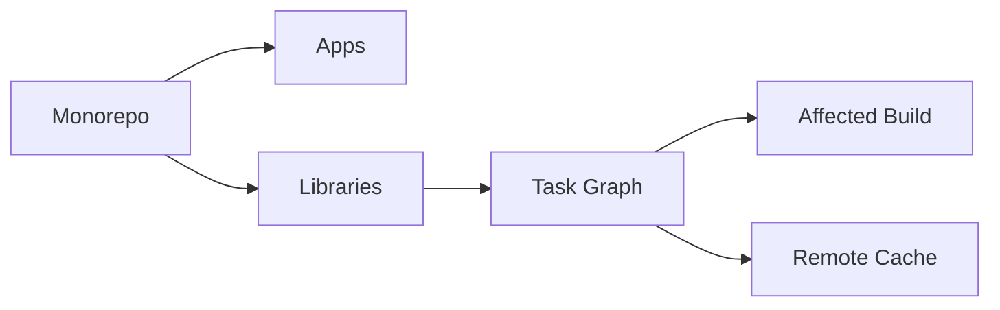

# Day 069 [Intermediate]: Monorepo Tooling Nx and Turborepo

## Index

- Goal
- Prerequisites
- Explanation
- Topic by Topic
- Key Concepts
- Visual Concept Map
- End-to-End Practical
- Hands-on Coding
- Mini Exercise
- Assessment Quiz
- Task
- Self Check
- Interview Questions and Answers
- Day Outcome

## Goal

Understand and apply Nx or Turborepo to scale Node codebases with shared libraries, task pipelines, and faster CI.

## Prerequisites

- Day 068 runtime contracts
- npm workspaces basics

## Explanation

Monorepos centralize multiple apps and packages in one repository. Nx and Turborepo optimize builds and tests by running only affected tasks and reusing cache.

## Topic by Topic

### Topic 1: Monorepo Fundamentals

Theory:
Shared code and coordinated changes are easier in one repository.

Practical:
Create apps and packages directories with workspace setup.

**Explanation:**
This topic explains Monorepo Fundamentals in a practical Node.js backend context so you can build reliable, production-ready APIs and services.

**Key Points:**
- Understand the core idea behind Monorepo Fundamentals.
- Apply the practical pattern with safe defaults and validation.
- Keep the implementation observable, maintainable, and secure where relevant.

### Topic 2: Task Graph and Affected Builds

Theory:
Tools compute dependency graph to run only impacted tasks.

Practical:
Run affected test and build based on changed files.

**Explanation:**
This topic explains Task Graph and Affected Builds in a practical Node.js backend context so you can build reliable, production-ready APIs and services.

**Key Points:**
- Understand the core idea behind Task Graph and Affected Builds.
- Apply the practical pattern with safe defaults and validation.
- Keep the implementation observable, maintainable, and secure where relevant.

### Topic 3: Caching and Remote Cache

Theory:
Cache avoids rerunning identical tasks across machines.

Practical:
Enable remote caching for CI speedups.

**Explanation:**
This topic explains Caching and Remote Cache in a practical Node.js backend context so you can build reliable, production-ready APIs and services.

**Key Points:**
- Understand the core idea behind Caching and Remote Cache.
- Apply the practical pattern with safe defaults and validation.
- Keep the implementation observable, maintainable, and secure where relevant.

### Topic 4: Shared Library Governance

Theory:
Uncontrolled shared libs become dumping grounds.

Practical:
Define clear ownership and dependency boundaries.

**Explanation:**
This topic explains Shared Library Governance in a practical Node.js backend context so you can build reliable, production-ready APIs and services.

**Key Points:**
- Understand the core idea behind Shared Library Governance.
- Apply the practical pattern with safe defaults and validation.
- Keep the implementation observable, maintainable, and secure where relevant.

### Topic 5: Nx vs Turborepo Selection

Theory:
Nx offers rich graph plugins; Turborepo emphasizes simple task pipelines.

Practical:
Choose based on team workflow and tooling complexity tolerance.

**Explanation:**
This topic explains Nx vs Turborepo Selection in a practical Node.js backend context so you can build reliable, production-ready APIs and services.

**Key Points:**
- Understand the core idea behind Nx vs Turborepo Selection.
- Apply the practical pattern with safe defaults and validation.
- Keep the implementation observable, maintainable, and secure where relevant.

### Topic 6: Deterministic Builds and Boundary Enforcement

Theory:
Fast pipelines are useful only when results are correct and reproducible. Deterministic installs and import boundaries prevent hidden CI/local differences.

Practical:
Lock dependency versions and enforce app/library dependency rules in tooling.

**Explanation:**
This topic explains Deterministic Builds and Boundary Enforcement in a practical Node.js backend context so you can build reliable, production-ready APIs and services.

**Key Points:**
- Understand the core idea behind Deterministic Builds and Boundary Enforcement.
- Apply the practical pattern with safe defaults and validation.
- Keep the implementation observable, maintainable, and secure where relevant.

## Tool Comparison Table

| Area                     | Nx                       | Turborepo           |
| ------------------------ | ------------------------ | ------------------- |
| Dependency graph insight | Strong built-in graphing | Leaner model        |
| Config complexity        | Higher                   | Lower               |
| Plugin ecosystem         | Broad                    | Smaller but growing |
| Quick adoption           | Moderate                 | Fast                |

## Key Concepts

- Workspace dependency graph
- Affected task execution
- Build and test caching
- Shared library boundaries
- Scalable CI optimization
- Reproducible monorepo task runs
- Automated boundary policy enforcement

## Visual Concept Map



## End-to-End Practical

1. Create monorepo workspace structure.
2. Add one Node app and one shared library.
3. Configure pipeline tasks for build and test.
4. Enable caching and affected command.
5. Measure local and CI execution improvements.

## Hands-on Coding

### Example 1: Case - Workspace Layout

Scenario:
Team hosts API, worker, and shared contracts together.

```txt
apps/
  api/
  worker/
packages/
  contracts/
  utils/
```

### Example 2: Case - Turbo Pipeline

Scenario:
Build and test run only when dependencies change.

```json
{
  "pipeline": {
    "build": { "dependsOn": ["^build"], "outputs": ["dist/**"] },
    "test": { "dependsOn": ["build"], "outputs": [] }
  }
}
```

### Example 3: Case - Affected Task Run

Scenario:
Only packages impacted by a PR should be tested in CI.

```bash
npx nx affected --target=test --base=origin/main --head=HEAD
```

### Example 4: Case - Deterministic Install in CI

Scenario:
CI should use exact lockfile versions to avoid surprise dependency drift.

```bash
npm ci
npx turbo run test --filter=...[origin/main]
```

### Example 5: Case - Boundary Rule Concept

Scenario:
App accidentally imports another app directly and creates tight coupling.

```txt
Rule: apps/* can depend on packages/*
Rule: apps/* cannot import from apps/* internal source
Rule: packages/contracts can be imported by all apps
```

## Mini Exercise

Scenario:
Add a shared contract library consumed by two Node apps and prove affected-only task execution.

Expected output:

- Shared library integration
- Affected-only pipeline run
- Caching-enabled task reuse

## Assessment Quiz

### Quiz Questions

1. Why do monorepo tools speed up large CI pipelines?
2. What does affected build mean?
3. True or False: Skipping edge-case handling is acceptable in production.
4. Why are dependency boundaries important in monorepos?
5. Why enforce deterministic installs in CI?

### Quiz Answers

1. They avoid running unchanged tasks and reuse cached outputs.
2. Running tasks only for projects impacted by recent changes.
3. False.
4. Without boundaries, teams create tangled dependencies and slower builds.
5. It ensures build/test results are reproducible across local and CI environments.

## Task

- Set up one monorepo workflow for Node apps
- Document Nx versus Turborepo decision
- Complete mini exercise and quiz.

## Self Check

- You can structure and optimize Node monorepos effectively.
- You can reduce CI cost with affected tasks and cache.
- You can answer at least 4 out of 5 quiz questions.

## Interview Questions and Answers

### Beginner

Question: Why choose a monorepo for multiple backend services?

Answer: It simplifies shared code reuse and coordinated refactors.

### Middle

Question: When can monorepo tooling become overkill?

Answer: Very small teams with a single tiny service may not benefit enough initially.

### Advanced

Question: What tradeoff exists between Nx and Turborepo?

Answer: Nx offers richer features and governance while Turborepo is often simpler to adopt.

## Day 069 Outcome

- You can evaluate and implement monorepo tooling for Node teams
- You can scale builds and tests with graph-aware execution
- You are ready for package design and internal libraries in Day 070
