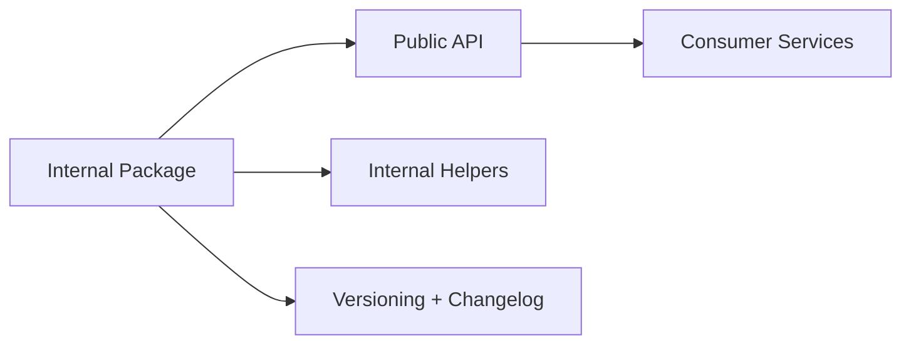

# Day 070 [Intermediate]: Package Design and Internal Libraries

## Index

- Goal
- Prerequisites
- Explanation
- Topic by Topic
- Key Concepts
- Visual Concept Map
- End-to-End Practical
- Hands-on Coding
- Mini Exercise
- Assessment Quiz
- Task
- Self Check
- Interview Questions and Answers
- Day Outcome

## Goal

Design robust internal Node packages with clear APIs, semantic versioning discipline, and maintainable reuse patterns.

## Prerequisites

- Day 069 monorepo tooling basics
- npm package publishing fundamentals

## Explanation

Internal libraries reduce duplication, but poorly designed packages can create hidden coupling. Good package design emphasizes small public APIs, stable contracts, and strong versioning practices.

## Topic by Topic

### Topic 1: Package Scope and Responsibility

Theory:
Each library should solve one cohesive concern.

Practical:
Split validation, logging, and auth helpers into separate packages.

**Explanation:**
This topic explains Package Scope and Responsibility in a practical Node.js backend context so you can build reliable, production-ready APIs and services.

**Key Points:**
- Understand the core idea behind Package Scope and Responsibility.
- Apply the practical pattern with safe defaults and validation.
- Keep the implementation observable, maintainable, and secure where relevant.

### Topic 2: Public API Surface Design

Theory:
Export only stable, intentional entry points.

Practical:
Provide index exports and keep internal helpers private.

**Explanation:**
This topic explains Public API Surface Design in a practical Node.js backend context so you can build reliable, production-ready APIs and services.

**Key Points:**
- Understand the core idea behind Public API Surface Design.
- Apply the practical pattern with safe defaults and validation.
- Keep the implementation observable, maintainable, and secure where relevant.

### Topic 3: Versioning and Compatibility

Theory:
Semantic versioning communicates contract impact.

Practical:
Use major for breaking changes, minor for additive features.

**Explanation:**
This topic explains Versioning and Compatibility in a practical Node.js backend context so you can build reliable, production-ready APIs and services.

**Key Points:**
- Understand the core idea behind Versioning and Compatibility.
- Apply the practical pattern with safe defaults and validation.
- Keep the implementation observable, maintainable, and secure where relevant.

### Topic 4: Testing and Contract Assurance

Theory:
Library consumers rely on stable behavior over time.

Practical:
Add unit tests and consumer-style integration tests.

**Explanation:**
This topic explains Testing and Contract Assurance in a practical Node.js backend context so you can build reliable, production-ready APIs and services.

**Key Points:**
- Understand the core idea behind Testing and Contract Assurance.
- Apply the practical pattern with safe defaults and validation.
- Keep the implementation observable, maintainable, and secure where relevant.

### Topic 5: Release and Adoption Strategy

Theory:
Internal package rollout should be incremental and observable.

Practical:
Release candidate tag before broad adoption.

**Explanation:**
This topic explains Release and Adoption Strategy in a practical Node.js backend context so you can build reliable, production-ready APIs and services.

**Key Points:**
- Understand the core idea behind Release and Adoption Strategy.
- Apply the practical pattern with safe defaults and validation.
- Keep the implementation observable, maintainable, and secure where relevant.

### Topic 6: Deprecation Workflow and API Compatibility Checks

Theory:
Package APIs should evolve safely with clear deprecation signals. Automated API checks reduce accidental breaking changes.

Practical:
Mark deprecated exports, publish migration notes, and run API surface checks in CI.

**Explanation:**
This topic explains Deprecation Workflow and API Compatibility Checks in a practical Node.js backend context so you can build reliable, production-ready APIs and services.

**Key Points:**
- Understand the core idea behind Deprecation Workflow and API Compatibility Checks.
- Apply the practical pattern with safe defaults and validation.
- Keep the implementation observable, maintainable, and secure where relevant.

## Package Design Checklist Table

| Item                          | Why it matters                     |
| ----------------------------- | ---------------------------------- |
| Clear package purpose         | Reduces accidental scope growth    |
| Minimal public exports        | Limits breaking surface area       |
| Semantic versioning           | Predictable consumer upgrades      |
| Changelog and migration notes | Faster adoption and safer upgrades |

## Key Concepts

- Cohesive internal package design
- Stable public contract management
- Semver-based release discipline
- Consumer-focused testing
- Adoption and deprecation lifecycle
- API compatibility governance
- Deprecation-first change strategy

## Visual Concept Map



## End-to-End Practical

1. Create one internal package in workspace.
2. Define explicit public exports.
3. Add unit tests for exported functions.
4. Version and publish to internal registry.
5. Integrate package into two consuming services.

## Hands-on Coding

### Example 1: Case - Package Export Surface

Scenario:
Expose only stable logger factory from package.

```json
{
  "name": "@acme/logging",
  "version": "1.2.0",
  "main": "dist/index.js",
  "types": "dist/index.d.ts"
}
```

### Example 2: Case - Controlled Public Exports

Scenario:
Prevent consumers from relying on unstable internals.

```ts
export { createLogger } from "./logger/createLogger";
export type { LoggerConfig } from "./logger/types";
```

### Example 3: Case - Consumer Integration

Scenario:
API service imports internal package with typed config.

```ts
import { createLogger } from "@acme/logging";

const logger = createLogger({ serviceName: "orders-api" });
logger.info("service_started");
```

### Example 4: Case - Deprecated Export Pattern

Scenario:
Old helper should remain temporarily while consumers migrate.

```ts
/** @deprecated Use createLogger from ./logger/createLogger */
export { legacyLogger } from "./legacy/logger";
export { createLogger } from "./logger/createLogger";
```

### Example 5: Case - Package Peer Dependency Contract

Scenario:
Internal package depends on host app's framework version.

```json
{
  "name": "@acme/http-middleware",
  "peerDependencies": {
    "express": "^5.0.0"
  }
}
```

## Mini Exercise

Scenario:
Design and publish one internal utility package, then consume it in two Node services with versioned upgrades.

Expected output:

- Reusable package with clear public API
- Consumer integration from two services
- Versioning and upgrade policy documented

## Assessment Quiz

### Quiz Questions

1. Why should internal packages keep a narrow public API?
2. What does semantic versioning communicate to consumers?
3. True or False: Skipping edge-case handling is acceptable in production.
4. Why are hidden deep imports from package internals dangerous?
5. Why mark exports as deprecated before removing them?

### Quiz Answers

1. It reduces accidental breakage and long-term maintenance burden.
2. Expected impact level of changes on compatibility.
3. False.
4. Internal file changes can break consumers unexpectedly.
5. It gives consumers migration time and reduces sudden breaking upgrades.

## Task

- Build one internal package and publish a versioned release
- Document compatibility and deprecation approach
- Complete mini exercise and quiz.

## Self Check

- You can design reusable internal Node libraries with stable contracts.
- You can manage package lifecycle with versioning discipline.
- You can answer at least 4 out of 5 quiz questions.

## Interview Questions and Answers

### Beginner

Question: Why create internal libraries in backend teams?

Answer: To share trusted logic consistently and reduce duplicate implementations.

### Middle

Question: When should logic stay in service instead of moving to shared package?

Answer: When it is highly service-specific and unlikely to be reused.

### Advanced

Question: What tradeoff appears with many internal packages?

Answer: Better modularity and reuse but more release coordination and dependency management.

## Day 070 Outcome

- You can build and govern internal package ecosystems in Node
- You can enforce clean public APIs and version-safe upgrades
- You are ready for higher-level platform engineering topics next
