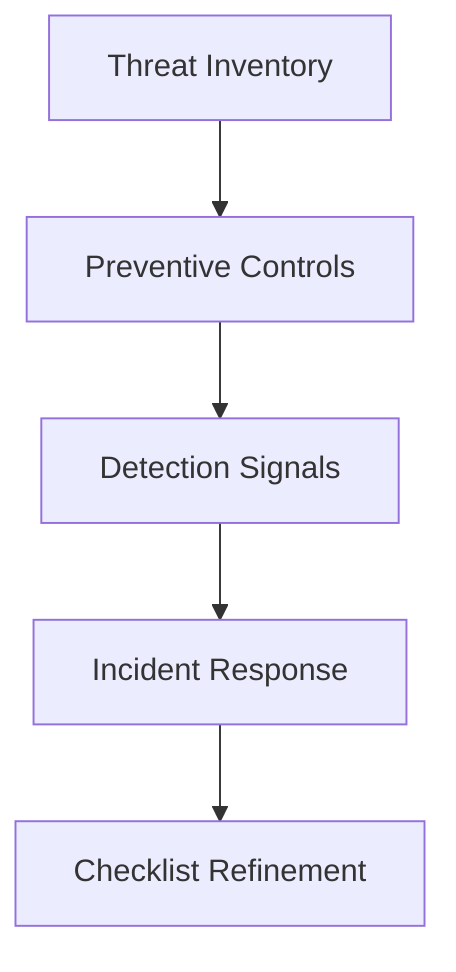

# Day 071 [Advanced]: Security Hardening Checklist

## Index

- Goal
- Prerequisites
- Explanation
- Topic by Topic
- Key Concepts
- Visual Concept Map
- End-to-End Practical
- Hands-on Coding
- Mini Exercise
- Assessment Quiz
- Task
- Self Check
- Interview Questions and Answers
- Day Outcome

## Goal

Apply a production-grade security hardening checklist to Node services and reduce exploit surface before release.

## Prerequisites

- Day 070 package and internal library practices
- Basic auth, HTTP, and deployment pipeline knowledge

## Explanation

Security hardening is a repeatable process, not a one-time patch. A checklist approach ensures teams consistently address auth, secrets, transport security, input handling, dependency risk, and incident readiness.

## Topic by Topic

### Topic 1: Attack Surface Mapping

Theory:
You cannot secure what you do not inventory.

Practical:
List every inbound path: APIs, admin routes, webhooks, and internal service ports.

**Explanation:**
This topic explains Attack Surface Mapping in a practical Node.js backend context so you can build reliable, production-ready APIs and services.

**Key Points:**
- Understand the core idea behind Attack Surface Mapping.
- Apply the practical pattern with safe defaults and validation.
- Keep the implementation observable, maintainable, and secure where relevant.

### Topic 2: Transport and Header Hardening

Theory:
TLS, strict headers, and secure cookie settings prevent common browser and network attacks.

Practical:
Use HTTPS-only cookies, HSTS, CSP baseline, and helmet defaults.

**Explanation:**
This topic explains Transport and Header Hardening in a practical Node.js backend context so you can build reliable, production-ready APIs and services.

**Key Points:**
- Understand the core idea behind Transport and Header Hardening.
- Apply the practical pattern with safe defaults and validation.
- Keep the implementation observable, maintainable, and secure where relevant.

### Topic 3: Identity, Session, and Access Controls

Theory:
Authentication proves identity; authorization controls scope.

Practical:
Enforce role and ownership checks for sensitive actions.

**Explanation:**
This topic explains Identity, Session, and Access Controls in a practical Node.js backend context so you can build reliable, production-ready APIs and services.

**Key Points:**
- Understand the core idea behind Identity, Session, and Access Controls.
- Apply the practical pattern with safe defaults and validation.
- Keep the implementation observable, maintainable, and secure where relevant.

### Topic 4: Secret and Configuration Hygiene

Theory:
Leaked credentials remain one of the highest real-world risks.

Practical:
Move secrets to vault or cloud secret manager and rotate keys.

**Explanation:**
This topic explains Secret and Configuration Hygiene in a practical Node.js backend context so you can build reliable, production-ready APIs and services.

**Key Points:**
- Understand the core idea behind Secret and Configuration Hygiene.
- Apply the practical pattern with safe defaults and validation.
- Keep the implementation observable, maintainable, and secure where relevant.

### Topic 5: Observability and Incident Readiness

Theory:
Hardening is incomplete without detection and response.

Practical:
Alert on suspicious auth failures and rate-limit spikes.

**Explanation:**
This topic explains Observability and Incident Readiness in a practical Node.js backend context so you can build reliable, production-ready APIs and services.

**Key Points:**
- Understand the core idea behind Observability and Incident Readiness.
- Apply the practical pattern with safe defaults and validation.
- Keep the implementation observable, maintainable, and secure where relevant.

### Topic 6: Verification and Rotation Drills

Theory:
Controls are useful only if verified regularly. Secret rotation and recovery drills reduce incident chaos.

Practical:
Run security regression checks in CI and practice key/session rotation in staging.

**Explanation:**
This topic explains Verification and Rotation Drills in a practical Node.js backend context so you can build reliable, production-ready APIs and services.

**Key Points:**
- Understand the core idea behind Verification and Rotation Drills.
- Apply the practical pattern with safe defaults and validation.
- Keep the implementation observable, maintainable, and secure where relevant.

## Hardening Checklist Table

| Area         | Minimum Control                            |
| ------------ | ------------------------------------------ |
| Transport    | TLS everywhere, redirect HTTP to HTTPS     |
| Input        | Runtime validation for body/query/params   |
| Auth         | Strong password policy and token expiry    |
| Sessions     | HttpOnly + Secure + SameSite cookies       |
| Dependencies | Automated vulnerability scanning           |
| Logging      | Security event audit logs with request IDs |

## Key Concepts

- Repeatable security baseline
- Layered defense model
- Principle of least privilege
- Secure-by-default configuration
- Operational security feedback loop
- Security control verification discipline
- Rotation and recovery readiness

## Visual Concept Map



## End-to-End Practical

1. Create hardening checklist for one Node service.
2. Implement baseline controls (headers, rate limit, validation).
3. Add authz checks on privileged endpoints.
4. Configure secret loading via environment provider.
5. Add one security alert and one runbook entry.

## Hands-on Coding

### Example 1: Case - Secure Express Defaults

Scenario:
Public API needs baseline protection against common web attack vectors.

```js
const helmet = require("helmet");
const rateLimit = require("express-rate-limit");

app.use(helmet());
app.use(rateLimit({ windowMs: 15 * 60 * 1000, max: 300 }));
app.disable("x-powered-by");
```

### Example 2: Case - Cookie and Session Hardening

Scenario:
Admin portal session must resist token theft in browser context.

```js
app.use(
  session({
    secret: process.env.SESSION_SECRET,
    cookie: {
      httpOnly: true,
      secure: true,
      sameSite: "lax",
      maxAge: 1000 * 60 * 30,
    },
  }),
);
```

### Example 3: Case - Role and Ownership Authorization

Scenario:
Only order owner or admin can view payment details.

```js
function canReadPayment(user, order) {
  return user.role === "admin" || order.userId === user.id;
}

if (!canReadPayment(req.user, order)) {
  return res.status(403).json({ message: "Forbidden" });
}
```

### Example 4: Case - Security Regression Gate in CI

Scenario:
Release should fail when critical dependency vulnerabilities are found.

```bash
npm audit --audit-level=high
```

### Example 5: Case - Session Secret Rotation Pattern

Scenario:
Rotate session signing key without logging out all users immediately.

```js
app.use(
  session({
    secret: [
      process.env.SESSION_SECRET_CURRENT,
      process.env.SESSION_SECRET_PREV,
    ],
    resave: false,
    saveUninitialized: false,
  }),
);
```

## Mini Exercise

Scenario:
Harden one existing Node API module with at least five checklist controls and document remaining risk.

Expected output:

- Concrete hardening controls applied
- One detection alert configured
- Explicit residual risk notes captured

## Assessment Quiz

### Quiz Questions

1. Why use a checklist instead of ad hoc security fixes?
2. What is one sign that security hardening is incomplete?
3. True or False: Skipping edge-case handling is acceptable in production.
4. Why is least privilege important for service accounts?
5. Why run rotation drills before incidents happen?

### Quiz Answers

1. It enforces consistent baseline controls and reduces missed gaps.
2. Missing observability and response runbooks.
3. False.
4. It limits blast radius when credentials or services are compromised.
5. Teams learn safe recovery steps early and reduce outage time during real compromises.

## Task

- Apply at least five hardening controls to one service
- Document one accepted risk and mitigation plan
- Complete mini exercise and quiz.

## Self Check

- You can operationalize a practical Node hardening baseline.
- You can prioritize and track security controls systematically.
- You can answer at least 4 out of 5 quiz questions.

## Interview Questions and Answers

### Beginner

Question: What is the first step in security hardening?

Answer: Inventory the attack surface and identify critical assets and entry points.

### Middle

Question: Should hardening happen only before release?

Answer: No. It should be continuous and tied to every change and incident review.

### Advanced

Question: What tradeoff comes with stricter security controls?

Answer: Better risk reduction, with some operational friction and implementation overhead.

## Day 071 Outcome

- You can apply a repeatable security hardening process in Node projects
- You can combine prevention, detection, and response practices
- You are ready for OWASP risk mapping in Day 072
