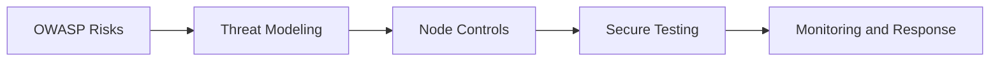

# Day 072 [Advanced]: OWASP Top 10 for Node Apps

## Index

- Goal
- Prerequisites
- Explanation
- Topic by Topic
- Key Concepts
- Visual Concept Map
- End-to-End Practical
- Hands-on Coding
- Mini Exercise
- Assessment Quiz
- Task
- Self Check
- Interview Questions and Answers
- Day Outcome

## Goal

Map OWASP Top 10 risks to practical Node patterns and apply defensive controls in everyday backend development.

## Prerequisites

- Day 071 security hardening checklist
- Runtime validation and authentication fundamentals

## Explanation

OWASP Top 10 highlights the most critical web application risks. For Node teams, it is a practical threat-modeling guide to prioritize secure coding and architecture decisions.

## Topic by Topic

### Topic 1: Broken Access Control

Theory:
Authorization gaps often create severe data exposure incidents.

Practical:
Enforce ownership and role checks at every sensitive endpoint.

**Explanation:**
This topic explains Broken Access Control in a practical Node.js backend context so you can build reliable, production-ready APIs and services.

**Key Points:**
- Understand the core idea behind Broken Access Control.
- Apply the practical pattern with safe defaults and validation.
- Keep the implementation observable, maintainable, and secure where relevant.

### Topic 2: Cryptographic Failures and Secrets

Theory:
Weak hashing, token handling, and key leaks expose users and systems.

Practical:
Use bcrypt or argon2, rotate keys, and avoid plaintext secrets.

**Explanation:**
This topic explains Cryptographic Failures and Secrets in a practical Node.js backend context so you can build reliable, production-ready APIs and services.

**Key Points:**
- Understand the core idea behind Cryptographic Failures and Secrets.
- Apply the practical pattern with safe defaults and validation.
- Keep the implementation observable, maintainable, and secure where relevant.

### Topic 3: Injection and Input Abuse

Theory:
Unvalidated input can influence SQL, NoSQL, and command execution paths.

Practical:
Use parameterized queries and strict schema validation.

**Explanation:**
This topic explains Injection and Input Abuse in a practical Node.js backend context so you can build reliable, production-ready APIs and services.

**Key Points:**
- Understand the core idea behind Injection and Input Abuse.
- Apply the practical pattern with safe defaults and validation.
- Keep the implementation observable, maintainable, and secure where relevant.

### Topic 4: Security Misconfiguration

Theory:
Defaults are often insecure for internet-facing deployments.

Practical:
Disable debug endpoints and enforce secure headers.

**Explanation:**
This topic explains Security Misconfiguration in a practical Node.js backend context so you can build reliable, production-ready APIs and services.

**Key Points:**
- Understand the core idea behind Security Misconfiguration.
- Apply the practical pattern with safe defaults and validation.
- Keep the implementation observable, maintainable, and secure where relevant.

### Topic 5: Logging, Monitoring, and SSRF

Theory:
Weak telemetry delays incident detection; unsafe outbound requests can be abused.

Practical:
Validate outbound host allowlists and alert on suspicious behavior.

**Explanation:**
This topic explains Logging, Monitoring, and SSRF in a practical Node.js backend context so you can build reliable, production-ready APIs and services.

**Key Points:**
- Understand the core idea behind Logging, Monitoring, and SSRF.
- Apply the practical pattern with safe defaults and validation.
- Keep the implementation observable, maintainable, and secure where relevant.

### Topic 6: Insecure Design and Supply-chain Risks

Theory:
Many breaches happen from weak design assumptions or compromised dependencies.

Practical:
Add abuse-case design reviews and dependency integrity checks in CI.

**Explanation:**
This topic explains Insecure Design and Supply-chain Risks in a practical Node.js backend context so you can build reliable, production-ready APIs and services.

**Key Points:**
- Understand the core idea behind Insecure Design and Supply-chain Risks.
- Apply the practical pattern with safe defaults and validation.
- Keep the implementation observable, maintainable, and secure where relevant.

## OWASP Mapping Table

| OWASP Risk                      | Node Mitigation                                     |
| ------------------------------- | --------------------------------------------------- |
| Broken Access Control           | Centralized authz middleware and ownership checks   |
| Cryptographic Failures          | Strong hashing, TLS, secret management              |
| Injection                       | Schema validation and parameterized DB operations   |
| Security Misconfiguration       | Hardened headers, disabled debug/prod-safe defaults |
| Logging and Monitoring Failures | Structured logs, anomaly alerts, incident runbooks  |

## Key Concepts

- Risk-driven secure development
- Access control enforcement patterns
- Input and query safety controls
- Hardened deployment defaults
- Detect and respond discipline
- Abuse-case aware design review
- Dependency and package integrity defense

## Visual Concept Map



## End-to-End Practical

1. Pick one Node endpoint with elevated risk.
2. Threat-model it using relevant OWASP categories.
3. Add validation, authz, and safe query handling.
4. Add security logs and failure alerts.
5. Run abuse-case tests and document controls.

## Hands-on Coding

### Example 1: Case - Access Control Guard

Scenario:
Prevent users from reading other users' invoices.

```js
app.get("/invoices/:id", async (req, res) => {
  const invoice = await invoiceRepo.findById(req.params.id);
  if (!invoice) return res.status(404).json({ message: "Not found" });

  if (req.user.role !== "admin" && invoice.userId !== req.user.id) {
    return res.status(403).json({ message: "Forbidden" });
  }

  res.json(invoice);
});
```

### Example 2: Case - Parameterized Query

Scenario:
Protect search endpoint from SQL injection input.

```js
const sql = "SELECT id, email FROM users WHERE email = $1";
const result = await pool.query(sql, [req.query.email]);
res.json(result.rows);
```

### Example 3: Case - Outbound URL Allowlist

Scenario:
Webhook relay should only call approved domains.

```js
const allowedHosts = new Set(["api.partner-a.com", "api.partner-b.com"]);
const url = new URL(req.body.targetUrl);

if (!allowedHosts.has(url.hostname)) {
  return res.status(400).json({ message: "Target host not allowed" });
}
```

### Example 4: Case - Command Injection-safe Exec

Scenario:
Do not interpolate user input in shell commands.

```js
const { spawn } = require("child_process");

const child = spawn(
  "node",
  ["scripts/report.js", "--id", String(req.params.id)],
  {
    shell: false,
  },
);
```

### Example 5: Case - Dependency Integrity Check

Scenario:
Prevent known vulnerable packages from shipping to production.

```bash
npm ci
npm audit --audit-level=high
```

## Mini Exercise

Scenario:
Harden a vulnerable endpoint by applying at least three OWASP-aligned controls and verifying them with abuse tests.

Expected output:

- Threat model and mitigation mapping
- Secure endpoint implementation
- Abuse-test evidence for controls

## Assessment Quiz

### Quiz Questions

1. Why should OWASP be used as a prioritization guide?
2. What is one common Node-specific access control mistake?
3. True or False: Skipping edge-case handling is acceptable in production.
4. Why are parameterized queries critical?
5. Why are dependency checks part of OWASP-aligned defense?

### Quiz Answers

1. It focuses effort on high-impact, common vulnerability classes.
2. Checking authentication but skipping ownership authorization.
3. False.
4. They prevent untrusted input from altering query structure.
5. Vulnerable packages can bypass otherwise strong app-layer controls.

## Task

- Apply three OWASP mitigations on one route
- Document residual risk and monitoring action
- Complete mini exercise and quiz.

## Self Check

- You can translate OWASP risks into Node implementation controls.
- You can prioritize meaningful security improvements.
- You can answer at least 4 out of 5 quiz questions.

## Interview Questions and Answers

### Beginner

Question: Is OWASP Top 10 only for security teams?

Answer: No. It is a practical development guide for everyday engineering decisions.

### Middle

Question: How often should OWASP mapping be revisited?

Answer: During design reviews, major releases, and after incidents.

### Advanced

Question: What tradeoff appears with stricter validation and authz checks?

Answer: Better security and data integrity, with extra development and test effort.

## Day 072 Outcome

- You can apply OWASP risk-driven hardening in Node APIs
- You can validate security controls through practical abuse scenarios
- You are ready for dependency and supply-chain defense in Day 073
