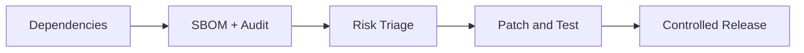

# Day 073 [Advanced]: Dependency Auditing and Supply Chain

## Index

- Goal
- Prerequisites
- Explanation
- Topic by Topic
- Key Concepts
- Visual Concept Map
- End-to-End Practical
- Hands-on Coding
- Mini Exercise
- Assessment Quiz
- Task
- Self Check
- Interview Questions and Answers
- Day Outcome

## Goal

Build a supply-chain security workflow for Node projects using dependency audits, provenance checks, and controlled update strategy.

## Prerequisites

- Day 072 OWASP risk mapping
- npm lockfile and CI pipeline familiarity

## Explanation

Most Node applications depend on hundreds of transitive packages. Supply-chain security focuses on knowing what you run, reducing risky dependencies, and reacting quickly to newly disclosed vulnerabilities.

## Topic by Topic

### Topic 1: Dependency Risk Landscape

Theory:
Risks include vulnerable versions, typo-squatting, malicious updates, and abandoned packages.

Practical:
Generate an SBOM and classify critical dependencies.

**Explanation:**
This topic explains Dependency Risk Landscape in a practical Node.js backend context so you can build reliable, production-ready APIs and services.

**Key Points:**
- Understand the core idea behind Dependency Risk Landscape.
- Apply the practical pattern with safe defaults and validation.
- Keep the implementation observable, maintainable, and secure where relevant.

### Topic 2: Automated Auditing in CI

Theory:
Security checks should be automatic and repeatable.

Practical:
Run npm audit plus policy thresholds in pull requests.

**Explanation:**
This topic explains Automated Auditing in CI in a practical Node.js backend context so you can build reliable, production-ready APIs and services.

**Key Points:**
- Understand the core idea behind Automated Auditing in CI.
- Apply the practical pattern with safe defaults and validation.
- Keep the implementation observable, maintainable, and secure where relevant.

### Topic 3: Lockfiles and Deterministic Builds

Theory:
Deterministic dependency resolution reduces surprise and drift.

Practical:
Enforce lockfile presence and npm ci in CI environments.

**Explanation:**
This topic explains Lockfiles and Deterministic Builds in a practical Node.js backend context so you can build reliable, production-ready APIs and services.

**Key Points:**
- Understand the core idea behind Lockfiles and Deterministic Builds.
- Apply the practical pattern with safe defaults and validation.
- Keep the implementation observable, maintainable, and secure where relevant.

### Topic 4: Update Strategy and Blast Radius

Theory:
Blind mass updates can break runtime behavior.

Practical:
Use staged updates with tests and canary release.

**Explanation:**
This topic explains Update Strategy and Blast Radius in a practical Node.js backend context so you can build reliable, production-ready APIs and services.

**Key Points:**
- Understand the core idea behind Update Strategy and Blast Radius.
- Apply the practical pattern with safe defaults and validation.
- Keep the implementation observable, maintainable, and secure where relevant.

### Topic 5: Provenance and Integrity Controls

Theory:
Package source trust and artifact provenance matter.

Practical:
Pin registry sources and verify signed release artifacts.

**Explanation:**
This topic explains Provenance and Integrity Controls in a practical Node.js backend context so you can build reliable, production-ready APIs and services.

**Key Points:**
- Understand the core idea behind Provenance and Integrity Controls.
- Apply the practical pattern with safe defaults and validation.
- Keep the implementation observable, maintainable, and secure where relevant.

### Topic 6: Exception Workflow and Fast-response Patching

Theory:
Not every vulnerability can be patched immediately. Teams need documented exception flow and fast mitigation actions.

Practical:
Track owner, expiry date, compensating control, and patch ETA for each accepted risk.

**Explanation:**
This topic explains Exception Workflow and Fast-response Patching in a practical Node.js backend context so you can build reliable, production-ready APIs and services.

**Key Points:**
- Understand the core idea behind Exception Workflow and Fast-response Patching.
- Apply the practical pattern with safe defaults and validation.
- Keep the implementation observable, maintainable, and secure where relevant.

## Supply Chain Control Table

| Control              | Purpose                             |
| -------------------- | ----------------------------------- |
| Lockfile enforcement | Repeatable dependency graph         |
| Audit gating         | Block high-risk vulnerabilities     |
| SBOM generation      | Inventory and compliance visibility |
| Provenance checks    | Validate source authenticity        |
| Update playbook      | Reduce upgrade regression risk      |

## Key Concepts

- Dependency threat awareness
- CI-driven vulnerability detection
- Deterministic build discipline
- Safe update rollout process
- Artifact trust and provenance
- Time-bound vulnerability exception policy
- Emergency patch and rollback readiness

## Visual Concept Map



## End-to-End Practical

1. Generate dependency inventory.
2. Add audit checks in CI.
3. Set severity threshold gate.
4. Patch one vulnerable dependency safely.
5. Document exception process for unpatchable issues.

## Hands-on Coding

### Example 1: Case - Audit in CI

Scenario:
Pipeline should fail on high or critical vulnerabilities.

```bash
npm ci
npm audit --audit-level=high
```

### Example 2: Case - Generate SBOM

Scenario:
Security team requests package inventory for compliance.

```bash
npx @cyclonedx/cyclonedx-npm --output-file sbom.json
```

### Example 3: Case - Controlled Dependency Update

Scenario:
Patch one vulnerable transitive dependency with minimal impact.

```bash
npm install minimatch@latest
npm test
```

### Example 4: Case - Audit Exception Record

Scenario:
Critical package fix is not yet available upstream.

```txt
id: VULN-2026-08
package: example-lib@2.1.0
owner: platform-security
expiresOn: 2026-08-15
compensatingControl: route disabled behind feature flag
patchPlan: upgrade to 2.1.3 when released
```

### Example 5: Case - Registry Source Enforcement

Scenario:
Prevent accidental package install from untrusted registries.

```bash
npm config set registry https://registry.npmjs.org/
npm config get registry
```

## Mini Exercise

Scenario:
Implement supply-chain checks for one Node service and produce a short remediation report.

Expected output:

- CI vulnerability gating
- Dependency inventory exported
- One tested remediation change

## Assessment Quiz

### Quiz Questions

1. Why are transitive dependencies a major security risk?
2. What is the value of deterministic installs?
3. True or False: Skipping edge-case handling is acceptable in production.
4. Why can immediate auto-fix updates be risky?
5. Why should audit exceptions have expiry dates?

### Quiz Answers

1. They increase attack surface beyond direct package list visibility.
2. Same lockfile yields reproducible environments and fewer surprises.
3. False.
4. They may introduce breaking changes without business validation.
5. Time limits force re-evaluation and prevent silent permanent risk acceptance.

## Task

- Add audit and SBOM generation to one pipeline
- Document one accepted exception and mitigation
- Complete mini exercise and quiz.

## Self Check

- You can build practical Node supply-chain defense workflows.
- You can prioritize dependency risk with operational discipline.
- You can answer at least 4 out of 5 quiz questions.

## Interview Questions and Answers

### Beginner

Question: Why are lockfiles security-relevant?

Answer: They pin dependency versions and reduce accidental intake of unreviewed updates.

### Middle

Question: Should all vulnerability findings block release?

Answer: Not always; apply severity and exploitability-based policy with documented exceptions.

### Advanced

Question: What tradeoff appears with strict audit gating?

Answer: Better security posture with occasional delivery slowdowns and triage overhead.

## Day 073 Outcome

- You can operationalize dependency and supply-chain checks in Node teams
- You can evaluate and remediate package risk systematically
- You are ready for Next.js SSR APIs in Day 074
