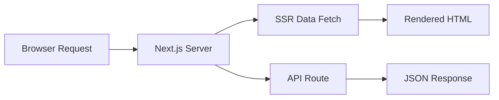

# Day 074 [Advanced]: SSR with Next.js API Routes

## Index

- Goal
- Prerequisites
- Explanation
- Topic by Topic
- Key Concepts
- Visual Concept Map
- End-to-End Practical
- Hands-on Coding
- Mini Exercise
- Assessment Quiz
- Task
- Self Check
- Interview Questions and Answers
- Day Outcome

## Goal

Build fullstack-ready Next.js applications using SSR and API routes with performance, caching, and security best practices.

## Prerequisites

- Day 073 supply-chain controls
- React and Next.js routing basics

## Explanation

SSR renders pages on the server for better SEO and initial UX. Next.js API routes provide backend endpoints in the same project, enabling cohesive fullstack architecture for many products.

## Topic by Topic

### Topic 1: SSR Request Lifecycle

Theory:
Each request may trigger server rendering and data fetch before HTML response.

Practical:
Build route that fetches product data server-side.

**Explanation:**
This topic explains SSR Request Lifecycle in a practical Node.js backend context so you can build reliable, production-ready APIs and services.

**Key Points:**
- Understand the core idea behind SSR Request Lifecycle.
- Apply the practical pattern with safe defaults and validation.
- Keep the implementation observable, maintainable, and secure where relevant.

### Topic 2: API Route Architecture

Theory:
API routes encapsulate backend logic close to frontend but still require backend discipline.

Practical:
Create typed route handlers with validation and error mapping.

**Explanation:**
This topic explains API Route Architecture in a practical Node.js backend context so you can build reliable, production-ready APIs and services.

**Key Points:**
- Understand the core idea behind API Route Architecture.
- Apply the practical pattern with safe defaults and validation.
- Keep the implementation observable, maintainable, and secure where relevant.

### Topic 3: Caching and Revalidation

Theory:
Caching strategies determine latency and freshness balance.

Practical:
Use cache headers and revalidate paths on data mutation.

**Explanation:**
This topic explains Caching and Revalidation in a practical Node.js backend context so you can build reliable, production-ready APIs and services.

**Key Points:**
- Understand the core idea behind Caching and Revalidation.
- Apply the practical pattern with safe defaults and validation.
- Keep the implementation observable, maintainable, and secure where relevant.

### Topic 4: Auth and Secret Boundaries

Theory:
Server components/API routes can safely access secrets; client components cannot.

Practical:
Keep DB credentials in server-only modules.

**Explanation:**
This topic explains Auth and Secret Boundaries in a practical Node.js backend context so you can build reliable, production-ready APIs and services.

**Key Points:**
- Understand the core idea behind Auth and Secret Boundaries.
- Apply the practical pattern with safe defaults and validation.
- Keep the implementation observable, maintainable, and secure where relevant.

### Topic 5: Performance and Failure Modes

Theory:
Slow upstream fetches can hurt TTFB and user experience.

Practical:
Set timeouts and graceful fallback UI states.

**Explanation:**
This topic explains Performance and Failure Modes in a practical Node.js backend context so you can build reliable, production-ready APIs and services.

**Key Points:**
- Understand the core idea behind Performance and Failure Modes.
- Apply the practical pattern with safe defaults and validation.
- Keep the implementation observable, maintainable, and secure where relevant.

### Topic 6: Cache-Control and API Route Hardening

Theory:
SSR performance and data correctness depend on explicit caching rules. API routes also need method and abuse controls.

Practical:
Define cache policy per route and enforce method checks plus simple rate limiting.

**Explanation:**
This topic explains Cache-Control and API Route Hardening in a practical Node.js backend context so you can build reliable, production-ready APIs and services.

**Key Points:**
- Understand the core idea behind Cache-Control and API Route Hardening.
- Apply the practical pattern with safe defaults and validation.
- Keep the implementation observable, maintainable, and secure where relevant.

## Rendering Strategy Table

| Strategy | Best for                    | Tradeoff                      |
| -------- | --------------------------- | ----------------------------- |
| SSR      | Fresh personalized pages    | Higher server cost/latency    |
| SSG      | Mostly static content       | Less real-time freshness      |
| ISR      | Balance freshness and scale | Cache invalidation complexity |

## Key Concepts

- Server-rendered data flow
- Co-located API route design
- Cache and revalidation decisions
- Server-only secret usage
- Fullstack operational tradeoffs
- Route-level cache policy discipline
- API route abuse protection basics

## Visual Concept Map



## End-to-End Practical

1. Build SSR product listing page.
2. Create API route for product mutation.
3. Add request validation and auth check.
4. Revalidate SSR content after update.
5. Measure response time and fallback behavior.

## Hands-on Coding

### Example 1: Case - SSR Data Fetch Page

Scenario:
Render latest products server-side for SEO-sensitive catalog.

```tsx
export default async function ProductsPage() {
  const res = await fetch("http://localhost:3000/api/products", {
    cache: "no-store",
  });
  const products = await res.json();
  return <ProductList items={products} />;
}
```

### Example 2: Case - API Route Validation

Scenario:
Reject malformed product creation payload.

```ts
export async function POST(req: Request) {
  const body = await req.json();
  if (!body.name || typeof body.name !== "string") {
    return Response.json({ message: "Invalid name" }, { status: 400 });
  }
  return Response.json({ ok: true }, { status: 201 });
}
```

### Example 3: Case - Revalidate After Mutation

Scenario:
After product update, cached page should refresh.

```ts
import { revalidatePath } from "next/cache";

revalidatePath("/products");
```

### Example 4: Case - API Method Guard

Scenario:
Endpoint should reject unsupported methods clearly.

```ts
export async function PUT() {
  return Response.json({ message: "Method Not Allowed" }, { status: 405 });
}
```

### Example 5: Case - Cache Strategy for Public Catalog

Scenario:
Catalog is mostly stable and should be fast under traffic.

```tsx
const res = await fetch("http://localhost:3000/api/products", {
  next: { revalidate: 60 },
});
```

## Mini Exercise

Scenario:
Implement SSR list plus API mutation route with validation and cache revalidation.

Expected output:

- SSR page with server data
- Protected validated API route
- Revalidation strategy documented

## Assessment Quiz

### Quiz Questions

1. Why choose SSR for some pages over CSR?
2. What is one risk of mixing heavy logic into API routes?
3. True or False: Skipping edge-case handling is acceptable in production.
4. Why is cache invalidation important after mutations?
5. Why define cache policy per SSR route?

### Quiz Answers

1. Better first paint and SEO for server-rendered content.
2. Route bloat and maintainability issues without clear layering.
3. False.
4. Users may see stale content despite successful updates.
5. Different pages have different freshness needs, and explicit policy avoids accidental stale or expensive rendering.

## Task

- Build one SSR page and one API route module
- Document cache strategy and fallback behavior
- Complete mini exercise and quiz.

## Self Check

- You can build practical SSR + API route fullstack flows.
- You can reason about caching, freshness, and performance tradeoffs.
- You can answer at least 4 out of 5 quiz questions.

## Interview Questions and Answers

### Beginner

Question: Where should sensitive credentials be accessed in Next.js?

Answer: In server-side code only, such as API routes or server components.

### Middle

Question: Is SSR always better than static generation?

Answer: No. Use SSR when data must be fresh per request; static or ISR can be faster and cheaper otherwise.

### Advanced

Question: What tradeoff appears when using SSR broadly?

Answer: Better freshness and personalization, with higher server compute cost and latency sensitivity.

## Day 074 Outcome

- You can implement SSR pages with disciplined API route design
- You can tune caching and revalidation based on product needs
- You are ready for server actions fullstack patterns in Day 075
