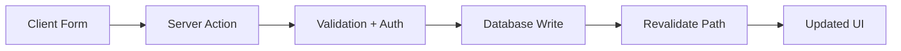

# Day 075 [Advanced]: Fullstack with Next.js Server Actions

## Index

- Goal
- Prerequisites
- Explanation
- Topic by Topic
- Key Concepts
- Visual Concept Map
- End-to-End Practical
- Hands-on Coding
- Mini Exercise
- Assessment Quiz
- Task
- Self Check
- Interview Questions and Answers
- Day Outcome

## Goal

Build modern fullstack Next.js features using Server Actions with secure mutation handling and robust UX patterns.

## Prerequisites

- Day 074 SSR and API route flow
- Form handling and basic data persistence knowledge

## Explanation

Server Actions let you run server-side mutations directly from components, reducing manual API boilerplate. They still require validation, authorization, and careful cache invalidation to be production-safe.

## Topic by Topic

### Topic 1: Server Action Fundamentals

Theory:
Server actions execute on server and can be called from forms and UI transitions.

Practical:
Create product form posting to a server action.

**Explanation:**
This topic explains Server Action Fundamentals in a practical Node.js backend context so you can build reliable, production-ready APIs and services.

**Key Points:**
- Understand the core idea behind Server Action Fundamentals.
- Apply the practical pattern with safe defaults and validation.
- Keep the implementation observable, maintainable, and secure where relevant.

### Topic 2: Validation and Authorization in Actions

Theory:
Actions are still public mutation boundaries and must verify input and user rights.

Practical:
Validate form data and reject unauthorized actions.

**Explanation:**
This topic explains Validation and Authorization in Actions in a practical Node.js backend context so you can build reliable, production-ready APIs and services.

**Key Points:**
- Understand the core idea behind Validation and Authorization in Actions.
- Apply the practical pattern with safe defaults and validation.
- Keep the implementation observable, maintainable, and secure where relevant.

### Topic 3: Pending State and UX Feedback

Theory:
Mutation UX needs loading, success, and error handling.

Practical:
Use useFormStatus and optimistic feedback patterns.

**Explanation:**
This topic explains Pending State and UX Feedback in a practical Node.js backend context so you can build reliable, production-ready APIs and services.

**Key Points:**
- Understand the core idea behind Pending State and UX Feedback.
- Apply the practical pattern with safe defaults and validation.
- Keep the implementation observable, maintainable, and secure where relevant.

### Topic 4: Revalidation and Cache Coherence

Theory:
After server mutation, stale routes must be revalidated.

Practical:
Use revalidatePath or revalidateTag after write operations.

**Explanation:**
This topic explains Revalidation and Cache Coherence in a practical Node.js backend context so you can build reliable, production-ready APIs and services.

**Key Points:**
- Understand the core idea behind Revalidation and Cache Coherence.
- Apply the practical pattern with safe defaults and validation.
- Keep the implementation observable, maintainable, and secure where relevant.

### Topic 5: Action Composition and Maintainability

Theory:
Large actions become hard to test and reason about.

Practical:
Extract domain services and keep actions thin.

**Explanation:**
This topic explains Action Composition and Maintainability in a practical Node.js backend context so you can build reliable, production-ready APIs and services.

**Key Points:**
- Understand the core idea behind Action Composition and Maintainability.
- Apply the practical pattern with safe defaults and validation.
- Keep the implementation observable, maintainable, and secure where relevant.

### Topic 6: Mutation Safety and Duplicate-submission Control

Theory:
User retries, double clicks, and network issues can submit the same action multiple times.

Practical:
Use idempotency keys and explicit action-intent checks for critical mutations.

**Explanation:**
This topic explains Mutation Safety and Duplicate-submission Control in a practical Node.js backend context so you can build reliable, production-ready APIs and services.

**Key Points:**
- Understand the core idea behind Mutation Safety and Duplicate-submission Control.
- Apply the practical pattern with safe defaults and validation.
- Keep the implementation observable, maintainable, and secure where relevant.

## Server Action vs API Route Table

| Aspect                    | Server Actions           | API Routes                     |
| ------------------------- | ------------------------ | ------------------------------ |
| Boilerplate               | Lower for form mutations | Higher explicit endpoint setup |
| Reuse by external clients | Limited                  | Strong                         |
| Debugging network shape   | More abstracted          | Explicit request/response      |
| Best fit                  | Internal app mutations   | Public or multi-client APIs    |

## Key Concepts

- Server-side mutation ergonomics
- Action boundary security controls
- Mutation UX and pending states
- Cache consistency after writes
- Thin-action architecture patterns
- Idempotent server-side mutation handling
- Duplicate submission risk control

## Visual Concept Map



## End-to-End Practical

1. Build form-driven create flow using server action.
2. Validate and sanitize form input.
3. Add authorization check in action.
4. Persist data and revalidate affected page.
5. Show pending and error states in UI.

## Hands-on Coding

### Example 1: Case - Basic Server Action

Scenario:
Create todo item directly from form submission.

```ts
"use server";

export async function createTodo(formData: FormData) {
  const title = String(formData.get("title") || "").trim();
  if (!title) throw new Error("Title is required");
  await todoRepo.create({ title });
}
```

### Example 2: Case - Action with Authz Check

Scenario:
Only admin can create system announcements.

```ts
"use server";

export async function createAnnouncement(formData: FormData) {
  const user = await getCurrentUser();
  if (!user || user.role !== "admin") throw new Error("Forbidden");
  const message = String(formData.get("message") || "");
  await announcementRepo.create({ message });
}
```

### Example 3: Case - Revalidate After Mutation

Scenario:
Todo list should refresh after item creation.

```ts
import { revalidatePath } from "next/cache";

await todoRepo.create({ title });
revalidatePath("/todos");
```

### Example 4: Case - Idempotency Key Check

Scenario:
Payment action must not create duplicate charges on repeated submits.

```ts
"use server";

export async function createPayment(formData: FormData) {
  const key = String(formData.get("idempotencyKey") || "");
  if (!key) throw new Error("Missing idempotency key");

  const alreadyDone = await actionLogRepo.exists(key);
  if (alreadyDone) return { ok: true, duplicate: true };

  await paymentService.charge(formData);
  await actionLogRepo.save(key);
  return { ok: true, duplicate: false };
}
```

### Example 5: Case - Explicit Intent Field

Scenario:
Prevent accidental action execution from malformed form posts.

```ts
const intent = String(formData.get("intent") || "");
if (intent !== "create-todo") throw new Error("Invalid action intent");
```

## Mini Exercise

Scenario:
Implement a server-action-based CRUD mini flow with validation, authorization, and revalidation.

Expected output:

- Form-to-server mutation flow
- Validation plus auth controls
- Updated SSR/route cache behavior

## Assessment Quiz

### Quiz Questions

1. What developer productivity problem do server actions reduce?
2. Why must server actions still validate input?
3. True or False: Skipping edge-case handling is acceptable in production.
4. Why can stale UI appear after successful actions?
5. Why are idempotency keys important for critical server actions?

### Quiz Answers

1. They reduce explicit endpoint boilerplate for internal form mutations.
2. They are externally reachable mutation boundaries and receive untrusted data.
3. False.
4. Cache or route data is not revalidated after mutations.
5. They prevent duplicate side effects caused by retries or repeated submissions.

## Task

- Build one server action with validation and auth check
- Document revalidation and fallback strategy
- Complete mini exercise and quiz.

## Self Check

- You can build production-conscious Next.js server actions.
- You can balance action convenience with backend discipline.
- You can answer at least 4 out of 5 quiz questions.

## Interview Questions and Answers

### Beginner

Question: Are server actions replacements for all API routes?

Answer: No. They are excellent for internal app mutations, but explicit APIs are better for external consumers.

### Middle

Question: What is the most common production mistake with server actions?

Answer: Skipping validation/authorization because actions feel internal to the UI.

### Advanced

Question: What tradeoff comes with server-action heavy architecture?

Answer: Faster development with less boilerplate, but tighter coupling to Next.js runtime model.

## Day 075 Outcome

- You can implement secure and maintainable server-action fullstack flows
- You can choose between server actions and API routes based on architecture needs
- You are ready for advanced platform and production reliability tracks next
