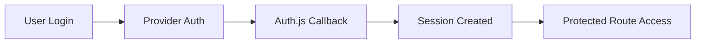

# Day 076 [Advanced]: Authentication in NextAuth or Auth.js

## Index

- Goal
- Prerequisites
- Explanation
- Topic by Topic
- Key Concepts
- Visual Concept Map
- End-to-End Practical
- Hands-on Coding
- Mini Exercise
- Assessment Quiz
- Task
- Self Check
- Interview Questions and Answers
- Day Outcome

## Goal

Implement secure authentication flows using Auth.js with provider configuration, session strategy choices, and production hardening.

## Prerequisites

- Day 075 Next.js server actions
- OAuth and session fundamentals

## Explanation

Auth.js enables authentication in Next.js with providers, sessions, and callback customization. Production setups require careful choices around JWT vs database sessions, token refresh, and route protection.

## Topic by Topic

### Topic 1: Session Strategy Selection

Theory:
JWT sessions are stateless and simple; database sessions offer central revocation.

Practical:
Choose JWT for smaller apps, DB sessions for enterprise revoke/compliance needs.

**Explanation:**
This topic explains Session Strategy Selection in a practical Node.js backend context so you can build reliable, production-ready APIs and services.

**Key Points:**
- Understand the core idea behind Session Strategy Selection.
- Apply the practical pattern with safe defaults and validation.
- Keep the implementation observable, maintainable, and secure where relevant.

### Topic 2: Provider and Callback Design

Theory:
Providers authenticate identity, callbacks shape authorization context.

Practical:
Attach role and tenant metadata in session callback.

**Explanation:**
This topic explains Provider and Callback Design in a practical Node.js backend context so you can build reliable, production-ready APIs and services.

**Key Points:**
- Understand the core idea behind Provider and Callback Design.
- Apply the practical pattern with safe defaults and validation.
- Keep the implementation observable, maintainable, and secure where relevant.

### Topic 3: Route and API Protection

Theory:
UI auth state is not enough. Server routes must verify sessions.

Practical:
Protect API handlers with auth middleware and role checks.

**Explanation:**
This topic explains Route and API Protection in a practical Node.js backend context so you can build reliable, production-ready APIs and services.

**Key Points:**
- Understand the core idea behind Route and API Protection.
- Apply the practical pattern with safe defaults and validation.
- Keep the implementation observable, maintainable, and secure where relevant.

### Topic 4: Token and Cookie Hardening

Theory:
Weak cookie settings and token lifetimes increase account takeover risk.

Practical:
Enforce secure cookies, short-lived access, and refresh patterns.

**Explanation:**
This topic explains Token and Cookie Hardening in a practical Node.js backend context so you can build reliable, production-ready APIs and services.

**Key Points:**
- Understand the core idea behind Token and Cookie Hardening.
- Apply the practical pattern with safe defaults and validation.
- Keep the implementation observable, maintainable, and secure where relevant.

### Topic 5: Incident Controls

Theory:
Authentication systems need lockout, anomaly alerts, and audit trails.

Practical:
Log failed attempts and trigger alerts for suspicious bursts.

**Explanation:**
This topic explains Incident Controls in a practical Node.js backend context so you can build reliable, production-ready APIs and services.

**Key Points:**
- Understand the core idea behind Incident Controls.
- Apply the practical pattern with safe defaults and validation.
- Keep the implementation observable, maintainable, and secure where relevant.

### Topic 6: Refresh-token Rotation and Session Revocation

Theory:
Long-lived sessions need controlled renewal. Rotation limits replay risk, and revocation enables emergency logout.

Practical:
Rotate refresh tokens on use and support central session invalidation.

**Explanation:**
This topic explains Refresh-token Rotation and Session Revocation in a practical Node.js backend context so you can build reliable, production-ready APIs and services.

**Key Points:**
- Understand the core idea behind Refresh-token Rotation and Session Revocation.
- Apply the practical pattern with safe defaults and validation.
- Keep the implementation observable, maintainable, and secure where relevant.

## Auth Strategy Table

| Strategy       | Best for                   | Tradeoff                                  |
| -------------- | -------------------------- | ----------------------------------------- |
| JWT session    | Simpler horizontal scaling | Harder instant revocation                 |
| DB session     | Strong central control     | Extra DB lookup overhead                  |
| OAuth provider | Fast social login support  | Provider dependency and scopes management |

## Key Concepts

- Auth.js provider integration
- Session lifecycle control
- Server-side authorization boundaries
- Callback-based claims shaping
- Authentication observability
- Refresh lifecycle security
- Revocation-ready session architecture

## Visual Concept Map



## End-to-End Practical

1. Configure Auth.js with one OAuth and credentials provider.
2. Set session strategy and token callbacks.
3. Protect dashboard and API route.
4. Add role checks for admin actions.
5. Test login, logout, and invalid token scenarios.

## Hands-on Coding

### Example 1: Case - Auth.js Basic Setup

Scenario:
App needs GitHub login and route protection.

```ts
import NextAuth from "next-auth";
import GitHub from "next-auth/providers/github";

export const { handlers, auth } = NextAuth({
  providers: [GitHub],
  session: { strategy: "jwt" },
});
```

### Example 2: Case - Session Callback Claims

Scenario:
Role information needed in server components.

```ts
callbacks: {
  async jwt({ token, user }) {
    if (user) token.role = user.role;
    return token;
  },
  async session({ session, token }) {
    session.user.role = token.role as string;
    return session;
  },
}
```

### Example 3: Case - Protected API Route

Scenario:
Only authenticated users can access profile data.

```ts
export async function GET() {
  const session = await auth();
  if (!session)
    return Response.json({ message: "Unauthorized" }, { status: 401 });
  return Response.json({ email: session.user.email });
}
```

### Example 4: Case - Session Version Check

Scenario:
Force logout all sessions after account security event.

```ts
callbacks: {
  async jwt({ token }) {
    if (!token.sub) return token;
    const user = await userRepo.findById(token.sub);
    if (!user) throw new Error("Unauthorized");
    token.sessionVersion = user.sessionVersion;
    return token;
  },
  async session({ session, token }) {
    session.user.sessionVersion = token.sessionVersion as number;
    return session;
  },
}
```

### Example 5: Case - Refresh Token Rotation Concept

Scenario:
After each refresh, previous refresh token should become invalid.

```txt
On refresh request:
1) Verify current refresh token
2) Issue new access + new refresh token
3) Revoke old refresh token record
4) Store new token hash and expiry
```

## Mini Exercise

Scenario:
Implement login plus role-based admin route access, and add one suspicious-login alert rule.

Expected output:

- Working auth provider flow
- Session-based route authorization
- Security event logging baseline

## Assessment Quiz

### Quiz Questions

1. Why is server-side route protection mandatory even with client auth state?
2. When is DB session strategy preferable to JWT?
3. True or False: Skipping edge-case handling is acceptable in production.
4. Why should callback payloads avoid sensitive raw tokens?
5. Why rotate refresh tokens?

### Quiz Answers

1. Client checks can be bypassed without server enforcement.
2. When you need immediate session invalidation and central session visibility.
3. False.
4. Sensitive data leakage can increase blast radius during compromise.
5. Rotation reduces replay risk if an old refresh token is stolen.

## Task

- Build one provider-based auth flow with route protection
- Document session strategy tradeoff
- Complete mini exercise and quiz.

## Self Check

- You can implement Auth.js authentication with production controls.
- You can design secure session and authorization boundaries.
- You can answer at least 4 out of 5 quiz questions.

## Interview Questions and Answers

### Beginner

Question: What does Auth.js mainly provide in Next.js apps?

Answer: Standardized authentication workflows, providers, and session handling.

### Middle

Question: Why is callback customization important?

Answer: It allows adding safe claims and shaping session data for authorization.

### Advanced

Question: What tradeoff exists with short token expiry?

Answer: Better security posture with more frequent refresh logic and user re-auth overhead.

## Day 076 Outcome

- You can build secure authentication flows in Next.js using Auth.js
- You can protect routes and APIs with reliable session checks
- You are ready for collaboration architecture in Day 077
