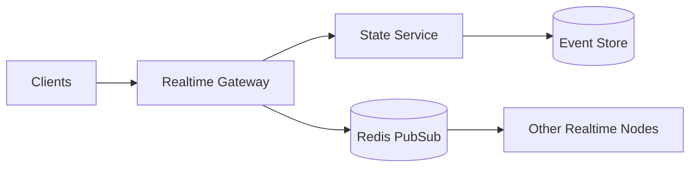

# Day 077 [Advanced]: Real-time Collaboration Architecture

## Index

- Goal
- Prerequisites
- Explanation
- Topic by Topic
- Key Concepts
- Visual Concept Map
- End-to-End Practical
- Hands-on Coding
- Mini Exercise
- Assessment Quiz
- Task
- Self Check
- Interview Questions and Answers
- Day Outcome

## Goal

Design and implement scalable real-time collaboration systems with conflict handling, presence tracking, and resilience.

## Prerequisites

- Day 076 authentication strategy
- WebSocket fundamentals

## Explanation

Real-time collaboration powers chat, shared docs, and whiteboards. A robust architecture must handle concurrent edits, reconnect behavior, and cross-node synchronization without losing consistency.

## Topic by Topic

### Topic 1: Collaboration Models

Theory:
Common models include operational transform, CRDTs, and server-authoritative event streams.

Practical:
Start with server-authoritative model for predictable conflict resolution.

**Explanation:**
This topic explains Collaboration Models in a practical Node.js backend context so you can build reliable, production-ready APIs and services.

**Key Points:**
- Understand the core idea behind Collaboration Models.
- Apply the practical pattern with safe defaults and validation.
- Keep the implementation observable, maintainable, and secure where relevant.

### Topic 2: Presence and Session Channels

Theory:
Presence states improve UX but can create noise under churn.

Practical:
Track join, heartbeat, and leave events with TTL cleanup.

**Explanation:**
This topic explains Presence and Session Channels in a practical Node.js backend context so you can build reliable, production-ready APIs and services.

**Key Points:**
- Understand the core idea behind Presence and Session Channels.
- Apply the practical pattern with safe defaults and validation.
- Keep the implementation observable, maintainable, and secure where relevant.

### Topic 3: Ordering and Conflict Rules

Theory:
Out-of-order updates can corrupt shared state.

Practical:
Attach version numbers and reject stale mutations.

**Explanation:**
This topic explains Ordering and Conflict Rules in a practical Node.js backend context so you can build reliable, production-ready APIs and services.

**Key Points:**
- Understand the core idea behind Ordering and Conflict Rules.
- Apply the practical pattern with safe defaults and validation.
- Keep the implementation observable, maintainable, and secure where relevant.

### Topic 4: Horizontal Scaling

Theory:
Multiple realtime nodes require shared pub/sub backplane.

Practical:
Use Redis adapter for fan-out across instances.

**Explanation:**
This topic explains Horizontal Scaling in a practical Node.js backend context so you can build reliable, production-ready APIs and services.

**Key Points:**
- Understand the core idea behind Horizontal Scaling.
- Apply the practical pattern with safe defaults and validation.
- Keep the implementation observable, maintainable, and secure where relevant.

### Topic 5: Reliability and Recovery

Theory:
Disconnected clients must catch up safely.

Practical:
Store event history and send missed deltas on reconnect.

**Explanation:**
This topic explains Reliability and Recovery in a practical Node.js backend context so you can build reliable, production-ready APIs and services.

**Key Points:**
- Understand the core idea behind Reliability and Recovery.
- Apply the practical pattern with safe defaults and validation.
- Keep the implementation observable, maintainable, and secure where relevant.

### Topic 6: Backpressure and Write Admission Control

Theory:
Realtime systems can overload when many users edit at once. Backpressure protects service stability.

Practical:
Rate limit high-frequency edits per user or room and queue bursts with bounded limits.

**Explanation:**
This topic explains Backpressure and Write Admission Control in a practical Node.js backend context so you can build reliable, production-ready APIs and services.

**Key Points:**
- Understand the core idea behind Backpressure and Write Admission Control.
- Apply the practical pattern with safe defaults and validation.
- Keep the implementation observable, maintainable, and secure where relevant.

## Collaboration Architecture Table

| Concern             | Baseline Pattern                   |
| ------------------- | ---------------------------------- |
| Presence            | Heartbeat + TTL expiry             |
| Message fan-out     | Room-based pub/sub                 |
| Conflict prevention | Version check + server arbitration |
| Reconnect recovery  | Event cursor replay                |
| Scale-out           | Shared adapter (Redis/Kafka)       |

## Key Concepts

- Multi-user state synchronization
- Conflict and ordering control
- Presence and heartbeat lifecycle
- Reconnect catch-up protocol
- Cross-instance event propagation
- Backpressure-aware collaboration safety
- Write-admission control patterns

## Visual Concept Map



## End-to-End Practical

1. Create room-based collaboration socket channels.
2. Add presence heartbeat and timeout cleanup.
3. Enforce optimistic version checks on edits.
4. Broadcast updates via Redis adapter across nodes.
5. Implement reconnect replay from last known event ID.

## Hands-on Coding

### Example 1: Case - Versioned Update Guard

Scenario:
Two users edit same document line concurrently.

```js
if (incoming.version !== current.version + 1) {
  socket.emit("edit_rejected", { reason: "version_conflict" });
  return;
}

applyEdit(incoming);
```

### Example 2: Case - Presence Heartbeat

Scenario:
Show active collaborators accurately.

```js
setInterval(() => {
  socket.emit("presence_heartbeat", { docId, userId, at: Date.now() });
}, 5000);
```

### Example 3: Case - Redis-backed Broadcast

Scenario:
Multiple realtime pods must deliver consistent updates.

```js
io.to(docId).emit("doc_update", payload);
redisPub.publish(`doc:${docId}`, JSON.stringify(payload));
```

### Example 4: Case - Edit Rate Limit per User

Scenario:
One client sends edits too quickly and impacts others.

```js
const limiter = new Map();

function canSendEdit(userId) {
  const now = Date.now();
  const prev = limiter.get(userId) || 0;
  if (now - prev < 40) return false;
  limiter.set(userId, now);
  return true;
}
```

### Example 5: Case - Room Queue Length Guard

Scenario:
Burst edits should not grow unbounded memory.

```js
if (roomQueue.length > 1000) {
  socket.emit("edit_rejected", { reason: "server_busy" });
  return;
}
roomQueue.push(incomingEdit);
```

## Mini Exercise

Scenario:
Build a collaborative notes feature with presence, conflict rejection, and reconnect replay.

Expected output:

- Realtime sync across participants
- Conflict handling with deterministic rules
- Recovery path for reconnecting clients

## Assessment Quiz

### Quiz Questions

1. Why is ordering critical in collaborative editing?
2. What does a pub/sub backplane solve in horizontal scale?
3. True or False: Skipping edge-case handling is acceptable in production.
4. Why is presence cleanup required?
5. Why is backpressure necessary in realtime collaboration?

### Quiz Answers

1. Without ordering, conflicting edits can corrupt shared document state.
2. It propagates events consistently across multiple realtime server instances.
3. False.
4. Stale presence causes incorrect online indicators and user confusion.
5. It prevents overload and keeps latency stable during edit bursts.

## Task

- Build one realtime collaboration flow with conflict strategy
- Document scale and recovery tradeoffs
- Complete mini exercise and quiz.

## Self Check

- You can design robust realtime collaboration backends.
- You can manage conflict, presence, and scale-out concerns.
- You can answer at least 4 out of 5 quiz questions.

## Interview Questions and Answers

### Beginner

Question: What is the hardest part of realtime collaboration systems?

Answer: Correctness under concurrency, reconnects, and distributed delivery timing.

### Middle

Question: When should teams avoid complex CRDT/OT approaches initially?

Answer: When collaboration needs are simple and a server-authoritative model can meet product requirements.

### Advanced

Question: What tradeoff appears with strict conflict rejection rules?

Answer: Higher consistency and simpler logic, but occasional user retry friction.

## Day 077 Outcome

- You can architect realtime systems with reliable concurrency behavior
- You can scale collaboration services across multiple nodes
- You are ready for queue-driven media pipelines in Day 078
