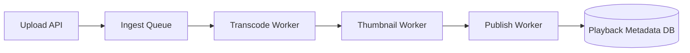

# Day 078 [Advanced]: Queue-driven Video Processing Case Study

## Index

- Goal
- Prerequisites
- Explanation
- Topic by Topic
- Key Concepts
- Visual Concept Map
- End-to-End Practical
- Hands-on Coding
- Mini Exercise
- Assessment Quiz
- Task
- Self Check
- Interview Questions and Answers
- Day Outcome

## Goal

Design a scalable queue-driven video processing pipeline for upload, transcode, thumbnail generation, and delivery.

## Prerequisites

- Day 077 realtime architecture patterns
- Queue and object storage fundamentals

## Explanation

Video processing is CPU and IO intensive and should be asynchronous. Queue-driven architecture decouples upload APIs from heavy processing, enabling elastic workers and predictable user experience.

## Topic by Topic

### Topic 1: Ingestion and Job Creation

Theory:
Upload endpoint should acknowledge quickly and enqueue background work.

Practical:
Return jobId immediately after storing source file metadata.

**Explanation:**
This topic explains Ingestion and Job Creation in a practical Node.js backend context so you can build reliable, production-ready APIs and services.

**Key Points:**
- Understand the core idea behind Ingestion and Job Creation.
- Apply the practical pattern with safe defaults and validation.
- Keep the implementation observable, maintainable, and secure where relevant.

### Topic 2: Worker Pipeline Stages

Theory:
Separate jobs by stage for retry isolation and observability.

Practical:
Create transcode, thumbnail, and publish queues.

**Explanation:**
This topic explains Worker Pipeline Stages in a practical Node.js backend context so you can build reliable, production-ready APIs and services.

**Key Points:**
- Understand the core idea behind Worker Pipeline Stages.
- Apply the practical pattern with safe defaults and validation.
- Keep the implementation observable, maintainable, and secure where relevant.

### Topic 3: Idempotency and Retry Safety

Theory:
Workers may retry and reprocess messages.

Practical:
Use output-exists checks and idempotency keys.

**Explanation:**
This topic explains Idempotency and Retry Safety in a practical Node.js backend context so you can build reliable, production-ready APIs and services.

**Key Points:**
- Understand the core idea behind Idempotency and Retry Safety.
- Apply the practical pattern with safe defaults and validation.
- Keep the implementation observable, maintainable, and secure where relevant.

### Topic 4: Progress Tracking and UX

Theory:
Users need status visibility for long-running jobs.

Practical:
Persist stage progress and expose polling or websocket updates.

**Explanation:**
This topic explains Progress Tracking and UX in a practical Node.js backend context so you can build reliable, production-ready APIs and services.

**Key Points:**
- Understand the core idea behind Progress Tracking and UX.
- Apply the practical pattern with safe defaults and validation.
- Keep the implementation observable, maintainable, and secure where relevant.

### Topic 5: Cost and Capacity Planning

Theory:
Transcoding cost grows with resolution, bitrate, and volume.

Practical:
Autoscale workers and prioritize premium queue classes.

**Explanation:**
This topic explains Cost and Capacity Planning in a practical Node.js backend context so you can build reliable, production-ready APIs and services.

**Key Points:**
- Understand the core idea behind Cost and Capacity Planning.
- Apply the practical pattern with safe defaults and validation.
- Keep the implementation observable, maintainable, and secure where relevant.

### Topic 6: Dead-letter Handling and Replay Operations

Theory:
Some jobs fail repeatedly and must be isolated. Reliable systems support safe replay after fixes.

Practical:
Move poison jobs to DLQ with reason codes and provide controlled replay tooling.

**Explanation:**
This topic explains Dead-letter Handling and Replay Operations in a practical Node.js backend context so you can build reliable, production-ready APIs and services.

**Key Points:**
- Understand the core idea behind Dead-letter Handling and Replay Operations.
- Apply the practical pattern with safe defaults and validation.
- Keep the implementation observable, maintainable, and secure where relevant.

## Pipeline Stage Table

| Stage           | Input             | Output               |
| --------------- | ----------------- | -------------------- |
| Upload accepted | Raw file URL      | Job queued           |
| Transcode       | Raw video         | HLS or MP4 variants  |
| Thumbnail       | Processed frame   | Preview images       |
| Publish         | Metadata + assets | Playable asset entry |

## Key Concepts

- Async media pipeline design
- Stage-based queue orchestration
- Idempotent worker behavior
- Status tracking and user feedback
- Throughput and cost optimization
- Dead-letter and replay operations
- Failure forensics for pipeline stages

## Visual Concept Map



## End-to-End Practical

1. Accept upload metadata and enqueue processing job.
2. Execute transcode in worker with retries.
3. Generate thumbnails and quality variants.
4. Persist progress state per stage.
5. Mark completion and notify client.

## Hands-on Coding

### Example 1: Case - Enqueue Video Job

Scenario:
Upload endpoint should avoid blocking on transcoding.

```js
const job = await queue.add("video.transcode", {
  videoId,
  sourceUrl,
  requestedProfiles: ["360p", "720p"],
});

res.status(202).json({ videoId, jobId: job.id });
```

### Example 2: Case - Worker with Retry Policy

Scenario:
Transient ffmpeg failures should retry before dead-letter.

```js
new Worker("video.transcode", async (job) => transcodeVideo(job.data), {
  connection: redis,
  concurrency: 4,
});
```

### Example 3: Case - Idempotent Stage Guard

Scenario:
Replay of same job should not duplicate outputs.

```js
if (await storage.exists(`videos/${videoId}/720p.m3u8`)) {
  return { skipped: true, reason: "already_processed" };
}
```

### Example 4: Case - DLQ on Max Retry

Scenario:
Transcode job keeps failing due to corrupt source media.

```js
worker.on("failed", async (job, err) => {
  if (job.attemptsMade >= 3) {
    await dlq.add("video.transcode.failed", {
      videoId: job.data.videoId,
      reason: err.message,
    });
  }
});
```

### Example 5: Case - Controlled Replay Command

Scenario:
After codec bug fix, selected failed jobs should be replayed safely.

```js
await queue.add("video.transcode", {
  videoId,
  sourceUrl,
  replayOf: failedJobId,
  replayReason: "codec_fix_2026_07",
});
```

## Mini Exercise

Scenario:
Build a mini asynchronous video pipeline with progress updates and retry-safe workers.

Expected output:

- Queue-based multi-stage workflow
- Retry and dead-letter strategy
- Progress visibility for clients

## Assessment Quiz

### Quiz Questions

1. Why should video processing be asynchronous?
2. What is the purpose of stage-level queues?
3. True or False: Skipping edge-case handling is acceptable in production.
4. Why is idempotency critical for media workers?
5. Why keep DLQ and replay workflow?

### Quiz Answers

1. It prevents long request blocking and improves scalability.
2. They isolate failures and improve observability per processing step.
3. False.
4. Retries can otherwise generate duplicate outputs and inconsistent metadata.
5. It isolates poison jobs and enables safe recovery after fixes without losing traceability.

## Task

- Implement one ingest-to-publish queue workflow
- Document retry and idempotency design
- Complete mini exercise and quiz.

## Self Check

- You can design scalable asynchronous media backends.
- You can operate queue-driven pipelines with reliability controls.
- You can answer at least 4 out of 5 quiz questions.

## Interview Questions and Answers

### Beginner

Question: What is the biggest benefit of queue-based video architecture?

Answer: It decouples user-facing APIs from heavy processing and scales workers independently.

### Middle

Question: When can a simple synchronous approach still be acceptable?

Answer: For tiny internal prototypes with very small media volume and no strict latency goals.

### Advanced

Question: What tradeoff comes with multi-stage pipelines?

Answer: Better scale and resilience with increased coordination and observability complexity.

## Day 078 Outcome

- You can implement queue-driven video processing end to end
- You can reason about retries, ordering, and throughput tradeoffs
- You are ready for payment integration architecture in Day 079
