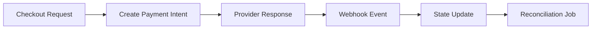

# Day 079 [Advanced]: Payment Integration Strategy

## Index

- Goal
- Prerequisites
- Explanation
- Topic by Topic
- Key Concepts
- Visual Concept Map
- End-to-End Practical
- Hands-on Coding
- Mini Exercise
- Assessment Quiz
- Task
- Self Check
- Interview Questions and Answers
- Day Outcome

## Goal

Design reliable payment integration architecture with idempotency, webhook verification, retries, and reconciliation workflows.

## Prerequisites

- Day 078 queue-driven processing patterns
- Basic transaction lifecycle understanding

## Explanation

Payment systems are failure-prone distributed workflows. A robust strategy treats payment as state machine, handles duplicate events safely, and always reconciles external provider truth with internal records.

## Topic by Topic

### Topic 1: Payment Flow State Modeling

Theory:
States like initiated, authorized, captured, failed, refunded need explicit transitions.

Practical:
Persist state transitions and prevent invalid jumps.

**Explanation:**
This topic explains Payment Flow State Modeling in a practical Node.js backend context so you can build reliable, production-ready APIs and services.

**Key Points:**
- Understand the core idea behind Payment Flow State Modeling.
- Apply the practical pattern with safe defaults and validation.
- Keep the implementation observable, maintainable, and secure where relevant.

### Topic 2: Idempotency and Retry Safety

Theory:
Network retries can trigger duplicate charge requests.

Practical:
Use idempotency keys per checkout attempt.

**Explanation:**
This topic explains Idempotency and Retry Safety in a practical Node.js backend context so you can build reliable, production-ready APIs and services.

**Key Points:**
- Understand the core idea behind Idempotency and Retry Safety.
- Apply the practical pattern with safe defaults and validation.
- Keep the implementation observable, maintainable, and secure where relevant.

### Topic 3: Webhook Security

Theory:
Webhooks must be signature-verified and replay-protected.

Practical:
Validate signature and reject stale timestamps.

**Explanation:**
This topic explains Webhook Security in a practical Node.js backend context so you can build reliable, production-ready APIs and services.

**Key Points:**
- Understand the core idea behind Webhook Security.
- Apply the practical pattern with safe defaults and validation.
- Keep the implementation observable, maintainable, and secure where relevant.

### Topic 4: Reconciliation and Drift Handling

Theory:
Provider state can diverge from internal records due to failures.

Practical:
Run scheduled reconciliation job and auto-repair mismatches.

**Explanation:**
This topic explains Reconciliation and Drift Handling in a practical Node.js backend context so you can build reliable, production-ready APIs and services.

**Key Points:**
- Understand the core idea behind Reconciliation and Drift Handling.
- Apply the practical pattern with safe defaults and validation.
- Keep the implementation observable, maintainable, and secure where relevant.

### Topic 5: Multi-provider and Fallback Design

Theory:
Single provider dependency creates business risk.

Practical:
Use abstraction layer to support secondary provider fallback.

**Explanation:**
This topic explains Multi-provider and Fallback Design in a practical Node.js backend context so you can build reliable, production-ready APIs and services.

**Key Points:**
- Understand the core idea behind Multi-provider and Fallback Design.
- Apply the practical pattern with safe defaults and validation.
- Keep the implementation observable, maintainable, and secure where relevant.

### Topic 6: Amount Integrity and Ledger-first Auditing

Theory:
Payment correctness is not only status-based. Amount, currency, and fee values must be verified end to end.

Practical:
Store immutable payment ledger entries and verify provider callback amounts before status transition.

**Explanation:**
This topic explains Amount Integrity and Ledger-first Auditing in a practical Node.js backend context so you can build reliable, production-ready APIs and services.

**Key Points:**
- Understand the core idea behind Amount Integrity and Ledger-first Auditing.
- Apply the practical pattern with safe defaults and validation.
- Keep the implementation observable, maintainable, and secure where relevant.

## Payment Reliability Table

| Control                        | Purpose                            |
| ------------------------------ | ---------------------------------- |
| Idempotency key                | Prevent duplicate charges          |
| Webhook signature verification | Reject forged callbacks            |
| Event persistence              | Audit and replay safety            |
| Reconciliation job             | Detect state drift                 |
| Retry with backoff             | Handle transient provider failures |

## Key Concepts

- Payment state machine modeling
- Idempotent transaction initiation
- Secure webhook ingestion
- External-internal state reconciliation
- Provider abstraction and fallback
- Amount and currency integrity checks
- Ledger-first auditability

## Visual Concept Map



## End-to-End Practical

1. Implement create-payment endpoint with idempotency key.
2. Persist payment intent status lifecycle.
3. Build webhook endpoint with signature verification.
4. Add retry-safe event processor.
5. Add nightly reconciliation task.

## Hands-on Coding

### Example 1: Case - Idempotent Payment Request

Scenario:
User retries checkout due to network timeout.

```js
const idempotencyKey = req.headers["idempotency-key"];
const existing = await paymentRepo.findByIdempotencyKey(idempotencyKey);
if (existing) return res.json(existing);

const payment = await provider.createIntent({ amount, currency });
await paymentRepo.save({ ...payment, idempotencyKey });
```

### Example 2: Case - Webhook Signature Check

Scenario:
Only authentic provider events should be processed.

```js
const signature = req.headers["x-signature"];
if (!verifySignature(req.rawBody, signature, process.env.WEBHOOK_SECRET)) {
  return res.status(400).send("Invalid signature");
}
```

### Example 3: Case - Reconciliation Drift Fix

Scenario:
Internal status says pending but provider says captured.

```js
if (local.status !== remote.status) {
  await paymentRepo.updateStatus(local.id, remote.status);
  logger.warn({ paymentId: local.id }, "payment_status_reconciled");
}
```

### Example 4: Case - Webhook Amount Verification

Scenario:
Captured amount from provider must match internal order total.

```js
if (
  webhook.amount !== order.totalAmount ||
  webhook.currency !== order.currency
) {
  await paymentRepo.flagForManualReview(order.id, "amount_mismatch");
  return res.status(202).json({ accepted: true, review: true });
}
```

### Example 5: Case - Immutable Ledger Entry

Scenario:
Need audit trail for every payment state transition.

```js
await paymentLedgerRepo.append({
  paymentId,
  fromStatus: "AUTHORIZED",
  toStatus: "CAPTURED",
  amount,
  currency,
  at: new Date().toISOString(),
});
```

## Mini Exercise

Scenario:
Create checkout-to-webhook payment flow with idempotency and reconciliation safeguards.

Expected output:

- End-to-end payment lifecycle handling
- Duplicate and forged event protections
- Drift detection with correction path

## Assessment Quiz

### Quiz Questions

1. Why must payment integrations be idempotent?
2. What risk is mitigated by webhook signature verification?
3. True or False: Skipping edge-case handling is acceptable in production.
4. Why is reconciliation required even with webhook processing?
5. Why verify amount and currency during webhook processing?

### Quiz Answers

1. To avoid double charging when clients retry.
2. Forged callback attacks and fraudulent state updates.
3. False.
4. Webhook delivery can fail or arrive late, causing state divergence.
5. It prevents incorrect or tampered settlement state from corrupting internal records.

## Task

- Build one payment flow with idempotency and webhook verification
- Document reconciliation and fallback strategy
- Complete mini exercise and quiz.

## Self Check

- You can design resilient payment integrations in Node services.
- You can prevent duplicate charges and state inconsistency.
- You can answer at least 4 out of 5 quiz questions.

## Interview Questions and Answers

### Beginner

Question: What is the most common payment integration reliability bug?

Answer: Duplicate processing due to retries without idempotency.

### Middle

Question: Should webhook events be trusted by default?

Answer: No. Always verify signatures and protect against replay.

### Advanced

Question: What tradeoff comes with multi-provider payment abstraction?

Answer: Better resilience and bargaining power, with higher integration and testing complexity.

## Day 079 Outcome

- You can model and operate robust payment workflows
- You can secure and reconcile provider-driven transactions
- You are ready for release management and semver in Day 080
