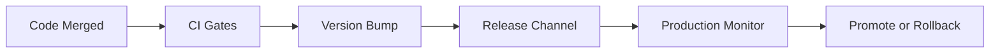

# Day 080 [Advanced]: Release Management and SemVer

## Index

- Goal
- Prerequisites
- Explanation
- Topic by Topic
- Key Concepts
- Visual Concept Map
- End-to-End Practical
- Hands-on Coding
- Mini Exercise
- Assessment Quiz
- Task
- Self Check
- Interview Questions and Answers
- Day Outcome

## Goal

Build a reliable release management workflow using semantic versioning, release trains, and rollback-ready deployment practices.

## Prerequisites

- Day 079 payment integration reliability
- CI/CD and branch strategy fundamentals

## Explanation

Release management controls how changes move from code to users with minimal risk. Semantic versioning communicates compatibility impact clearly, while release process defines quality gates and recovery actions.

## Topic by Topic

### Topic 1: SemVer Rules in Practice

Theory:
Patch for fixes, minor for backward-compatible features, major for breaking changes.

Practical:
Map change examples to correct version bump decisions.

**Explanation:**
This topic explains SemVer Rules in Practice in a practical Node.js backend context so you can build reliable, production-ready APIs and services.

**Key Points:**
- Understand the core idea behind SemVer Rules in Practice.
- Apply the practical pattern with safe defaults and validation.
- Keep the implementation observable, maintainable, and secure where relevant.

### Topic 2: Release Channels and Cadence

Theory:
Stable, beta, and canary channels balance speed and confidence.

Practical:
Promote canary to stable only after SLO checks.

**Explanation:**
This topic explains Release Channels and Cadence in a practical Node.js backend context so you can build reliable, production-ready APIs and services.

**Key Points:**
- Understand the core idea behind Release Channels and Cadence.
- Apply the practical pattern with safe defaults and validation.
- Keep the implementation observable, maintainable, and secure where relevant.

### Topic 3: Change Classification and Changelog Quality

Theory:
Consistent commit/release metadata improves traceability.

Practical:
Use conventional commits and generated changelogs.

**Explanation:**
This topic explains Change Classification and Changelog Quality in a practical Node.js backend context so you can build reliable, production-ready APIs and services.

**Key Points:**
- Understand the core idea behind Change Classification and Changelog Quality.
- Apply the practical pattern with safe defaults and validation.
- Keep the implementation observable, maintainable, and secure where relevant.

### Topic 4: Rollback and Hotfix Workflows

Theory:
Every release plan should include rollback criteria.

Practical:
Define p95/error thresholds that trigger automatic rollback.

**Explanation:**
This topic explains Rollback and Hotfix Workflows in a practical Node.js backend context so you can build reliable, production-ready APIs and services.

**Key Points:**
- Understand the core idea behind Rollback and Hotfix Workflows.
- Apply the practical pattern with safe defaults and validation.
- Keep the implementation observable, maintainable, and secure where relevant.

### Topic 5: Multi-package Versioning

Theory:
Monorepos may need independent or synchronized version strategies.

Practical:
Use changesets for package-level release decisions.

**Explanation:**
This topic explains Multi-package Versioning in a practical Node.js backend context so you can build reliable, production-ready APIs and services.

**Key Points:**
- Understand the core idea behind Multi-package Versioning.
- Apply the practical pattern with safe defaults and validation.
- Keep the implementation observable, maintainable, and secure where relevant.

### Topic 6: Release Verification and Post-release Learning

Theory:
Shipping is not the final step. Teams need structured verification and short feedback loops after deployment.

Practical:
Run post-release smoke checks, compare key metrics, and record release retro notes.

**Explanation:**
This topic explains Release Verification and Post-release Learning in a practical Node.js backend context so you can build reliable, production-ready APIs and services.

**Key Points:**
- Understand the core idea behind Release Verification and Post-release Learning.
- Apply the practical pattern with safe defaults and validation.
- Keep the implementation observable, maintainable, and secure where relevant.

## Release Governance Table

| Area         | Practice                                    |
| ------------ | ------------------------------------------- |
| Versioning   | Enforce SemVer in release automation        |
| Changelog    | Generate from conventional commits          |
| Quality gate | Tests, security scan, performance checks    |
| Rollback     | Clear triggers and one-command restore path |
| Ownership    | Named release captain per cycle             |

## Key Concepts

- SemVer compatibility signaling
- Controlled release channels
- Risk-based deployment governance
- Fast rollback readiness
- Multi-package version strategy
- Post-release verification discipline
- Continuous release process improvement

## Visual Concept Map



## End-to-End Practical

1. Define release policy and SemVer mapping guide.
2. Automate version bump and changelog generation.
3. Deploy canary release with monitoring window.
4. Promote or rollback based on guardrails.
5. Publish post-release summary and lessons.

## Hands-on Coding

### Example 1: Case - Version Bump Decision

Scenario:
A public API response field is removed.

```txt
Change type: breaking
Required bump: major
Example: 2.4.1 -> 3.0.0
```

### Example 2: Case - Release Script Steps

Scenario:
Automate predictable release process.

```bash
npm run test
npm run build
npx changeset version
npx changeset publish
```

### Example 3: Case - Rollback Trigger

Scenario:
Canary error rate exceeds threshold.

```txt
if error_rate > 2% for 10m or p95 > 1200ms:
  rollback to previous stable release
```

### Example 4: Case - Post-release Smoke Checklist

Scenario:
Team needs a repeatable 15-minute verification after production deploy.

```txt
1) Health and readiness endpoints are green
2) Login and checkout journeys pass
3) Error rate and p95 remain within SLO budget
4) No critical alert regression in monitoring
```

### Example 5: Case - Release Retro Template

Scenario:
Capture learning to improve next release cycle.

```txt
release: 3.4.0
what_went_well: canary detected no regressions
issues: migration note missed one edge case
actions: add migration-check step to release checklist
owner: release-captain
```

## Mini Exercise

Scenario:
Define release process for one Node service with canary checks, semver rules, and rollback conditions.

Expected output:

- Versioning policy tied to change types
- Automated release pipeline steps
- Clear rollback governance

## Assessment Quiz

### Quiz Questions

1. Why is SemVer critical for consumer trust?
2. When should a major version be released?
3. True or False: Skipping edge-case handling is acceptable in production.
4. Why should rollback conditions be predefined?
5. Why do post-release checks matter if CI already passed?

### Quiz Answers

1. It sets clear compatibility expectations and reduces upgrade surprises.
2. When changes break existing public contract behavior.
3. False.
4. Real incidents need fast, objective action without debate.
5. Real production traffic can reveal issues that pre-release tests miss.

## Task

- Create one semver and release policy document
- Add one canary guardrail and rollback trigger
- Complete mini exercise and quiz.

## Self Check

- You can run predictable and safer release cycles.
- You can communicate compatibility impact clearly with SemVer.
- You can answer at least 4 out of 5 quiz questions.

## Interview Questions and Answers

### Beginner

Question: Why are release checklists valuable?

Answer: They reduce human error and ensure critical gates are not skipped.

### Middle

Question: Should every bug fix trigger a new major version?

Answer: No. Most bug fixes are patch releases unless they break existing contracts.

### Advanced

Question: What tradeoff appears with slower gated releases?

Answer: Better reliability and trust, with reduced raw release speed.

## Day 080 Outcome

- You can design release workflows with safety and clarity
- You can apply SemVer accurately to Node services and packages
- You are ready for enterprise-scale engineering tracks next
