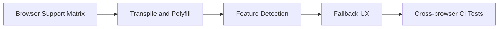

# Day 081 [Advanced]: Browser Compatibility for Fullstack Apps

## Index

- Goal
- Prerequisites
- Explanation
- Topic by Topic
- Key Concepts
- Visual Concept Map
- End-to-End Practical
- Hands-on Coding
- Mini Exercise
- Assessment Quiz
- Task
- Self Check
- Interview Questions and Answers
- Day Outcome

## Goal

Build fullstack applications that behave reliably across modern and legacy browsers without sacrificing performance or maintainability.

## Prerequisites

- Day 080 release management and SemVer
- JavaScript transpilation and polyfill basics

## Explanation

Browser compatibility is a product reliability concern, not just a frontend issue. Differences in JS APIs, CSS features, cookie behavior, and fetch/security policies can break authentication, rendering, and API interactions.

## Topic by Topic

### Topic 1: Compatibility Matrix and Risk Prioritization

Theory:
Not all browsers need equal support; define official support policy.

Practical:
Create browser support matrix from analytics and business requirements.

**Explanation:**
This topic explains Compatibility Matrix and Risk Prioritization in a practical Node.js backend context so you can build reliable, production-ready APIs and services.

**Key Points:**
- Understand the core idea behind Compatibility Matrix and Risk Prioritization.
- Apply the practical pattern with safe defaults and validation.
- Keep the implementation observable, maintainable, and secure where relevant.

### Topic 2: Transpilation and Polyfill Strategy

Theory:
Transpilation handles syntax; polyfills handle missing runtime APIs.

Practical:
Use Browserslist targets and load polyfills conditionally.

**Explanation:**
This topic explains Transpilation and Polyfill Strategy in a practical Node.js backend context so you can build reliable, production-ready APIs and services.

**Key Points:**
- Understand the core idea behind Transpilation and Polyfill Strategy.
- Apply the practical pattern with safe defaults and validation.
- Keep the implementation observable, maintainable, and secure where relevant.

### Topic 3: Authentication and Cookie Compatibility

Theory:
SameSite and secure cookie policies differ subtly by browser versions.

Practical:
Test login/session persistence across target browsers.

**Explanation:**
This topic explains Authentication and Cookie Compatibility in a practical Node.js backend context so you can build reliable, production-ready APIs and services.

**Key Points:**
- Understand the core idea behind Authentication and Cookie Compatibility.
- Apply the practical pattern with safe defaults and validation.
- Keep the implementation observable, maintainable, and secure where relevant.

### Topic 4: Progressive Enhancement

Theory:
Build core functionality first, then layer advanced APIs where supported.

Practical:
Fallback gracefully when features like Web Share or Clipboard API are unavailable.

**Explanation:**
This topic explains Progressive Enhancement in a practical Node.js backend context so you can build reliable, production-ready APIs and services.

**Key Points:**
- Understand the core idea behind Progressive Enhancement.
- Apply the practical pattern with safe defaults and validation.
- Keep the implementation observable, maintainable, and secure where relevant.

### Topic 5: Automated Cross-browser Testing

Theory:
Manual testing misses edge cases and is hard to scale.

Practical:
Run Playwright matrix tests in CI for Chromium, Firefox, and WebKit.

**Explanation:**
This topic explains Automated Cross-browser Testing in a practical Node.js backend context so you can build reliable, production-ready APIs and services.

**Key Points:**
- Understand the core idea behind Automated Cross-browser Testing.
- Apply the practical pattern with safe defaults and validation.
- Keep the implementation observable, maintainable, and secure where relevant.

### Topic 6: Runtime Monitoring and Compatibility Rollback

Theory:
Some compatibility bugs appear only in real user environments. You need browser-segmented telemetry and quick rollback options.

Practical:
Track errors by browser family/version and disable risky feature flags for affected segments.

**Explanation:**
This topic explains Runtime Monitoring and Compatibility Rollback in a practical Node.js backend context so you can build reliable, production-ready APIs and services.

**Key Points:**
- Understand the core idea behind Runtime Monitoring and Compatibility Rollback.
- Apply the practical pattern with safe defaults and validation.
- Keep the implementation observable, maintainable, and secure where relevant.

## Compatibility Decision Table

| Concern                   | Primary Tool         | Typical Fix                      |
| ------------------------- | -------------------- | -------------------------------- |
| JS syntax support         | TypeScript/Babel     | Target older engines             |
| Missing APIs              | Polyfills            | Conditional runtime import       |
| CSS inconsistencies       | PostCSS/autoprefixer | Prefix and fallback styles       |
| Cookie policy differences | Browser testing      | Adjust SameSite and secure flags |

## Key Concepts

- Support policy design
- Syntax vs runtime compatibility
- Authentication behavior across browsers
- Progressive enhancement mindset
- CI-driven browser verification
- Runtime compatibility observability
- Feature-flag rollback for browser issues

## Visual Concept Map



## End-to-End Practical

1. Define supported browser list.
2. Configure build targets and polyfill policy.
3. Add fallback for one unsupported API.
4. Validate authentication/session behavior on 3 browsers.
5. Add cross-browser tests to CI pipeline.

## Hands-on Coding

### Example 1: Case - Browserslist Targeting

Scenario:
Product team supports last 2 major versions and not dead browsers.

```txt
last 2 Chrome versions
last 2 Firefox versions
last 2 Safari versions
not dead
```

### Example 2: Case - Feature Detection Fallback

Scenario:
Clipboard API unavailable on certain browser versions.

```js
if (navigator.clipboard?.writeText) {
  await navigator.clipboard.writeText(text);
} else {
  fallbackCopyToInputSelection(text);
}
```

### Example 3: Case - Playwright Browser Matrix

Scenario:
CI should verify login flow on three browser engines.

```ts
projects: [
  { name: "chromium", use: { browserName: "chromium" } },
  { name: "firefox", use: { browserName: "firefox" } },
  { name: "webkit", use: { browserName: "webkit" } },
];
```

### Example 4: Case - Browser-segmented Error Logging

Scenario:
New release fails only on one browser family.

```js
logger.error({
  browser: req.headers["user-agent"],
  route: req.path,
  code: "COMPAT_RUNTIME_ERROR",
});
```

### Example 5: Case - Feature Flag Compatibility Kill Switch

Scenario:
Disable new upload UI for a problematic browser version.

```js
const isLegacySafari = /Version\/14.*Safari/.test(userAgent);
const uploadV2Enabled = runtimeFlags.uploadV2 && !isLegacySafari;
```

## Mini Exercise

Scenario:
Harden one authenticated user flow with browser fallback and matrix test coverage.

Expected output:

- Defined support matrix
- Feature fallback implemented
- Multi-browser test evidence produced

## Assessment Quiz

### Quiz Questions

1. Why should support policy be explicit instead of ad hoc?
2. What is the difference between transpilation and polyfill?
3. True or False: Skipping edge-case handling is acceptable in production.
4. Why can auth cookies behave differently across browsers?
5. Why track compatibility errors by browser segment?

### Quiz Answers

1. It aligns engineering effort with actual user and business needs.
2. Transpilation converts syntax, polyfills add missing runtime features.
3. False.
4. Browser policy changes around SameSite and secure flags vary.
5. It helps isolate affected users quickly and enables targeted rollback decisions.

## Task

- Define browser support and fallback policy
- Add one cross-browser automated test suite
- Complete mini exercise and quiz.

## Self Check

- You can design compatibility-first fullstack experiences.
- You can prevent browser-specific regressions in production.
- You can answer at least 4 out of 5 quiz questions.

## Interview Questions and Answers

### Beginner

Question: Why is browser compatibility a backend concern too?

Answer: Because sessions, cookies, and API request behavior can differ by browser implementation.

### Middle

Question: Should every old browser be fully supported?

Answer: Not always; support should match business and analytics priorities.

### Advanced

Question: What tradeoff comes with broad compatibility targets?

Answer: Better reach, with larger bundle size and extra testing overhead.

## Day 081 Outcome

- You can implement practical browser compatibility strategy end to end
- You can balance compatibility, performance, and delivery speed
- You are ready for large-scale module architecture in Day 082
