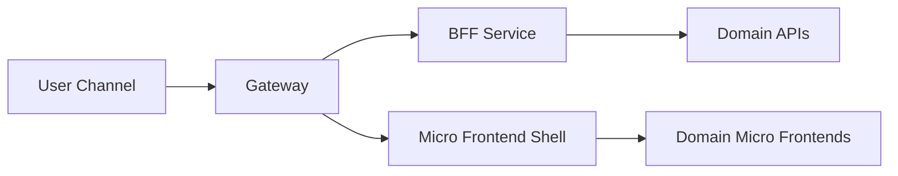

# Day 083 [Advanced]: Micro Frontend and BFF Strategy

## Index

- Goal
- Prerequisites
- Explanation
- Topic by Topic
- Key Concepts
- Visual Concept Map
- End-to-End Practical
- Hands-on Coding
- Mini Exercise
- Assessment Quiz
- Task
- Self Check
- Interview Questions and Answers
- Day Outcome

## Goal

Design scalable product delivery with micro frontends and BFF layers while balancing autonomy, consistency, and operational complexity.

## Prerequisites

- Day 082 module architecture
- API gateway and frontend composition basics

## Explanation

Micro frontends help teams ship independently, while BFF (Backend for Frontend) services tailor APIs for each client experience. Together they can increase delivery speed, but require strict governance to avoid fragmented UX and duplicated logic.

## Topic by Topic

### Topic 1: Micro Frontend Boundaries

Theory:
Boundaries should follow user journeys, not arbitrary UI components.

Practical:
Split by checkout, catalog, and account domains.

**Explanation:**
This topic explains Micro Frontend Boundaries in a practical Node.js backend context so you can build reliable, production-ready APIs and services.

**Key Points:**
- Understand the core idea behind Micro Frontend Boundaries.
- Apply the practical pattern with safe defaults and validation.
- Keep the implementation observable, maintainable, and secure where relevant.

### Topic 2: Composition Models

Theory:
Composition can be build-time, server-side, or client-side runtime.

Practical:
Use server-side composition for SEO-critical flows.

**Explanation:**
This topic explains Composition Models in a practical Node.js backend context so you can build reliable, production-ready APIs and services.

**Key Points:**
- Understand the core idea behind Composition Models.
- Apply the practical pattern with safe defaults and validation.
- Keep the implementation observable, maintainable, and secure where relevant.

### Topic 3: BFF Responsibilities

Theory:
BFF should aggregate data and shape responses for a specific UI.

Practical:
Create mobile-specific BFF with minimal payload and fewer round trips.

**Explanation:**
This topic explains BFF Responsibilities in a practical Node.js backend context so you can build reliable, production-ready APIs and services.

**Key Points:**
- Understand the core idea behind BFF Responsibilities.
- Apply the practical pattern with safe defaults and validation.
- Keep the implementation observable, maintainable, and secure where relevant.

### Topic 4: Contract and Release Coordination

Theory:
Independent releases still need compatibility contracts.

Practical:
Version BFF endpoints and enforce contract tests.

**Explanation:**
This topic explains Contract and Release Coordination in a practical Node.js backend context so you can build reliable, production-ready APIs and services.

**Key Points:**
- Understand the core idea behind Contract and Release Coordination.
- Apply the practical pattern with safe defaults and validation.
- Keep the implementation observable, maintainable, and secure where relevant.

### Topic 5: Observability and Operational Risk

Theory:
Distributed UI architecture needs traceability across layers.

Practical:
Propagate request IDs from gateway to BFF to downstream services.

**Explanation:**
This topic explains Observability and Operational Risk in a practical Node.js backend context so you can build reliable, production-ready APIs and services.

**Key Points:**
- Understand the core idea behind Observability and Operational Risk.
- Apply the practical pattern with safe defaults and validation.
- Keep the implementation observable, maintainable, and secure where relevant.

### Topic 6: Resilience, Caching, and Contract Drift Prevention

Theory:
BFF services can become a bottleneck if every page request triggers many backend calls. Contract drift across teams can also break composition silently.

Practical:
Add short-lived cache, fallback defaults, and schema contract checks between BFF and domain services.

**Explanation:**
This topic explains Resilience, Caching, and Contract Drift Prevention in a practical Node.js backend context so you can build reliable, production-ready APIs and services.

**Key Points:**
- Understand the core idea behind Resilience, Caching, and Contract Drift Prevention.
- Apply the practical pattern with safe defaults and validation.
- Keep the implementation observable, maintainable, and secure where relevant.

## Strategy Comparison Table

| Approach            | Strength                           | Tradeoff                                    |
| ------------------- | ---------------------------------- | ------------------------------------------- |
| Monolithic frontend | Consistent UX governance           | Slower independent team delivery            |
| Micro frontend      | Team autonomy and deployment speed | Integration complexity and consistency risk |
| BFF per channel     | Optimized client payloads          | More services to maintain                   |

## Key Concepts

- Domain-oriented UI decomposition
- BFF data aggregation patterns
- Cross-team contract governance
- Multi-layer observability
- Release coordination discipline
- BFF resilience and cache strategy
- Schema drift detection discipline

## Visual Concept Map



## End-to-End Practical

1. Define micro frontend boundaries for one product.
2. Build shell plus one remote module integration.
3. Add BFF endpoint for page data aggregation.
4. Implement contract tests between frontend and BFF.
5. Track request path with end-to-end tracing IDs.

## Hands-on Coding

### Example 1: Case - BFF Aggregation Endpoint

Scenario:
Dashboard needs profile, orders, and recommendations in one call.

```js
app.get("/bff/dashboard", async (req, res) => {
  const [profile, orders, recommendations] = await Promise.all([
    profileApi.get(req.user.id),
    ordersApi.listRecent(req.user.id),
    recApi.get(req.user.id),
  ]);

  res.json({ profile, orders, recommendations });
});
```

### Example 2: Case - Partial Failure Fallback

Scenario:
Recommendations service fails but dashboard should still render.

```js
let recommendations = [];
try {
  recommendations = await recApi.get(req.user.id);
} catch {
  recommendations = [];
}
```

### Example 3: Case - Request ID Propagation

Scenario:
Need trace continuity from shell to BFF to downstream services.

```js
const requestId = req.headers["x-request-id"] || crypto.randomUUID();
await ordersApi.listRecent(req.user.id, { requestId });
```

### Example 4: Case - Short-lived BFF Cache

Scenario:
Dashboard receives repeated refreshes from many clients.

```js
const key = `dashboard:${req.user.id}`;
const cached = await redis.get(key);
if (cached) return res.json(JSON.parse(cached));

const payload = await buildDashboardPayload(req.user.id);
await redis.set(key, JSON.stringify(payload), { EX: 15 });
res.json(payload);
```

### Example 5: Case - Downstream Contract Guard

Scenario:
Orders service changed payload and breaks dashboard rendering.

```js
if (!Array.isArray(orders?.items)) {
  logger.error({ requestId, service: "orders" }, "contract_mismatch");
  orders = { items: [] };
}
```

## Mini Exercise

Scenario:
Compose one page from micro frontend modules and power it through a dedicated BFF endpoint with fallback handling.

Expected output:

- Domain-specific UI composition
- BFF aggregation with fallback path
- Contract and tracing readiness

## Assessment Quiz

### Quiz Questions

1. Why does BFF reduce client complexity?
2. What is one risk of micro frontend autonomy without governance?
3. True or False: Skipping edge-case handling is acceptable in production.
4. Why are contract tests essential in this model?
5. Why add caching and contract guards in BFF?

### Quiz Answers

1. It consolidates many backend calls and shapes client-specific responses.
2. Inconsistent UX and breaking interface contracts.
3. False.
4. Independent release cycles can silently break integration.
5. They reduce latency and prevent downstream schema drift from causing page failures.

## Task

- Build one BFF endpoint with micro frontend integration point
- Document autonomy vs consistency tradeoff
- Complete mini exercise and quiz.

## Self Check

- You can architect scalable frontend-backend composition models.
- You can balance team autonomy with platform governance.
- You can answer at least 4 out of 5 quiz questions.

## Interview Questions and Answers

### Beginner

Question: Why introduce a BFF instead of calling all services from browser?

Answer: It centralizes aggregation, security, and client-specific shaping while reducing frontend complexity.

### Middle

Question: When should teams avoid micro frontends initially?

Answer: When product scope is small and a single team can move fast with a unified frontend.

### Advanced

Question: What tradeoff is most common in micro frontend programs?

Answer: Faster independent delivery with higher integration and operational governance effort.

## Day 083 Outcome

- You can design micro frontend and BFF systems with production constraints
- You can prevent integration drift with contracts and observability
- You are ready for edge runtime and serverless patterns in Day 084
