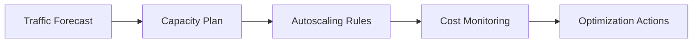

# Day 085 [Advanced]: Cost Optimization and Capacity Planning

## Index

- Goal
- Prerequisites
- Explanation
- Topic by Topic
- Key Concepts
- Visual Concept Map
- End-to-End Practical
- Hands-on Coding
- Mini Exercise
- Assessment Quiz
- Task
- Self Check
- Interview Questions and Answers
- Day Outcome

## Goal

Design data-driven cost optimization and capacity planning strategy for Node systems under real traffic and growth uncertainty.

## Prerequisites

- Day 084 edge and serverless runtime strategies
- Observability metrics and SLO familiarity

## Explanation

Cost optimization is not just reducing spend. It is balancing cost, performance, reliability, and growth readiness. Capacity planning prevents both under-provision outages and over-provision waste.

## Topic by Topic

### Topic 1: Cost Drivers in Node Platforms

Theory:
Major drivers include compute hours, database throughput, network egress, storage, and cache footprint.

Practical:
Break monthly cloud bill by service and team ownership.

**Explanation:**
This topic explains Cost Drivers in Node Platforms in a practical Node.js backend context so you can build reliable, production-ready APIs and services.

**Key Points:**
- Understand the core idea behind Cost Drivers in Node Platforms.
- Apply the practical pattern with safe defaults and validation.
- Keep the implementation observable, maintainable, and secure where relevant.

### Topic 2: Capacity Forecasting Models

Theory:
Capacity can be planned using baseline, seasonal, and surge scenarios.

Practical:
Forecast p95 load for next quarter with confidence range.

**Explanation:**
This topic explains Capacity Forecasting Models in a practical Node.js backend context so you can build reliable, production-ready APIs and services.

**Key Points:**
- Understand the core idea behind Capacity Forecasting Models.
- Apply the practical pattern with safe defaults and validation.
- Keep the implementation observable, maintainable, and secure where relevant.

### Topic 3: Autoscaling and Rightsizing

Theory:
Autoscaling handles variability; rightsizing handles steady-state waste.

Practical:
Tune min/max replicas and CPU/memory requests by observed utilization.

**Explanation:**
This topic explains Autoscaling and Rightsizing in a practical Node.js backend context so you can build reliable, production-ready APIs and services.

**Key Points:**
- Understand the core idea behind Autoscaling and Rightsizing.
- Apply the practical pattern with safe defaults and validation.
- Keep the implementation observable, maintainable, and secure where relevant.

### Topic 4: Caching and Efficiency Improvements

Theory:
Caching, query optimization, and batching reduce expensive backend work.

Practical:
Add cache-aside on hot endpoints and monitor hit ratio.

**Explanation:**
This topic explains Caching and Efficiency Improvements in a practical Node.js backend context so you can build reliable, production-ready APIs and services.

**Key Points:**
- Understand the core idea behind Caching and Efficiency Improvements.
- Apply the practical pattern with safe defaults and validation.
- Keep the implementation observable, maintainable, and secure where relevant.

### Topic 5: FinOps and Governance

Theory:
Optimization must be continuous with budgets, alerts, and ownership.

Practical:
Set cost anomaly alerts and weekly cost review routine.

**Explanation:**
This topic explains FinOps and Governance in a practical Node.js backend context so you can build reliable, production-ready APIs and services.

**Key Points:**
- Understand the core idea behind FinOps and Governance.
- Apply the practical pattern with safe defaults and validation.
- Keep the implementation observable, maintainable, and secure where relevant.

### Topic 6: Guardrails, Budgets, and Load-testing Validation

Theory:
Cost plans fail without enforcement. Guardrails and pre-production load tests confirm that savings do not break SLOs.

Practical:
Define budget thresholds per service and validate scaling policies with periodic load tests.

**Explanation:**
This topic explains Guardrails, Budgets, and Load-testing Validation in a practical Node.js backend context so you can build reliable, production-ready APIs and services.

**Key Points:**
- Understand the core idea behind Guardrails, Budgets, and Load-testing Validation.
- Apply the practical pattern with safe defaults and validation.
- Keep the implementation observable, maintainable, and secure where relevant.

## Cost Optimization Table

| Lever                    | Benefit                   | Risk                                            |
| ------------------------ | ------------------------- | ----------------------------------------------- |
| Rightsize instances      | Lower baseline cost       | Under-provision if done aggressively            |
| Autoscaling              | Better burst handling     | Cost spikes without upper bounds                |
| Caching                  | Lower DB and compute load | Stale data if invalidation is weak              |
| Reserved/committed usage | Reduced unit price        | Less flexibility for rapid architecture changes |

## Key Concepts

- Cost-to-performance balancing
- Forecast-based capacity planning
- Autoscaling and rightsizing tuning
- Efficiency optimization patterns
- FinOps governance loop
- Service-level budget guardrails
- Load-tested capacity confidence

## Visual Concept Map



## End-to-End Practical

1. Gather 30-day performance and cost metrics.
2. Build baseline cost model per request path.
3. Tune one autoscaling and one caching strategy.
4. Simulate traffic growth and validate headroom.
5. Publish monthly optimization action plan.

## Hands-on Coding

### Example 1: Case - Cost Per Request Estimation

Scenario:
Team needs visibility into API unit economics.

```txt
monthly_compute_cost = $4200
monthly_requests = 140,000,000
cost_per_1k_requests = ($4200 / 140000000) * 1000 = $0.03
```

### Example 2: Case - Autoscaling Policy

Scenario:
Traffic spikes at 9 PM daily due to streaming event.

```yaml
minReplicas: 3
maxReplicas: 25
targetCPUUtilizationPercentage: 65
scaleUpCooldownSeconds: 60
scaleDownCooldownSeconds: 300
```

### Example 3: Case - Cache-aside Guard

Scenario:
Reduce expensive DB reads for frequently requested catalog data.

```js
const cached = await redis.get(cacheKey);
if (cached) return JSON.parse(cached);

const data = await repo.fetchCatalog();
await redis.set(cacheKey, JSON.stringify(data), "EX", 120);
return data;
```

### Example 4: Case - Budget Alert Threshold

Scenario:
Checkout service monthly spend should stay within agreed budget.

```txt
service: checkout-api
monthly_budget_usd: 8000
alert_75_percent: notify team-finops
alert_90_percent: require optimization action plan
```

### Example 5: Case - Capacity Validation Drill

Scenario:
Before seasonal campaign, test whether autoscaling keeps p95 under SLO.

```bash
autocannon -c 300 -d 300 https://staging.example.com/api/checkout
```

## Mini Exercise

Scenario:
Optimize one high-traffic endpoint for cost and capacity while maintaining p95 latency SLO.

Expected output:

- Baseline cost model
- Capacity and autoscale policy
- Measurable optimization impact

## Assessment Quiz

### Quiz Questions

1. Why can pure cost-cutting hurt product reliability?
2. What is the difference between autoscaling and rightsizing?
3. True or False: Skipping edge-case handling is acceptable in production.
4. Why should optimization be tied to SLOs?
5. Why run load tests after cost optimization changes?

### Quiz Answers

1. Removing too much capacity can increase latency and outages.
2. Autoscaling handles dynamic peaks; rightsizing reduces steady over-provisioning.
3. False.
4. It prevents savings that degrade user experience below acceptable thresholds.
5. They verify that cost reductions still meet real traffic reliability and latency goals.

## Task

- Build one cost model and one capacity forecast
- Apply one optimization and compare before-after metrics
- Complete mini exercise and quiz.

## Self Check

- You can run practical FinOps-style optimization for Node systems.
- You can plan capacity with performance and reliability guardrails.
- You can answer at least 4 out of 5 quiz questions.

## Interview Questions and Answers

### Beginner

Question: What is the first step before optimizing cloud cost?

Answer: Build a transparent baseline of where money is spent and why.

### Middle

Question: Should optimization focus only on infrastructure cost?

Answer: No, it must include reliability impact and engineering productivity effects.

### Advanced

Question: What tradeoff appears with aggressive autoscaling limits?

Answer: Better budget control with higher risk of throttling during sudden demand spikes.

## Day 085 Outcome

- You can optimize Node platform cost without sacrificing reliability
- You can create capacity plans backed by real metrics
- You are ready for final capstone and architecture review stages next
