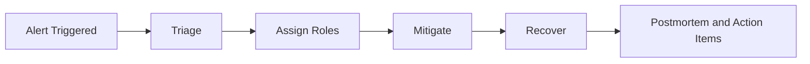

# Day 086 [Advanced]: Incident Response and On-call Playbook

## Index

- Goal
- Prerequisites
- Explanation
- Topic by Topic
- Key Concepts
- Visual Concept Map
- End-to-End Practical
- Hands-on Coding
- Mini Exercise
- Assessment Quiz
- Task
- Self Check
- Interview Questions and Answers
- Day Outcome

## Goal

Build a practical incident response and on-call system that reduces downtime, speeds recovery, and improves team reliability habits.

## Prerequisites

- Day 085 cost optimization and capacity planning
- Logging, metrics, and tracing fundamentals

## Explanation

Incidents are inevitable in production systems. High-performing teams are not the teams with zero incidents, but teams that detect early, communicate clearly, recover quickly, and learn systematically. An on-call playbook is the operational contract that makes this repeatable.

## Topic by Topic

### Topic 1: Incident Lifecycle and Severity Model

Theory:
Define clear lifecycle phases: detection, triage, mitigation, recovery, and postmortem.

Practical:
Use severity levels (SEV1 to SEV4) with response SLAs and escalation paths.

**Explanation:**
This topic explains Incident Lifecycle and Severity Model in a practical Node.js backend context so you can build reliable, production-ready APIs and services.

**Key Points:**
- Understand the core idea behind Incident Lifecycle and Severity Model.
- Apply the practical pattern with safe defaults and validation.
- Keep the implementation observable, maintainable, and secure where relevant.

### Topic 2: Roles During an Incident

Theory:
One person should not do everything. Split roles into incident commander, communications lead, and technical responders.

Practical:
Assign temporary roles in incident channel and rotate every 30-60 minutes if needed.

**Explanation:**
This topic explains Roles During an Incident in a practical Node.js backend context so you can build reliable, production-ready APIs and services.

**Key Points:**
- Understand the core idea behind Roles During an Incident.
- Apply the practical pattern with safe defaults and validation.
- Keep the implementation observable, maintainable, and secure where relevant.

### Topic 3: Runbooks and Decision Trees

Theory:
Standardized runbooks reduce panic and improve action quality under pressure.

Practical:
Create runbook sections for symptoms, checks, mitigations, rollback steps, and owner contacts.

**Explanation:**
This topic explains Runbooks and Decision Trees in a practical Node.js backend context so you can build reliable, production-ready APIs and services.

**Key Points:**
- Understand the core idea behind Runbooks and Decision Trees.
- Apply the practical pattern with safe defaults and validation.
- Keep the implementation observable, maintainable, and secure where relevant.

### Topic 4: Alert Quality and Noise Control

Theory:
Too many low-signal alerts create fatigue and slower response.

Practical:
Tune thresholds, deduplicate alert storms, and classify paging vs non-paging alerts.

**Explanation:**
This topic explains Alert Quality and Noise Control in a practical Node.js backend context so you can build reliable, production-ready APIs and services.

**Key Points:**
- Understand the core idea behind Alert Quality and Noise Control.
- Apply the practical pattern with safe defaults and validation.
- Keep the implementation observable, maintainable, and secure where relevant.

### Topic 5: Postmortems and Reliability Learning

Theory:
Blameless postmortems convert incidents into system improvements.

Practical:
Track action items with owners and deadlines, then verify completion.

**Explanation:**
This topic explains Postmortems and Reliability Learning in a practical Node.js backend context so you can build reliable, production-ready APIs and services.

**Key Points:**
- Understand the core idea behind Postmortems and Reliability Learning.
- Apply the practical pattern with safe defaults and validation.
- Keep the implementation observable, maintainable, and secure where relevant.

### Topic 6: Game Days and Operational Preparedness

Theory:
Playbooks are only reliable if practiced. Game days expose weak assumptions before real incidents happen.

Practical:
Run controlled failure drills and measure response timing against incident SLAs.

**Explanation:**
This topic explains Game Days and Operational Preparedness in a practical Node.js backend context so you can build reliable, production-ready APIs and services.

**Key Points:**
- Understand the core idea behind Game Days and Operational Preparedness.
- Apply the practical pattern with safe defaults and validation.
- Keep the implementation observable, maintainable, and secure where relevant.

## Key Concepts

- Incident severity and response SLAs
- Role-driven execution model
- Runbook-first mitigation
- Alert signal-to-noise optimization
- Blameless learning loop
- Drill-based readiness validation
- Continuous on-call skill calibration

## Visual Concept Map



## End-to-End Practical

1. Define severity model and response expectations.
2. Build one runbook for a common outage type.
3. Simulate incident with role assignment and timed updates.
4. Apply mitigation and rollback decision process.
5. Write postmortem with concrete prevention tasks.

## Hands-on Coding

### Example 1: Case - Incident Context Template

Scenario:
Your checkout API latency spikes above SLO and users cannot place orders.

```json
{
  "incidentId": "INC-2026-071",
  "severity": "SEV1",
  "service": "checkout-api",
  "commander": "oncall-backend",
  "status": "triage",
  "startedAt": "2026-07-24T08:15:00Z"
}
```

### Example 2: Case - Auto-escalation Rule

Scenario:
If p95 latency crosses threshold for 10 minutes, page primary on-call and backup.

```yaml
rule: checkout_latency_p95
condition: p95_latency_ms > 1200 for 10m
actions:
  - page: oncall-primary
  - page: oncall-backup
  - notify: incident-channel
```

### Example 3: Case - Controlled Mitigation Toggle

Scenario:
Disable recommendations dependency to recover checkout flow quickly.

```js
if (process.env.INCIDENT_MODE === "checkout-degraded") {
  return { recommendations: [], mode: "degraded" };
}
```

### Example 4: Case - Incident Update Cadence

Scenario:
Stakeholders need consistent status during a SEV1 incident.

```txt
SEV1 update cadence:
- Internal incident channel every 10 minutes
- External status page every 20 minutes
```

### Example 5: Case - Game Day Drill Scorecard

Scenario:
Evaluate whether team can execute runbook under pressure.

```txt
drill: checkout-db-latency
target_mttd: < 5m
target_mttr: < 25m
communication_sla_met: yes/no
followup_actions_logged: yes/no
```

## Mini Exercise

Scenario:
Create a mini on-call playbook for one critical endpoint in your app.

Expected output:

- Severity mapping with response targets
- Runbook with validation and rollback steps
- Postmortem template with ownership fields

## Assessment Quiz

### Quiz Questions

1. Why is role separation important during incidents?
2. What is the difference between mitigation and root-cause fix?
3. True or False: Every alert should page on-call immediately.
4. What is the purpose of blameless postmortems?
5. Why are game days important for on-call quality?

### Quiz Answers

1. It reduces coordination chaos and improves decision speed.
2. Mitigation restores service quickly; root-cause fix prevents recurrence.
3. False.
4. To learn and improve systems without personal blame.
5. They validate runbooks, communication, and response speed before real incidents.

## Task

- Build one incident runbook with rollback and communication steps
- Define paging policy for critical and non-critical alerts
- Complete mini exercise and quiz

## Self Check

- You can run a structured incident response from alert to recovery
- You can design on-call policies that reduce fatigue
- You can answer at least 4 out of 5 quiz questions

## Interview Questions and Answers

### Beginner

Question: What is the first thing to do when a production incident is reported?

Answer: Confirm impact and severity, then establish clear ownership and communication.

### Middle

Question: How do you reduce false-positive alerts without missing real incidents?

Answer: Use multi-signal thresholds, time windows, and alert deduplication.

### Advanced

Question: What incident KPI would you track to evaluate process maturity?

Answer: MTTD, MTTR, repeat incident rate, and action-item completion rate.

## Day 086 Outcome

- You can execute incident response with a practical playbook
- You can run healthier and more scalable on-call operations
- You are ready for performance budget governance in Day 087
