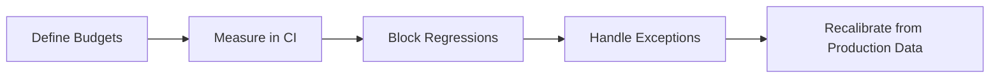

# Day 087 [Advanced]: Performance Budget Governance

## Index

- Goal
- Prerequisites
- Explanation
- Topic by Topic
- Key Concepts
- Visual Concept Map
- End-to-End Practical
- Hands-on Coding
- Mini Exercise
- Assessment Quiz
- Task
- Self Check
- Interview Questions and Answers
- Day Outcome

## Goal

Implement performance budgets as enforceable engineering governance so regressions are caught before they reach production.

## Prerequisites

- Day 086 incident response and reliability operations
- Core Web Vitals and backend latency fundamentals

## Explanation

Performance budgets convert vague speed goals into measurable limits for frontend bundles, backend latency, and infrastructure behavior. Governance means these limits are integrated into pull request checks, release gates, and ownership workflows.

## Topic by Topic

### Topic 1: Budget Types and Scope

Theory:
Budgets can target network weight, render metrics, API timings, and database query cost.

Practical:
Define separate budgets for landing page, dashboard, and checkout.

**Explanation:**
This topic explains Budget Types and Scope in a practical Node.js backend context so you can build reliable, production-ready APIs and services.

**Key Points:**
- Understand the core idea behind Budget Types and Scope.
- Apply the practical pattern with safe defaults and validation.
- Keep the implementation observable, maintainable, and secure where relevant.

### Topic 2: CI Budget Enforcement

Theory:
Budgets are effective only if enforced automatically.

Practical:
Fail CI when thresholds are exceeded and require review sign-off.

**Explanation:**
This topic explains CI Budget Enforcement in a practical Node.js backend context so you can build reliable, production-ready APIs and services.

**Key Points:**
- Understand the core idea behind CI Budget Enforcement.
- Apply the practical pattern with safe defaults and validation.
- Keep the implementation observable, maintainable, and secure where relevant.

### Topic 3: Ownership and Exception Workflow

Theory:
Temporary budget violations may be valid but must be explicit and time-bound.

Practical:
Add exception tickets with expiry and rollback plan.

**Explanation:**
This topic explains Ownership and Exception Workflow in a practical Node.js backend context so you can build reliable, production-ready APIs and services.

**Key Points:**
- Understand the core idea behind Ownership and Exception Workflow.
- Apply the practical pattern with safe defaults and validation.
- Keep the implementation observable, maintainable, and secure where relevant.

### Topic 4: Observability-Driven Recalibration

Theory:
Budgets should evolve with product behavior and user device mix.

Practical:
Recalibrate quarterly based on field data rather than assumptions.

**Explanation:**
This topic explains Observability-Driven Recalibration in a practical Node.js backend context so you can build reliable, production-ready APIs and services.

**Key Points:**
- Understand the core idea behind Observability-Driven Recalibration.
- Apply the practical pattern with safe defaults and validation.
- Keep the implementation observable, maintainable, and secure where relevant.

### Topic 5: Team Rituals for Performance

Theory:
Governance needs recurring review habits, not one-time setup.

Practical:
Review top 5 regressions weekly and track remediation owners.

**Explanation:**
This topic explains Team Rituals for Performance in a practical Node.js backend context so you can build reliable, production-ready APIs and services.

**Key Points:**
- Understand the core idea behind Team Rituals for Performance.
- Apply the practical pattern with safe defaults and validation.
- Keep the implementation observable, maintainable, and secure where relevant.

### Topic 6: Guardrail Tiers and Canary Verification

Theory:
Not all routes need the same strictness. Critical journeys need tighter guardrails and faster rollback decisions.

Practical:
Define tiered budgets and validate canary metrics before full rollout.

**Explanation:**
This topic explains Guardrail Tiers and Canary Verification in a practical Node.js backend context so you can build reliable, production-ready APIs and services.

**Key Points:**
- Understand the core idea behind Guardrail Tiers and Canary Verification.
- Apply the practical pattern with safe defaults and validation.
- Keep the implementation observable, maintainable, and secure where relevant.

## Key Concepts

- Budget dimensions and segmentation
- CI gating and PR-level enforcement
- Exception governance discipline
- Data-informed budget tuning
- Team accountability loops
- Tier-based performance protection
- Canary-driven regression detection

## Visual Concept Map



## End-to-End Practical

1. Set baseline metrics for one critical user journey.
2. Define hard and soft budget thresholds.
3. Integrate checks into CI and PR templates.
4. Add exception policy with owner and expiry.
5. Publish monthly budget compliance report.

## Hands-on Coding

### Example 1: Case - Frontend Budget Contract

Scenario:
Checkout page bundle must remain under strict weight to protect conversion.

```json
{
  "route": "/checkout",
  "maxJsKb": 220,
  "maxCssKb": 80,
  "maxLcpMs": 2500
}
```

### Example 2: Case - CI Gate Script

Scenario:
Reject pull request when p95 API latency budget is exceeded.

```js
if (report.api.checkout.p95Ms > 400) {
  throw new Error("Performance budget failed: checkout p95 > 400ms");
}
```

### Example 3: Case - Temporary Exception Metadata

Scenario:
A product launch introduces controlled temporary budget breach.

```yaml
budgetException:
  ticket: PERF-194
  reason: "A/B experiment image payload"
  expiresAt: "2026-08-15"
  owner: "web-platform"
```

### Example 4: Case - Tiered Budget Policy

Scenario:
Checkout is stricter than internal admin dashboard.

```yaml
tiers:
  critical:
    route: /checkout
    maxP95Ms: 400
  standard:
    route: /dashboard
    maxP95Ms: 800
```

### Example 5: Case - Canary Promotion Rule

Scenario:
Release can proceed only if canary metrics stay within budget.

```txt
promote_if:
  canary_error_rate <= 1%
  canary_p95_ms <= 450
  window >= 20 minutes
else: rollback
```

## Mini Exercise

Scenario:
Create one enforceable budget policy for a key journey and wire it into CI with exception controls.

Expected output:

- Defined budgets with thresholds
- Automated fail/pass gate in CI
- Exception workflow with expiry

## Assessment Quiz

### Quiz Questions

1. Why is a budget without automation usually ineffective?
2. What is the difference between hard and soft budget thresholds?
3. True or False: Skipping edge-case handling is acceptable in production.
4. Why should budget exceptions have expiration dates?
5. Why use stricter budget tiers for critical journeys?

### Quiz Answers

1. Because regressions are not consistently blocked or tracked.
2. Hard thresholds block merges; soft thresholds warn and require review.
3. False.
4. To avoid permanent normalization of degraded performance.
5. Critical journeys have direct business impact and need faster protection against regressions.

## Task

- Define performance budgets for one production journey
- Implement CI enforcement and temporary exception rule
- Complete mini exercise and quiz.

## Self Check

- You can build enforceable performance governance workflows.
- You can align speed targets with release quality controls.
- You can answer at least 4 out of 5 quiz questions.

## Interview Questions and Answers

### Beginner

Question: What is a performance budget?

Answer: A measurable speed limit for application behavior that engineering must maintain.

### Middle

Question: When should budget thresholds be revisited?

Answer: After major architecture/product changes or when field data shifts significantly.

### Advanced

Question: What tradeoff comes with strict budget gates?

Answer: Higher delivery friction short term, with stronger user experience reliability long term.

## Day 087 Outcome

- You can operate performance budgets as an engineering control system
- You can prevent regressions using CI and ownership workflows
- You are ready for accessibility workflow engineering in Day 088
